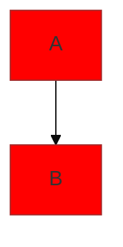

# 📖 Руководство по просмотру диаграмм проекта

## Где находятся диаграммы?

Все диаграммы находятся в папке [`docs/diagrams/`](./diagrams/)

## 🖥️ Способы просмотра

### 1. GitHub (рекомендуется)
Самый простой способ - загрузите проект на GitHub и откройте любой файл диаграммы:

```bash
# Инициализируйте git репозиторий
git init
git add .
git commit -m "Initial commit with diagrams"

# Создайте репозиторий на GitHub и загрузите
git remote add origin https://github.com/your-username/your-repo.git
git push -u origin main
```

GitHub автоматически рендерит Mermaid диаграммы! 🎉

### 2. VS Code / Cursor (локально)

#### Вариант A: Встроенный preview (работает в последних версиях)
1. Откройте любой файл диаграммы (`.md`)
2. Нажмите `Cmd+Shift+V` (Mac) или `Ctrl+Shift+V` (Windows/Linux)
3. Диаграмма отобразится в preview панели

#### Вариант B: С расширением (для лучшего отображения)
1. Установите расширение "Markdown Preview Mermaid Support":
   - Откройте Extensions (`Cmd+Shift+X` / `Ctrl+Shift+X`)
   - Найдите "Markdown Preview Mermaid Support"
   - Нажмите Install
2. Откройте файл диаграммы
3. Откройте preview (`Cmd+Shift+V` / `Ctrl+Shift+V`)

### 3. Mermaid Live Editor (онлайн)

Если нужно отредактировать или просмотреть конкретную диаграмму:

1. Откройте [Mermaid Live Editor](https://mermaid.live)
2. Скопируйте код диаграммы из файла (только блок между \`\`\`mermaid и \`\`\`)
3. Вставьте в редактор
4. Можете экспортировать в PNG/SVG

### 4. Obsidian (для документации)

Если используете Obsidian для документации:
1. Откройте папку проекта как vault
2. Obsidian нативно поддерживает Mermaid
3. Все диаграммы будут отображаться автоматически

## 📱 Просмотр на мобильных устройствах

### iOS
- Приложение "Working Copy" поддерживает Mermaid
- GitHub mobile app отображает диаграммы

### Android
- MGit + Markor поддерживают Mermaid
- GitHub mobile app отображает диаграммы

## 🔧 Редактирование диаграмм

### Синтаксис Mermaid

Каждая диаграмма использует Mermaid синтаксис:

```markdown
# Заголовок

Описание диаграммы

\`\`\`mermaid
graph TB
    A[Начало] --> B[Процесс]
    B --> C[Конец]
\`\`\`
```

### Типы диаграмм в проекте

1. **Flowchart / Mind Map**
   ```mermaid
   graph TB
       root[Root] --> child1[Child 1]
       root --> child2[Child 2]
   ```

2. **Entity Relationship Diagram**
   ```mermaid
   erDiagram
       USER ||--o{ ORDER : places
   ```

3. **Sequence Diagram**
   ```mermaid
   sequenceDiagram
       Client->>Server: Request
       Server-->>Client: Response
   ```

## 📚 Документация Mermaid

- [Официальная документация](https://mermaid.js.org/)
- [Примеры диаграмм](https://mermaid.js.org/intro/)
- [Live Editor](https://mermaid.live)

## 🎨 Темы и стили

Mermaid автоматически адаптируется к теме (светлая/темная) в GitHub и VS Code.

Если хотите кастомизировать стили, добавьте в начало диаграммы:



## 💡 Советы

1. **Для больших диаграмм** - используйте Mermaid Live Editor для лучшего масштабирования
2. **Экспорт** - В Mermaid Live Editor можно экспортировать в PNG/SVG для презентаций
3. **Печать** - Лучше всего экспортировать в PDF через браузер GitHub
4. **Редактирование** - Изменяйте диаграммы прямо в `.md` файлах

## ❓ Проблемы

### Диаграммы не отображаются в VS Code?
- Обновите VS Code до последней версии
- Установите расширение "Markdown Preview Mermaid Support"
- Перезапустите VS Code

### GitHub не рендерит диаграммы?
- Убедитесь, что используете публичный репозиторий (приватные тоже поддерживают, но нужна подписка)
- Проверьте синтаксис Mermaid на [Mermaid Live](https://mermaid.live)

### Сложно редактировать большие диаграммы?
- Используйте Mermaid Live Editor с live preview
- Разбейте большие диаграммы на несколько меньших

## 🚀 Быстрый старт

```bash
# 1. Перейдите в папку с диаграммами
cd docs/diagrams

# 2. Откройте README.md для навигации
code README.md

# 3. Откройте любую диаграмму
code 01-project-structure.md

# 4. Откройте preview (Cmd+Shift+V)
```

Готово! Наслаждайтесь визуализацией проекта! 🎉
