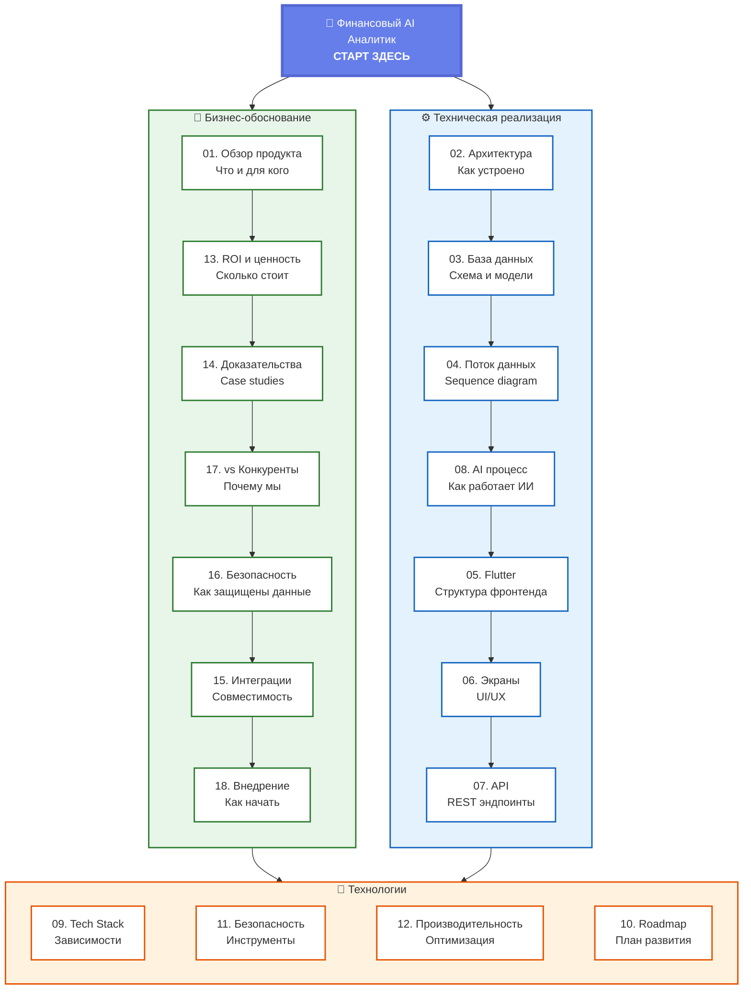

# 00. Навигация по системе

**Интерактивная карта** всех диаграмм проекта - кликните на любой блок для перехода.

## 🗺️ Как пользоваться

### Для бизнеса (менеджеры, владельцы):
1. **Начните с [01. Обзор продукта](#)** - что это и зачем
2. **[13. ROI и ценность](#)** - финансовое обоснование
3. **[14. Доказательства](#)** - реальные кейсы
4. **[18. Внедрение](#)** - как начать работать

### Для технических специалистов:
1. **[02. Архитектура](#)** - общая структура
2. **[03. База данных](#)** - Prisma схемы
3. **[08. AI процесс](#)** - как работает ИИ
4. **[09. Tech Stack](#)** - используемые технологии

### Навигация:
- 🖱️ **Кликните на любой блок** для перехода к диаграмме
- ← **Sidebar** - полный список всех диаграмм
- 🔍 **Zoom/Pan** - для детального просмотра
