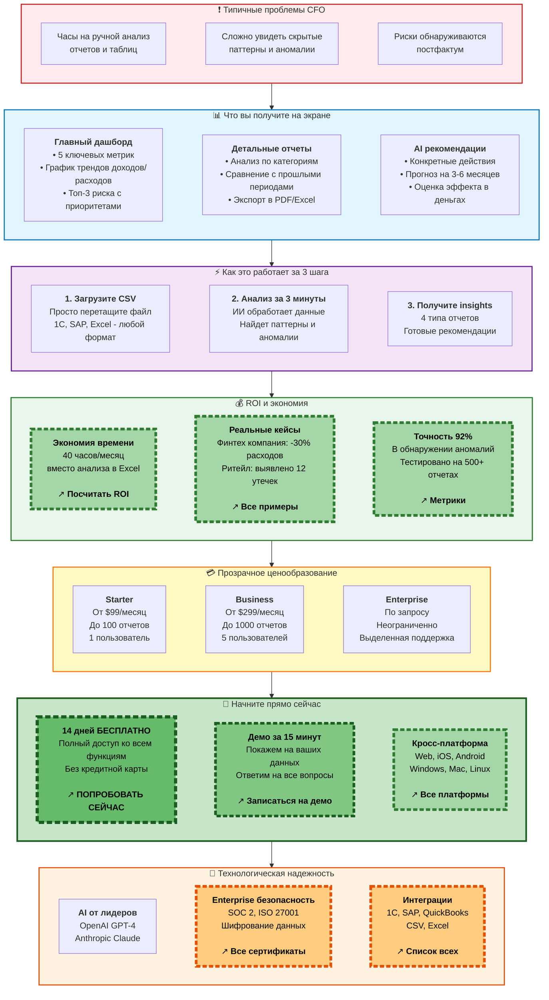

# 1. Обзор продукта

**ИИ-аналитик финансов** для принятия управленческих решений на основе данных.

```mermaid
graph TB
    subgraph problemBlock ["❗ Типичные проблемы CFO"]
        direction LR
        p1["Часы на ручной анализ<br/>отчетов и таблиц"]
        p2["Сложно увидеть скрытые<br/>паттерны и аномалии"]
        p3["Риски обнаруживаются<br/>постфактум"]
        
        p1 ~~~ p2 ~~~ p3
    end
    
    problemBlock --> resultBlock
    
    subgraph resultBlock ["📊 Что вы получите на экране"]
        direction LR
        r1["<b>Главный дашборд</b><br/>• 5 ключевых метрик<br/>• График трендов доходов/расходов<br/>• Топ-3 риска с приоритетами"]
        r2["<b>Детальные отчеты</b><br/>• Анализ по категориям<br/>• Сравнение с прошлыми периодами<br/>• Экспорт в PDF/Excel"]
        r3["<b>AI рекомендации</b><br/>• Конкретные действия<br/>• Прогноз на 3-6 месяцев<br/>• Оценка эффекта в деньгах"]
        
        r1 ~~~ r2 ~~~ r3
    end
    
    resultBlock --> flowBlock
    
    subgraph flowBlock ["⚡ Как это работает за 3 шага"]
        direction LR
        f1["<b>1. Загрузите CSV</b><br/>Просто перетащите файл<br/>1С, SAP, Excel - любой формат"]
        f2["<b>2. Анализ за 3 минуты</b><br/>ИИ обработает данные<br/>Найдет паттерны и аномалии"]
        f3["<b>3. Получите insights</b><br/>4 типа отчетов<br/>Готовые рекомендации"]
        
        f1 ~~~ f2 ~~~ f3
    end
    
    flowBlock --> valueBlock
    
    subgraph valueBlock ["💰 ROI и экономия"]
        direction LR
        v1["<b>Экономия времени</b><br/>40 часов/месяц<br/>вместо анализа в Excel<br/><br/>↗️ <b>Посчитать ROI</b>"]
        v2["<b>Реальные кейсы</b><br/>Финтех компания: -30% расходов<br/>Ритейл: выявлено 12 утечек<br/><br/>↗️ <b>Все примеры</b>"]
        v3["<b>Точность 92%</b><br/>В обнаружении аномалий<br/>Тестировано на 500+ отчетах<br/><br/>↗️ <b>Метрики</b>"]
        
        v1 ~~~ v2 ~~~ v3
    end
    
    valueBlock --> priceBlock
    
    subgraph priceBlock ["💳 Прозрачное ценообразование"]
        direction LR
        pr1["<b>Starter</b><br/>От $99/месяц<br/>До 100 отчетов<br/>1 пользователь"]
        pr2["<b>Business</b><br/>От $299/месяц<br/>До 1000 отчетов<br/>5 пользователей"]
        pr3["<b>Enterprise</b><br/>По запросу<br/>Неограниченно<br/>Выделенная поддержка"]
        
        pr1 ~~~ pr2 ~~~ pr3
    end
    
    priceBlock --> ctaBlock
    
    subgraph ctaBlock ["🚀 Начните прямо сейчас"]
        direction LR
        cta1["<b>14 дней БЕСПЛАТНО</b><br/>Полный доступ ко всем функциям<br/>Без кредитной карты<br/><br/>↗️ <b>ПОПРОБОВАТЬ СЕЙЧАС</b>"]
        cta2["<b>Демо за 15 минут</b><br/>Покажем на ваших данных<br/>Ответим на все вопросы<br/><br/>↗️ <b>Записаться на демо</b>"]
        cta3["<b>Кросс-платформа</b><br/>Web, iOS, Android<br/>Windows, Mac, Linux<br/><br/>↗️ <b>Все платформы</b>"]
        
        cta1 ~~~ cta2 ~~~ cta3
    end
    
    ctaBlock --> techBlock
    
    subgraph techBlock ["🔧 Технологическая надежность"]
        direction LR
        t1["<b>AI от лидеров</b><br/>OpenAI GPT-4<br/>Anthropic Claude"]
        t2["<b>Enterprise безопасность</b><br/>SOC 2, ISO 27001<br/>Шифрование данных<br/><br/>↗️ <b>Все сертификаты</b>"]
        t3["<b>Интеграции</b><br/>1C, SAP, QuickBooks<br/>CSV, Excel<br/><br/>↗️ <b>Список всех</b>"]
        
        t1 ~~~ t2 ~~~ t3
    end
    
    click v1 "?diagram=13" "💰 Калькулятор ROI"
    click v2 "?diagram=14" "📊 Реальные кейсы"
    click v3 "?diagram=14" "📊 Метрики эффективности"
    click cta1 "?diagram=18" "🚀 Как начать за 14 дней"
    click cta2 "?diagram=18" "📞 Записаться на демо"
    click cta3 "?diagram=06" "📱 Посмотреть экраны"
    click t2 "?diagram=16" "🔒 SOC 2, ISO 27001"
    click t3 "?diagram=15" "🔌 Все интеграции"
    
    style problemBlock fill:#ffebee,stroke:#c62828,stroke-width:2px
    style resultBlock fill:#e1f5fe,stroke:#0277bd,stroke-width:2px
    style flowBlock fill:#f3e5f5,stroke:#6a1b9a,stroke-width:2px
    style valueBlock fill:#e8f5e9,stroke:#2e7d32,stroke-width:2px
    style priceBlock fill:#fff9c4,stroke:#f57f17,stroke-width:2px
    style ctaBlock fill:#c8e6c9,stroke:#1b5e20,stroke-width:3px
    style techBlock fill:#fff3e0,stroke:#e65100,stroke-width:2px
    
    style v1 fill:#a5d6a7,stroke:#2e7d32,stroke-width:5px,stroke-dasharray: 8 4,cursor:pointer,color:#000
    style v2 fill:#a5d6a7,stroke:#2e7d32,stroke-width:5px,stroke-dasharray: 8 4,cursor:pointer,color:#000
    style v3 fill:#a5d6a7,stroke:#2e7d32,stroke-width:5px,stroke-dasharray: 8 4,cursor:pointer,color:#000
    style cta1 fill:#66bb6a,stroke:#1b5e20,stroke-width:6px,stroke-dasharray: 10 5,cursor:pointer,color:#000
    style cta2 fill:#81c784,stroke:#1b5e20,stroke-width:5px,stroke-dasharray: 8 4,cursor:pointer,color:#000
    style cta3 fill:#a5d6a7,stroke:#2e7d32,stroke-width:5px,stroke-dasharray: 8 4,cursor:pointer,color:#000
    style t2 fill:#ffcc80,stroke:#e65100,stroke-width:5px,stroke-dasharray: 8 4,cursor:pointer,color:#000
    style t3 fill:#ffcc80,stroke:#e65100,stroke-width:5px,stroke-dasharray: 8 4,cursor:pointer,color:#000
```
