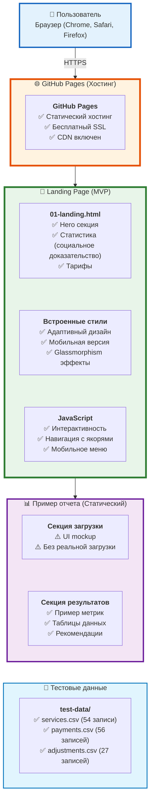

# 2. Архитектура системы - MVP Landing Page

Текущая архитектура MVP: статический landing page с примером отчета для демонстрации ценности продукта.

## Что реализовано в MVP

### ✅ Landing Page
- **Hero секция** - Заголовок, описание продукта, social proof
- **Статистика** - Визуальные метрики для убедительности
- **Тарифные планы** - Три уровня подписки
- **Адаптивный дизайн** - Работает на desktop, tablet, mobile
- **Мобильное меню** - Гамбургер-меню для навигации
- **Якоря** - Прямые ссылки на секции

### ✅ Пример отчета (Статический)
- **UI загрузки файла** - Mockup интерфейса drag & drop
- **Секция результатов** - Демонстрация:
  - Ключевые метрики (выручка, рентабельность, долги)
  - Топ сотрудников
  - Рекомендации в виде таблицы
  - Красивый дизайн с gradients

### ✅ Тестовые данные
- **CSV файлы** в `test-data/`:
  - `services.csv` - 54 записи начислений
  - `payments.csv` - 56 оплат
  - `adjustments.csv` - 27 корректировок
- Документация в `test-data/README.md`

### ⚠️ Что НЕ реализовано (требует backend)
- ❌ Реальная загрузка CSV файлов
- ❌ Backend для обработки данных
- ❌ AI-анализ (OpenAI/Claude API)
- ❌ База данных
- ❌ Аутентификация/регистрация
- ❌ Экспорт в PDF/Excel
- ❌ История отчетов

## Технологический стек MVP

### Frontend (Реализовано)
- **HTML5** - Семантическая разметка
- **CSS3** - Встроенные стили с:
  - CSS Grid / Flexbox для layout
  - Media queries для адаптивности
  - CSS Variables для цветовой схемы
  - Animations для микроинтеракций
- **JavaScript (Vanilla)** - Интерактивность без фреймворков:
  - Навигация с якорями
  - Мобильное меню (hamburger)
  - Smooth scroll
  - Copy to clipboard

### Хостинг (Реализовано)
- **GitHub Pages** - Бесплатный статический хостинг
  - Автоматический SSL (Let's Encrypt)
  - CDN через GitHub
  - Custom domain поддержка
  - Автоматический deploy при push в `main`

### Дизайн
- **Цветовая палитра**:
  - Primary: `#2563eb` (Blue)
  - Secondary: `#06b6d4` (Cyan)
  - Success: `#10b981` (Green)
  - Warning: `#f59e0b` (Amber)
- **Типографика**: System fonts
  - `-apple-system, BlinkMacSystemFont, 'SF Pro Display', 'Segoe UI'`
- **Эффекты**: Glassmorphism, gradients, subtle shadows

### Будущий стек (Roadmap)

**Backend:**
- Node.js + TypeScript
- Express / Fastify
- PostgreSQL + Prisma ORM
- Redis для кеша

**AI/ML:**
- OpenAI GPT-4 для анализа
- CSV парсинг (csv-parse)

**Deployment:**
- Backend: Railway / Render / Fly.io
- Database: Railway PostgreSQL / Supabase
- Storage: AWS S3 / Cloudflare R2

## Архитектурные принципы MVP

### 1. **Простота превыше всего**
- Нет backend, нет базы данных
- Статический HTML без build процесса
- Минимум зависимостей (zero npm packages)
- Легкий deploy (просто push в GitHub)

### 2. **Быстрая итерация**
- Изменения видны сразу после push
- GitHub Pages автоматически деплоит
- Нет сложной CI/CD pipeline
- Можно править прямо в GitHub

### 3. **Фокус на демонстрацию ценности**
- Показываем готовый результат (пример отчета)
- Убеждаем визуально (графики, метрики, дизайн)
- Социальное доказательство (статистика)
- CTA для перехода к следующему этапу

### 4. **Мобильность**
- Mobile-first подход
- Адаптивная типографика с `clamp()`
- Touch-friendly элементы (44px минимум)
- Оптимизация для iPhone 15

### 5. **SEO и доступность**
- Семантический HTML
- Meta tags для социальных сетей
- Alt текст для изображений (когда будут)
- Быстрая загрузка (< 1 сек)

## Следующие шаги (Backend)

Когда будет готовность перейти к реальному функционалу:

1. **Backend API**:
   - `POST /api/analyze` - Загрузка CSV, анализ, возврат результата
   - Node.js + Express + TypeScript
   - CSV парсинг in-memory (без сохранения)

2. **AI Integration**:
   - OpenAI GPT-4 API для анализа
   - Промпт с финансовыми данными
   - Возврат JSON с метриками и рекомендациями

3. **Database** (опционально для MVP):
   - Можно начать без БД (stateless)
   - Добавить позже для сохранения истории

4. **Deployment**:
   - Railway / Render для backend ($7-15/мес)
   - GitHub Pages остается для frontend

См. [Roadmap (Диаграмма 10)](#) для детального плана эволюции.
