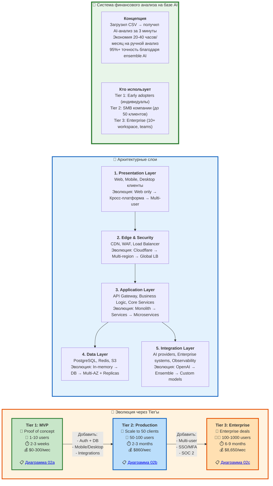

# 2. Архитектура системы - Общий обзор

> **Что показано:** Высокоуровневая архитектура системы и эволюция через tier'ы  
> **Цель:** Понять общую структуру системы без погружения в детали  
> **Детали:** См. диаграммы 02a (MVP), 02b (Production), 02c (Enterprise)

**[↩️ Вернуться к Roadmap (Диаграмма 10)](#)**



## Основные архитектурные слои

### 1. Presentation Layer (Клиенты)
**Tier 1 (MVP):**
- Web app только (Flutter Web)
- Анонимный доступ
- Загрузка CSV → анализ

**Tier 2 (Production):**
- + Mobile (iOS, Android)
- + Desktop (Windows, Mac, Linux)
- Регистрация + история отчетов
- Offline режим

**Tier 3 (Enterprise):**
- + Multi-user workspaces
- + RBAC (4+ roles)
- + Real-time collaboration
- + White-labeling

**📋 Детали:** См. клиентские разделы в [02a](#), [02b](#), [02c](#)

---

### 2. Edge & Security Layer
**Tier 1 (MVP):**
- Нет (прямое подключение к backend)

**Tier 2 (Production):**
- Cloudflare CDN
- SSL/TLS termination
- Basic DDoS protection

**Tier 3 (Enterprise):**
- + WAF (Web Application Firewall)
- + Global Load Balancer
- + Multi-region deployment
- + SSO/MFA (SAML, OAuth2)
- + RBAC Engine
- + Audit Service

**📋 Детали:** См. edge/security разделы в [02b](#), [02c](#)

---

### 3. Application Layer (Бизнес-логика)
**Tier 1 (MVP):**
- Stateless monolith
- Один endpoint: POST /analyze
- In-memory обработка
- Без сохранения данных

**Tier 2 (Production):**
- Distributed services:
  - AuthService (JWT)
  - FileService (S3 upload)
  - IntegrationService (1C, QuickBooks)
  - AnalysisService (ML + AI)
  - ForecastService (ARIMA)
  - ExportService (PDF, Excel)
- Background workers (Redis Queue)
- Сохранение в PostgreSQL

**Tier 3 (Enterprise):**
- Microservices architecture:
  - + WorkspaceService (multi-tenant)
  - + RBAC Engine (permissions)
  - + CustomizationService (custom AI prompts)
  - + WebSocket Server (real-time)
  - + NotificationService (Push, Email, Slack)
  - + CollaborationService (comments, @mentions)
- Kafka для messaging
- 10-20 workers (auto-scaling)

**📋 Детали:** См. backend/services разделы в [02a](#), [02b](#), [02c](#)

---

### 4. Data Layer (Хранилище)
**Tier 1 (MVP):**
- In-memory только
- Без БД
- Без постоянного хранения

**Tier 2 (Production):**
- PostgreSQL (users, reports, analysis)
- 1-2 read replicas
- Redis Cache (sessions, metrics)
- S3 Storage (files, exports)
- Backups каждые 6h

**Tier 3 (Enterprise):**
- PostgreSQL Multi-AZ (auto-failover < 30s)
- 2-3 geo-distributed read replicas
- Redis Cluster (3+ nodes, Sentinel)
- Multi-region S3 (cross-region replication)
- Hourly backups, 90-day retention
- Point-in-time recovery (30 days)

**📋 Детали:** См. storage разделы в [02a](#), [02b](#), [02c](#)

---

### 5. Integration Layer (Внешние системы)
**Tier 1 (MVP):**
- OpenAI GPT-4 (AI анализ)

**Tier 2 (Production):**
- + Anthropic Claude (ensemble AI, 92% accuracy)
- + 1C УПП/КА integration
- + QuickBooks OAuth2
- + SendGrid (email)
- + Firebase (push notifications)

**Tier 3 (Enterprise):**
- + SAP connector (если есть sponsor)
- + Slack/Teams webhooks
- + ELK Stack (logs)
- + Prometheus + Grafana (metrics)
- + Jaeger (distributed tracing)
- + SOC 2 audits
- + Quarterly pentests

**📋 Детали:** См. external/observability разделы в [02a](#), [02b](#), [02c](#)

---

## Ключевые архитектурные принципы

### 1. Эволюционная архитектура
- **Не строим сразу все:** Начинаем с простого MVP, добавляем сложность по мере роста
- **Validate before scale:** Доказываем ценность на малом масштабе, затем инвестируем
- **Каждый tier - готовый продукт:** Можем остановиться на любом tier'е если он достаточен

### 2. Stateless → Stateful → Multi-tenant
- **Tier 1:** Stateless (нет БД, все в памяти)
- **Tier 2:** Stateful (PostgreSQL, сохранение истории)
- **Tier 3:** Multi-tenant (workspace isolation, RBAC)

### 3. Monolith → Services → Microservices
- **Tier 1:** Monolith (один процесс, все в нём)
- **Tier 2:** Distributed services (6 сервисов, но связанные)
- **Tier 3:** Microservices (9+ независимых сервисов)

### 4. Single AI → Ensemble → Custom models
- **Tier 1:** OpenAI GPT-4 (primary, ~80% accuracy)
- **Tier 2:** GPT-4 + Claude (ensemble, 92% accuracy)
- **Tier 3:** Ensemble + custom prompts + domain models (95%+ accuracy)

### 5. Cost-aware scaling
- **Tier 1:** $0-300/мес (serverless, pay-as-you-go)
- **Tier 2:** $860/мес (dedicated resources, 50 users)
- **Tier 3:** $8,650/мес (enterprise infrastructure, 100+ users)

---

## Технологический стек

### Frontend
```
Framework: Flutter (Web, iOS, Android, Desktop)
- Tier 1: Web only
- Tier 2: + Mobile, + Desktop
- Tier 3: + White-labeling
```

### Backend
```
Language: Node.js / Go / Python (TBD)
Framework: Express / Fastify / Koa (Node.js) OR Gin (Go) OR FastAPI (Python)

Tier 1: Monolith (один сервис)
Tier 2: Distributed (6 сервисов, Docker Compose)
Tier 3: Microservices (9+ сервисов, Kubernetes)
```

### Database
```
Primary: PostgreSQL (ACID, JSONB, Full-text search)
Cache: Redis (sessions, metrics, rate limiting)
Storage: S3 / Cloudflare R2 (files, exports)

Tier 1: -
Tier 2: PostgreSQL + 1-2 replicas, Redis, S3
Tier 3: + Multi-AZ, + Geo-distributed replicas, + Redis Cluster
```

### Queue / Messaging
```
Tier 1: -
Tier 2: BullMQ (Redis-based, 3-5 workers)
Tier 3: Kafka / RabbitMQ (distributed, 10-20 workers)
```

### AI / ML
```
Tier 1: OpenAI GPT-4
Tier 2: + Anthropic Claude (ensemble)
Tier 3: + Custom prompts, + Domain-specific models
```

### Observability
```
Tier 1: Console logs
Tier 2: Basic logging (files), simple metrics
Tier 3: Prometheus + Grafana, ELK Stack, Jaeger tracing
```

### Security & Compliance
```
Tier 1: HTTPS only
Tier 2: + JWT auth, + encryption at rest
Tier 3: + SSO/MFA, + RBAC, + Audit logs, + SOC 2 Type I
```

---

## Метрики по tier'ам

### Tier 1: MVP
| Метрика | Значение |
|---------|----------|
| **Users** | 1-10 |
| **Uptime** | Best effort (~95%) |
| **API latency** | < 500ms (p95) |
| **Analysis time** | < 60s |
| **Cost** | $0-300/мес |
| **Timeline** | 2-3 weeks |
| **Team** | 1-2 разработчика |

### Tier 2: Production
| Метрика | Значение |
|---------|----------|
| **Users** | 50-100 |
| **Uptime** | 99% SLA (~7h downtime/мес) |
| **API latency** | < 200ms (p95) |
| **Analysis time** | < 40s |
| **Cost** | $860/мес |
| **Timeline** | 2-3 months |
| **Team** | 3-5 разработчиков |

### Tier 3: Enterprise
| Метрика | Значение |
|---------|----------|
| **Users** | 100-1000 |
| **Uptime** | 99.9% SLA (~43min downtime/мес) |
| **API latency** | < 100ms (p95) |
| **Analysis time** | < 60s (из-за custom metrics) |
| **Cost** | $8,650/мес |
| **Timeline** | 6-9 months (включая SOC 2) |
| **Team** | 8-12 разработчиков + devops + security |

---

## Когда переходить на следующий tier

### MVP → Production
✅ **Готовы, если:**
- ✅ Есть 10+ активных пользователей
- ✅ Пользователи просят сохранение истории
- ✅ Пользователи просят mobile/desktop app
- ✅ Пользователи готовы платить $99/мес
- ✅ Churn < 10%
- ✅ Revenue > $1K/мес (10 paying users)

### Production → Enterprise
✅ **Готовы, если:**
- ✅ Есть 50+ paying clients
- ✅ Enterprise клиенты просят multi-user
- ✅ Enterprise клиенты просят SOC 2
- ✅ Enterprise клиенты готовы платить $10K/год
- ✅ Revenue > $15K/мес
- ✅ Gross margin > 40%
- ✅ Готовы нанять 3-5 инженеров

---

## Детальные диаграммы

### 📋 [Диаграмма 02a: Tier 1 (MVP)](#)
- Полная архитектура MVP
- Stateless monolith
- In-memory обработка
- $0-300/мес
- 2-3 weeks timeline

### 📋 [Диаграмма 02b: Tier 2 (Production)](#)
- Полная архитектура Production
- Distributed services
- PostgreSQL + Redis + S3
- $860/мес
- 2-3 months timeline

### 📋 [Диаграмма 02c: Tier 3 (Enterprise)](#)
- Полная архитектура Enterprise
- Microservices
- Multi-AZ + Geo-distributed
- $8,650/мес
- 6-9 months timeline

---

## Следующие шаги

1. **Если новый проект:** Начните с [Tier 1 MVP (02a)](#)
2. **Если есть traction:** Изучите [Tier 2 Production (02b)](#)
3. **Если enterprise клиенты:** Изучите [Tier 3 Enterprise (02c)](#)
4. **Roadmap всех tier'ов:** См. [Диаграмма 10 (Roadmap)](#)
