# 2. Архитектура системы - Полная (все tier'ы)

Целевая архитектура, показывающая как реализуются все обещания из диаграммы 1 (Tier 1 + Tier 2 + Tier 3).

```mermaid
graph TB
    subgraph clients ["📱 Кросс-платформенные клиенты + Multi-user"]
        direction LR
        web["<b>Web App</b><br/>✅ Workspaces<br/>✅ RBAC<br/>✅ Real-time collaboration"]
        desktop["<b>Desktop</b><br/>✅ Offline работа<br/>✅ Bulk operations"]
        mobile["<b>Mobile</b><br/>✅ iOS, Android<br/>✅ Push notifications"]
        
        web ~~~ desktop ~~~ mobile
    end
    
    clients ~~~ edge
    
    subgraph edge ["🌐 Edge Layer"]
        direction LR
        cdn["<b>CDN</b><br/>✅ Cloudflare<br/>✅ Multi-region"]
        waf["<b>WAF</b><br/>✅ DDoS protection<br/>✅ Rate limiting"]
        lb["<b>Load Balancer</b><br/>✅ Global<br/>✅ Auto-failover"]
        
        cdn ~~~ waf ~~~ lb
    end
    
    edge ~~~ security
    
    subgraph security ["🔒 Security Layer - SOC 2 Type I"]
        direction LR
        sso["<b>SSO/MFA</b><br/>✅ SAML, OAuth2<br/><i>Auth0 / Okta / custom</i>"]
        rbac["<b>RBAC Engine</b><br/>✅ 4+ roles<br/>✅ Permissions matrix"]
        audit["<b>Audit Service</b><br/>✅ All actions logged<br/>✅ Compliance reports"]
        
        sso ~~~ rbac ~~~ audit
    end
    
    security ~~~ api
    
    subgraph api ["🌐 API Gateway"]
        direction LR
        routes["<b>REST API</b><br/>✅ Rate limiting<br/>✅ Request validation<br/><i>Express / Fastify / Koa</i>"]
    end
    
    api ~~~ businessLogic
    
    subgraph businessLogic ["📊 Бизнес-логика - Обещания из диаграммы 1"]
        direction LR
        
        workspace["<b>WorkspaceService</b><br/>✅ Multi-tenant<br/>✅ Team management"]
        upload["<b>FileService</b><br/>✅ Загрузка CSV/Excel<br/>✅ Virus scan"]
        integration["<b>IntegrationService</b><br/>✅ 1C, SAP, QuickBooks<br/>✅ Custom adapters"]
        custom["<b>CustomizationService</b><br/>✅ Custom AI prompts<br/>✅ White-labeling"]
        
        workspace ~~~ upload ~~~ integration ~~~ custom
    end
    
    businessLogic ~~~ coreServices
    
    subgraph coreServices ["🤖 Core Services - ИИ анализ за 3 минуты"]
        direction LR
        
        analysis["<b>AnalysisService</b><br/>✅ 95%+ точность<br/>✅ ML pipeline<br/>✅ A/B testing"]
        forecast["<b>ForecastService</b><br/>✅ Прогноз 3-6 мес<br/>✅ Multiple models"]
        ai["<b>AIService</b><br/>✅ GPT-4 + Claude<br/>✅ Ensemble AI"]
        
        analysis ~~~ forecast ~~~ ai
    end
    
    coreServices ~~~ reporting
    
    subgraph reporting ["📈 Reporting Layer - 4 типа отчетов"]
        direction LR
        
        dashboard["<b>DashboardService</b><br/>✅ Custom widgets<br/>✅ Embed API"]
        reports["<b>ReportService</b><br/>✅ Scheduled reports<br/>✅ Email delivery"]
        export["<b>ExportService</b><br/>✅ PDF/Excel/CSV<br/>✅ Batch export"]
        
        dashboard ~~~ reports ~~~ export
    end
    
    reporting ~~~ realtime
    
    subgraph realtime ["⚡ Real-time Layer"]
        direction LR
        
        ws["<b>WebSocket</b><br/>✅ Presence<br/>✅ Live updates"]
        notifications["<b>Notifications</b><br/>✅ Push, Email<br/>✅ Slack/Teams"]
        collab["<b>Collaboration</b><br/>✅ Comments<br/>✅ @mentions"]
        
        ws ~~~ notifications ~~~ collab
    end
    
    realtime ~~~ queue
    
    subgraph queue ["⚙️ Background Processing - 40 часов экономии"]
        direction LR
        
        jobs["<b>Job Queue</b><br/>✅ Kafka / RabbitMQ<br/>✅ Priority queues"]
        workers["<b>Workers</b><br/>✅ 10-20 instances<br/>✅ Auto-scaling"]
        scheduler["<b>Scheduler</b><br/>✅ Cron jobs<br/>✅ Recurring reports"]
        
        jobs ~~~ workers ~~~ scheduler
    end
    
    queue ~~~ storage
    
    subgraph storage ["💾 Data Storage - Multi-region"]
        direction LR
        
        db["<b>PostgreSQL</b><br/>✅ Multi-AZ<br/>✅ Auto-failover<br/>✅ 2-3 read replicas"]
        redis["<b>Redis Cluster</b><br/>✅ 3+ nodes<br/>✅ High availability"]
        s3["<b>S3 / Cloud Storage</b><br/>✅ Multi-region<br/>✅ Versioning"]
        
        db ~~~ redis ~~~ s3
    end
    
    storage ~~~ monitoring
    
    subgraph monitoring ["📊 Observability Stack"]
        direction LR
        
        metrics["<b>Metrics</b><br/>✅ Prometheus<br/>✅ Grafana"]
        logs["<b>Logs</b><br/>✅ ELK Stack<br/>✅ 90-day retention"]
        traces["<b>Tracing</b><br/>✅ Jaeger<br/>✅ Distributed"]
        
        metrics ~~~ logs ~~~ traces
    end
    
    monitoring ~~~ external
    
    subgraph external ["🌐 External APIs"]
        direction LR
        
        llm["<b>LLM Providers</b><br/>✅ OpenAI / Anthropic<br/>✅ Failover"]
        integrations["<b>Integrations</b><br/>✅ 15+ systems<br/>✅ iPaaS (Zapier)"]
        compliance["<b>Compliance</b><br/>✅ SOC 2 audits<br/>✅ Pentests"]
        
        llm ~~~ integrations ~~~ compliance
    end
    
    style clients fill:#e3f2fd,stroke:#1565c0,stroke-width:3px
    style edge fill:#fff3e0,stroke:#e65100,stroke-width:2px
    style security fill:#ffebee,stroke:#c62828,stroke-width:4px
    style api fill:#fff3e0,stroke:#e65100,stroke-width:2px
    style businessLogic fill:#f3e5f5,stroke:#6a1b9a,stroke-width:3px
    style coreServices fill:#e8f5e9,stroke:#2e7d32,stroke-width:4px
    style reporting fill:#e1f5fe,stroke:#0277bd,stroke-width:3px
    style realtime fill:#fff9c4,stroke:#f57f17,stroke-width:3px
    style queue fill:#fce4ec,stroke:#c2185b,stroke-width:2px
    style storage fill:#e0f2f1,stroke:#00695c,stroke-width:3px
    style monitoring fill:#ede7f6,stroke:#4527a0,stroke-width:3px
    style external fill:#e0f7fa,stroke:#00838f,stroke-width:2px
```

## Соответствие обещаниям из диаграммы 1

### ✅ "Что вы получите на экране" (Dashboard + Reports)
- **DashboardService** → Custom widgets, Embed API, White-label
- **ReportService** → Scheduled reports, Email delivery, API access
- **ExportService** → PDF/Excel/CSV, Batch export, Watermarks

### ✅ "Как работает за 3 шага" (Upload → Analysis → Results)
- **FileService** → Загрузка CSV/Excel, virus scan (шаг 1)
- **AnalysisService + Workers** → Анализ за 10-30s, 95%+ точность (шаг 2)
- **ReportService** → 4 типа отчетов, real-time updates (шаг 3)

### ✅ "ROI и экономия 40 часов/месяц"
- **Job Queue** → Kafka/RabbitMQ, 10-20 workers
- **Redis Cluster** → High availability caching
- **Auto-scaling** → Оптимизация затрат

### ✅ "Точность 95%+ в обнаружении аномалий"
- **AnalysisService** → ML pipeline, A/B testing, 500+ тестов
- **AIService** → Ensemble AI (GPT-4 + Claude)

### ✅ "Прогноз на 3-6 месяцев"
- **ForecastService** → Multiple models, Confidence intervals

### ✅ "Интеграции: 1C, SAP, QuickBooks, CSV, Excel"
- **IntegrationService** → 15+ systems, Custom adapters, iPaaS (Zapier)

### ✅ "SOC 2 Type I сертификация"
- **Security Layer** → SSO/MFA, RBAC Engine, Audit Service
- **Compliance** → Quarterly audits, Penetration tests
- **Encryption** → At rest and in transit (TLS 1.3)

### ✅ "Кросс-платформа + Multi-user"
- **Client Applications** → Web, iOS, Android, Desktop
- **WorkspaceService** → Multi-tenant, Team collaboration
- **Real-time Layer** → WebSocket, Presence, Live updates

### ✅ "Enterprise: 99.9% uptime, observability"
- **Multi-region** → Load balancer, Auto-failover, Multi-AZ DB
- **Observability** → Prometheus + Grafana, ELK Stack, Jaeger
- **Disaster Recovery** → Point-in-time recovery, 30-day retention

## Примеры технологий (можно менять)

### Frontend
- **Flutter** (текущий выбор) - или React Native, Electron
- **State Management**: Riverpod - или Redux, MobX, Bloc

### Backend
- **API Framework**: Express - или **Fastify**, Koa, NestJS, Hono
- **Language**: Node.js + TypeScript - или Python, Go, Rust
- **ORM**: Prisma - или TypeORM, Sequelize, Drizzle

### Data Storage
- **Database**: PostgreSQL - или MySQL, MSSQL, MariaDB
- **Object Storage**: S3 - или MinIO, Azure Blob, GCS
- **Cache**: Redis - или Memcached, KeyDB

### Background Processing
- **Queue**: BullMQ - или RabbitMQ, Kafka, AWS SQS
- **Worker**: Bull - или Agenda, Bee-Queue

### Security
- **Reverse Proxy**: Nginx - или Caddy, Traefik, HAProxy
- **Auth**: JWT - или OAuth2, SAML, Auth0

### AI/ML
- **LLM**: OpenAI/Anthropic - или Azure OpenAI, AWS Bedrock, self-hosted
- **ML**: Custom models - или AWS SageMaker, GCP Vertex AI

### Export
- **PDF**: Puppeteer - или wkhtmltopdf, pdfkit
- **Excel**: ExcelJS - или xlsx, node-xlsx

## Архитектурные принципы

1. **Separation of Concerns** - каждый сервис отвечает за свою область
2. **Technology Agnostic** - можно менять реализацию без изменения интерфейса
3. **Scalability** - горизонтальное масштабирование через очереди и кеш
4. **Security First** - все данные шифруются, логируются, аудируются
5. **API-First** - клиенты работают через единый REST API

## Взаимодействие сервисов

- **Client → API Gateway**: REST API (JSON over HTTPS)
- **API Gateway → Business Logic**: Service layer
- **Business Logic → Core Services**: Internal function calls
- **Core Services → AI**: HTTP APIs (provider-agnostic)
- **All Services → Database**: ORM layer (database-agnostic)
- **Background Jobs → Queue**: Message queue (queue-agnostic)
- **File Storage**: Object storage interface (storage-agnostic)
