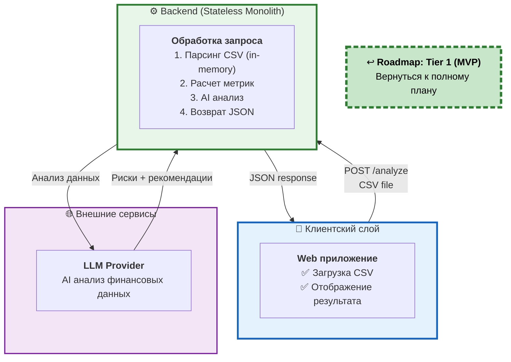

# 2a. Tier 1: MVP - Базовые компоненты

> **Что показано:** Компоненты, которые строим в MVP (baseline архитектура)  
> **Цель:** Доказать ценность (экономия 20+ часов/месяц) с минимальными затратами

**[↩️ Вернуться к Roadmap (Диаграмма 10)](#)** → Кликабельная ссылка в диаграмме ниже



## Что включено в MVP

### ✅ Клиент (Web приложение)
**Почему Web-only:**
- Быстрый deployment (5 минут)
- Нет app store review (экономия 1-2 недели)
- Работает на всех устройствах через браузер
- Нулевой friction - сразу можно использовать

**Экраны:**
1. **Landing** - объяснение продукта + "Try it now"
2. **Upload** - drag & drop CSV (анонимно)
3. **Analysis** - полный дашборд:
   - 📊 15+ ключевых метрик
   - 📈 Тренды и графики
   - ⚠️ Аномалии и риски
   - 💡 AI-рекомендации
   - 🎯 Прогноз тренда
   - 💾 CTA: "Sign up to save + get history" (внизу страницы)

### ✅ Backend (Stateless Monolith)
**Один endpoint, вся логика внутри:**

**Endpoint:**
```
POST /analyze
  Input:  CSV file (max 10MB)
  Output: { analysis: {...} }
  
  Flow (последовательный):
  1. parseCSV(file) → { rows: [...] }
     - Ожидаемые колонки: date, category, amount, description
     - Формат даты: ISO-8601 или DD/MM/YYYY
     - Валидация: обязательные поля, типы данных
  
  2. calculateMetrics(rows) → { metrics: {...} }
     - Revenue: sum(amount WHERE amount > 0)
     - Costs: sum(amount WHERE amount < 0)
     - Profit: revenue - costs
     - Margin: profit / revenue * 100
     - Burn rate: avg monthly costs (last 3 months)
     - Runway: current_cash / burn_rate
     - MoM growth: (current - previous) / previous * 100
  
  3. analyzeWithAI(metrics, rows) → { risks, recommendations }
     - Prompt to LLM (примерно 2000 tokens)
     - Fallback: если API недоступен → возврат только метрик
  
  4. return { metrics, risks, recommendations, forecast }
```

**Tech Stack:**
- API framework (REST)
- In-memory file processing
- CSV parser
- LLM SDK

### ✅ AI Анализ (ПОЛНЫЙ в MVP!)
**Промпт (как в диаграмме 8 - ПОЛНАЯ мощь):**
```
Analyze this financial CSV data:
{csv_content}

Provide COMPREHENSIVE analysis:

1. KEY METRICS (15+ метрик):
   - Revenue: total, by period, growth rate
   - Costs: total, by category, cost structure
   - Profitability: gross/net margin, EBITDA
   - Cash flow: operating, free cash flow
   - Efficiency: burn rate, runway months
   - Trends: MoM, QoQ, YoY growth

2. ANOMALY DETECTION:
   - Statistical outliers (>2σ)
   - Unusual patterns
   - Seasonality breaks
   - Severity: low/medium/high/critical

3. RISK ASSESSMENT:
   - Cash flow risks
   - Cost overruns
   - Revenue concentration
   - Burn rate warnings
   - Priority + impact score

4. FORECASTING (1-2 months):
   - Revenue projection
   - Expense trends
   - Cash runway
   - Confidence intervals

5. ACTIONABLE RECOMMENDATIONS:
   - Prioritized actions
   - Expected impact
   - Implementation complexity
   - Quick wins vs strategic

6. EXECUTIVE SUMMARY:
   - Top 3 insights
   - Critical issues
   - Opportunities

Format as detailed JSON with all sections.
```

**Output (ПОЛНЫЙ JSON - 100+ строк):**
```json
{
  "metrics": {
    "revenue": {
      "total": 450000,
      "mom_growth": 12.3,
      "yoy_growth": 45.2,
      "avg_monthly": 37500
    },
    "profitability": {
      "gross_margin": 65.4,
      "net_margin": 18.7,
      "ebitda": 95000
    },
    "cashflow": {
      "operating": 85000,
      "burn_rate": 25000,
      "runway_months": 8.2
    }
    // ... 10+ более метрик
  },
  "anomalies": [
    {
      "severity": "high",
      "category": "expenses",
      "description": "Marketing costs выросли на 127% в марте",
      "impact": "Сжигает runway на 2.5 месяца быстрее",
      "detected_at": "2024-03"
    }
    // ... 5-10 аномалий
  ],
  "risks": [
    {
      "type": "cashflow",
      "severity": "critical",
      "description": "При текущем burn rate кэш закончится через 8 месяцев",
      "probability": 0.85,
      "mitigation": "Снизить маркетинг или привлечь раунд"
    }
    // ... 5-7 рисков
  ],
  "forecast": {
    "revenue_next_month": {
      "predicted": 42000,
      "confidence_low": 38000,
      "confidence_high": 46000
    }
    // ... прогнозы по всем метрикам
  },
  "recommendations": [
    {
      "priority": "high",
      "action": "Оптимизировать маркетинговые каналы с ROI < 2x",
      "expected_impact": "Экономия $15K/месяц = +1.5 мес runway",
      "complexity": "medium",
      "timeframe": "2-3 weeks"
    }
    // ... 8-12 рекомендаций
  ],
  "summary": {
    "top_insights": [
      "Выручка растет (+12% MoM), но маржа падает (-3%)",
      "Критический риск: runway 8 месяцев при текущем burn",
      "Возможность: 40% expenses неэффективны, можно сократить"
    ],
    "overall_health": "moderate_concern",
    "confidence": 0.82
  }
}
```

**🎯 Цель MVP**: 
Показать ПОЛНУЮ мощь AI (как в платной версии), чтобы пользователь:
1. Получил "WOW! Это реально полезно!"
2. Захотел сохранить отчет → увидел "Sign up to save"
3. Конвертировался в платного пользователя в Tier 2

**Разница MVP vs Tier 2**:
- MVP: видишь анализ, но **не можешь сохранить** (данные удаляются через 24ч)
- Tier 2: **все то же самое + сохранение + история + экспорт PDF**

## Что НЕ включено (откладываем)

### ❌ Не в MVP (НО это не про функциональность!):
- ❌ **Регистрация/Auth** → анонимный доступ (переносим в Tier 2)
- ❌ **История отчетов** → нет сохранения (данные хранятся 24 часа)
- ❌ **Подписка/Billing** → пока бесплатно (монетизация в Tier 2)
- ❌ **Экспорт PDF/Excel** → можно только смотреть на экране
- ❌ Mobile apps (iOS/Android) → используем web
- ❌ Desktop apps → используем web
- ❌ Интеграции 1C/SAP → только CSV
- ❌ Прогноз на 3-6 мес → краткосрочный прогноз (1-2 мес)
- ❌ Multi-user/workspaces → анонимный доступ
- ❌ RBAC → нет авторизации
- ❌ Real-time updates → refresh вручную
- ❌ Кеширование → пока не нужно
- ❌ Rate limiting → IP-based ограничения (10 анализов/день)

### ✅ ЧТО ЕСТЬ В MVP (ПОЛНОЦЕННО!):
- ✅ **Полный AI-анализ** - все метрики, как в Tier 2/3
- ✅ **Все рекомендации** - полный список действий
- ✅ **Риски + аномалии** - детальная диагностика
- ✅ **Графики и визуализация** - красивый UI
- ✅ **Прогноз тренда** - краткосрочный

**🎯 Философия MVP:**
> Убираем барьеры (регистрацию), но показываем ПОЛНУЮ мощь продукта.
> Пользователь должен сказать "WOW!" и захотеть сохранить результат → Tier 2.

## Инфраструктура

### Deployment
```
Frontend: Static hosting (free tier) - $0
Backend:  PaaS provider ($7/month, 512MB RAM)
LLM API:  ~$1-5/month (зависит от usage)
Total:    ~$8-12/month

✅ Что есть:
- ✅ Полностью stateless backend (нет БД!)
- ✅ Все в памяти (in-memory обработка)
- ✅ Простой deployment (один сервис)
- ✅ Нет overhead на БД управление

⚠️ Trade-offs MVP:
- ❌ Нет логирования для улучшения промптов
- ❌ Нет observability запросов пользователей
- ❌ Нет дебаг данных при проблемах
- ✅ Но: максимально простой MVP!
- ✅ Добавим БД в Tier 2 (когда нужна регистрация)

💰 Монетизация: "Sign up to save + get history" CTA
```

### CI/CD
```
- Git repository
- Auto-deploy при push в main
- Нет сложного CI/CD setup
```

## Ограничения MVP

### Performance
- **Max CSV size:** 10MB (~100K строк)
- **Analysis time:** 30-60 секунд (зависит от OpenAI)
- **Concurrent users:** ~10-20 (Railway 512MB RAM)
- **API rate limit:** IP-based (10 req/hour для защиты от abuse)

### Availability
- **Uptime:** Best effort (~95%, Railway shared infra)
- **Backups:** Не нужны (100% stateless, нет БД!)
- **Support:** Email only, 24-48h response
- **Data retention:** 0 (полностью stateless, нет персистентности)

## Метрики успеха MVP

### Технические:
- ✅ API response time < 60s (full analysis)
- ✅ CSV parsing < 1s (10MB файлы)
- ✅ Uptime > 95%
- ✅ No data loss (т.к. ничего не сохраняем 😄)

### Бизнес:
- ✅ 100+ уникальных анализов/месяц
- ✅ 15+ qualified leads (кликнули "Save this report")
- ✅ Conversion rate > 15% (visitor → completed analysis)
- ✅ NPS > 50 ("Would you recommend this?" после анализа)
- ✅ Avg session time > 5 мин (пользователь изучает результат)

## Переход к Tier 2

**Когда готовы:**
1. ✅ Достигли 10 клиентов
2. ✅ Получили feedback на недостающие фичи
3. ✅ Стабильная работа MVP (нет критических багов)
4. ✅ Появились запросы на mobile/desktop
5. ✅ Клиенты просят интеграции

**Что добавится в Tier 2:**
- **💾 PostgreSQL** (users + reports + analysis_log tables)
- **🔐 Регистрация + Auth** (JWT, Email/Password, OAuth)
- **💳 Подписка Stripe** ($99/мес)
- **📋 История отчетов** (сохранение навсегда, поиск, фильтры)
- **📄 Экспорт** (PDF/Excel с брендингом)
- **📱 Mobile/Desktop apps** (offline доступ)
- **🔗 Интеграции** (1C УПП/КА, QuickBooks, Excel auto-sync)
- **📈 Улучшенная точность** (Ensemble AI: GPT-4 + Claude)
- **🔮 Долгосрочный прогноз** (ARIMA models, 3-6 месяцев)
- **👥 Multi-user** (команды, расшаривание отчетов)
- **📊 Analytics & Logging** (observability, улучшение промптов)

**Разница с MVP:**
- MVP: 100% stateless, без БД, без персистентности
- Tier 2: БД появляется впервые (регистрация, история, логи)
