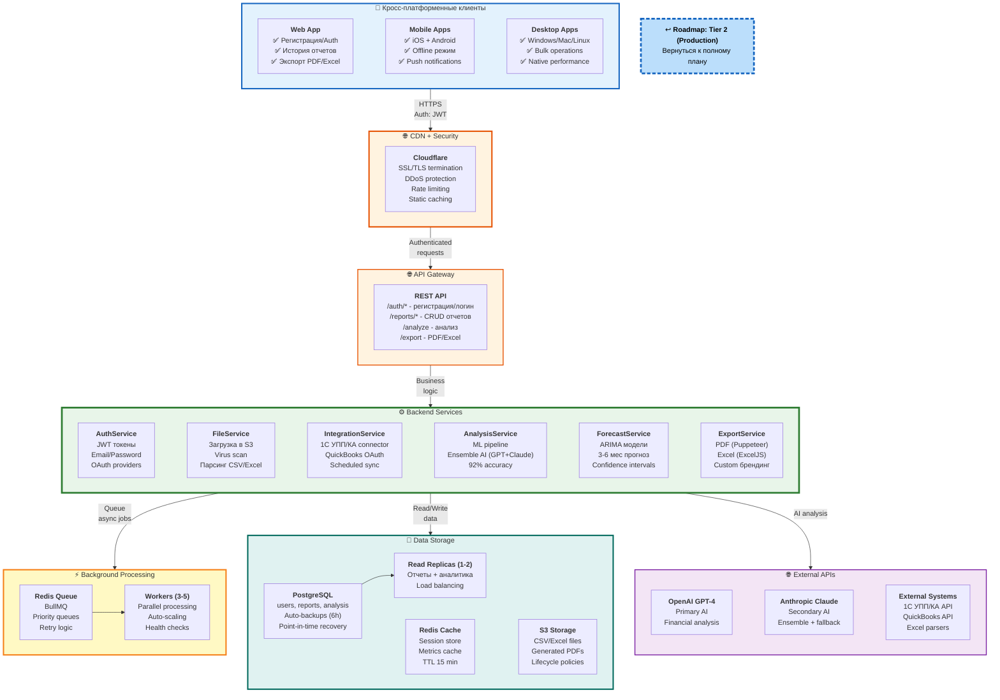

# 2b. Tier 2: Production - Полная архитектура

> **Что показано:** Полная архитектура Production системы (эволюция от Tier 1 MVP)  
> **База:** Все из Tier 1 + масштабирование + новые платформы + интеграции  
> **Цель:** 50+ клиентов, 99% uptime, 92% точность AI, кросс-платформа

**[↩️ Вернуться к Roadmap (Диаграмма 10)](#)** → Кликабельная ссылка в диаграмме ниже



## Что включено в Tier 2

### ✅ Клиенты (Кросс-платформа)

**Web App (Flutter Web):**
- Полноценная регистрация и аутентификация
- История всех отчетов (сохраняется навсегда)
- Экспорт в PDF и Excel
- Scheduled reports (email delivery)

**Mobile Apps (Flutter):**
- **iOS**: App Store, push notifications, Touch ID/Face ID
- **Android**: Google Play, push notifications, Biometric auth
- **Offline режим**: SQLite локально, синхронизация при подключении
- **Native UX**: platform-specific компоненты

**Desktop Apps (Flutter Desktop):**
- **Windows/Mac/Linux**: нативные приложения
- **Bulk operations**: загрузка нескольких файлов
- **Полный offline**: работа без интернета
- **Auto-updates**: автоматическое обновление

### ✅ Backend (Distributed Services)

**AuthService:**
```typescript
Endpoints:
- POST /auth/register - Регистрация нового пользователя
  Input: { email, password, name }
  Output: { user, accessToken, refreshToken }

- POST /auth/login - Логин существующего пользователя
  Input: { email, password }
  Output: { accessToken, refreshToken }

- POST /auth/refresh - Обновление токена
  Input: { refreshToken }
  Output: { accessToken }

- POST /auth/logout - Выход из системы

Tech Stack:
- JWT (access: 15 min, refresh: 30 days)
- bcrypt для паролей
- Rate limiting (5 попыток/15 минут)
```

**FileService + IntegrationService:**
```typescript
POST /reports/upload
  Input: CSV/Excel file OR 1C/QuickBooks connection
  
  Flow:
  1. Upload to S3 → virus scan (ClamAV)
  2. Parse CSV/Excel (in-memory) OR fetch from integration
  3. Validate data (schema, required fields)
  4. Save metadata to PostgreSQL (reports table)
  5. Queue analysis job (Redis)
  6. Return { reportId, status: 'processing' }

Интеграции:
- 1C УПП/КА: REST API connector, scheduled sync (daily)
- QuickBooks: OAuth2, webhook для real-time updates
- Excel: ExcelJS для .xlsx, поддержка формул
```

**AnalysisService (92% accuracy):**
```typescript
Background Worker Job:
  Input: { reportId, csvData }
  
  Flow:
  1. calculateMetrics(csvData) → базовые метрики
  2. analyzeWithGPT4(metrics, csvData) → первичный анализ
  3. validateWithClaude(gpt4Result) → вторичная проверка (ensemble)
  4. detectAnomalies(csvData) → ML модели для аномалий
  5. prioritizeRisks(analysis) → ранжирование по severity
  6. generateRecommendations(analysis) → actionable советы
  7. Save to PostgreSQL (analysis table)
  8. Notify user (push/email)
  
  Output: {
    metrics: {...},      // 15+ ключевых метрик
    anomalies: [...],    // Statistical outliers
    risks: [...],        // Приоритизированные риски
    recommendations: [...], // Конкретные действия
    confidence: 0.92     // Ensemble AI confidence
  }

ML Pipeline:
- Anomaly detection: Isolation Forest + Z-score
- Risk scoring: Gradient Boosting (XGBoost)
- Ensemble AI: GPT-4 (70%) + Claude (30%) weighted average
- A/B testing: 500+ real reports validation
```

**ForecastService:**
```typescript
POST /reports/:id/forecast
  Input: { reportId, horizon: '3-6 months' }
  
  Models:
  - ARIMA: временные ряды (revenue, costs)
  - Prophet: сезонность и тренды (Facebook's model)
  - Linear Regression: простые предсказания
  
  Output: {
    forecast: {
      revenue: [
        { month: 'Jul', predicted: 45K, low: 42K, high: 48K },
        { month: 'Aug', predicted: 47K, low: 43K, high: 51K },
        ...
      ],
      expenses: [...],
      profit: [...],
      runway: { months: 12.5, confidence: 0.85 }
    }
  }
```

**ExportService:**
```typescript
POST /reports/:id/export
  Input: { reportId, format: 'pdf' | 'excel', branding: {...} }
  
  PDF Export (Puppeteer):
  - Full report with all charts and tables
  - Custom branding (logo, colors, footer)
  - 8-15 pages
  - Generation time: 10-15 seconds
  
  Excel Export (ExcelJS):
  - Raw data + pivot tables
  - Multiple sheets (Metrics, Risks, Recommendations)
  - Conditional formatting
  - Generation time: 3-5 seconds
```

### ✅ Background Processing

**Redis Queue + Workers:**
```typescript
Job Types:
1. analyze_report (priority: high)
   - Duration: 20-40s
   - Retry: 3 attempts (exponential backoff)
   
2. generate_forecast (priority: medium)
   - Duration: 10-20s
   - Retry: 2 attempts
   
3. export_pdf (priority: medium)
   - Duration: 10-15s
   - Retry: 2 attempts
   
4. sync_integration (priority: low)
   - Duration: 5-30s (depends on external API)
   - Retry: 5 attempts (1C может быть медленным)

Worker Pool:
- 3-5 инстансов (auto-scaling based on queue length)
- Parallel processing (multiple jobs at once)
- Health checks (restart if hung >2 min)
- Dead letter queue для failed jobs
```

### ✅ Data Storage

**PostgreSQL Schema:**
```sql
-- Users table
CREATE TABLE users (
  id UUID PRIMARY KEY,
  email VARCHAR(255) UNIQUE NOT NULL,
  password_hash VARCHAR(255) NOT NULL,
  name VARCHAR(255),
  created_at TIMESTAMP DEFAULT NOW()
);

-- Reports table
CREATE TABLE reports (
  id UUID PRIMARY KEY,
  user_id UUID REFERENCES users(id),
  filename VARCHAR(255),
  s3_key VARCHAR(500),
  status VARCHAR(50), -- 'processing', 'completed', 'failed'
  created_at TIMESTAMP DEFAULT NOW()
);

-- Analysis table
CREATE TABLE analysis (
  id UUID PRIMARY KEY,
  report_id UUID REFERENCES reports(id),
  metrics JSONB,
  anomalies JSONB,
  risks JSONB,
  recommendations JSONB,
  confidence FLOAT,
  created_at TIMESTAMP DEFAULT NOW()
);

-- Indexes для быстрых запросов
CREATE INDEX idx_reports_user_id ON reports(user_id);
CREATE INDEX idx_analysis_report_id ON analysis(report_id);
```

**Read Replicas:**
- 1-2 инстанса для SELECT запросов (отчеты, аналитика)
- Load balancing между репликами
- Async replication (lag < 1 second)

**Redis Cache:**
```typescript
Кешируем:
- User sessions (TTL: 15 min, refresh on activity)
- Metrics summary (TTL: 5 min, invalidate on new analysis)
- Frequently accessed reports (TTL: 10 min)

Keys:
- session:{userId} → { user, permissions, lastActivity }
- metrics:{reportId} → { summary, cached_at }
- report:{reportId} → { metadata, status }
```

**S3 Storage:**
```
Структура:
/uploads/{userId}/{reportId}/original.csv
/uploads/{userId}/{reportId}/parsed.json
/exports/{userId}/{reportId}/report.pdf
/exports/{userId}/{reportId}/data.xlsx

Lifecycle policies:
- Original files: keep 90 days
- Parsed JSON: keep 30 days
- Exports: keep 30 days (or forever for premium users)
```

## Что НЕ включено (откладываем в Tier 3)

### ❌ Не в Tier 2:
- ❌ **Multi-user workspaces** → только single-user (добавим в Tier 3)
- ❌ **RBAC (roles)** → все пользователи равны (в Tier 3: admin, analyst, viewer)
- ❌ **Real-time collaboration** → нет WebSocket, comments, @mentions
- ❌ **SOC 2 сертификация** → требует 6-9 месяцев подготовки (Tier 3)
- ❌ **SAP integration** → требует enterprise клиента-спонсора (Tier 3)
- ❌ **Custom AI prompts** → пользователи не могут менять промпты (Tier 3)
- ❌ **White-labeling** → брендинг фиксированный (Tier 3: custom logo/colors)
- ❌ **Multi-region deployment** → один регион (Tier 3: multi-region)
- ❌ **Advanced observability** → basic monitoring (Tier 3: Grafana, Jaeger)

### ✅ ЧТО ЕСТЬ В Tier 2:
- ✅ **Полная кросс-платформа** (Web, iOS, Android, Desktop)
- ✅ **Регистрация + Auth** (JWT, защищенные endpoints)
- ✅ **История отчетов** (сохранение навсегда в PostgreSQL)
- ✅ **Интеграции** (1C УПП/КА, QuickBooks, Excel)
- ✅ **92% AI accuracy** (Ensemble: GPT-4 + Claude)
- ✅ **Прогноз 3-6 мес** (ARIMA + Prophet models)
- ✅ **Экспорт** (PDF с брендингом, Excel с pivot tables)
- ✅ **Background processing** (Redis Queue + 3-5 workers)
- ✅ **Caching** (Redis для performance)
- ✅ **Cloud storage** (S3 для файлов)
- ✅ **Read replicas** (масштабирование чтения)

## Инфраструктура

### Deployment
```
Frontend:
- Web: Vercel / Netlify ($20/мес - Pro plan)
- Mobile: TestFlight (iOS) + Google Play Console
- Desktop: GitHub Releases (auto-update)

Backend:
- API + Workers: AWS ECS / GCP Cloud Run ($150/мес)
  - 2-3 API instances (auto-scaling)
  - 3-5 Worker instances (queue-based scaling)

Database:
- PostgreSQL: AWS RDS / GCP Cloud SQL ($100/мес)
  - db.t3.medium (2 vCPU, 4GB RAM)
  - 100GB storage (auto-scaling)
  - Automated backups (every 6 hours)
  - 1-2 read replicas

Cache & Queue:
- Redis: AWS ElastiCache / Redis Cloud ($50/мес)
  - cache.t3.small (2GB RAM)
  - Cluster mode disabled (simple setup)

Storage:
- S3: AWS S3 / Cloudflare R2 ($20/мес)
  - ~500GB storage (50 users × 10 reports × 1MB avg)
  - Lifecycle policies (auto-cleanup old files)

CDN:
- Cloudflare Pro ($20/мес)
  - DDoS protection, WAF, rate limiting
  - SSL/TLS termination
  - Static assets caching

External APIs:
- OpenAI GPT-4: ~$300/мес (50 users × 10 reports × $0.06)
- Anthropic Claude: ~$200/мес (secondary checks)

Total: ~$860/мес
```

### Cost per customer
```
50 клиентов × $99/мес = $4,950/мес revenue

Infrastructure: $860/мес
AI API costs: $500/мес
Total costs: $1,360/мес

Gross margin: 73% ✅
Net profit: $3,590/мес
```

### CI/CD
```
Backend:
- GitHub Actions
- Docker images → Container Registry
- Auto-deploy to ECS/Cloud Run on push to main

Frontend:
- Web: Vercel/Netlify (auto-deploy on push)
- Mobile: Manual release (TestFlight → App Store/Play)
- Desktop: GitHub Actions → GitHub Releases
```

## Ограничения Tier 2

### Performance
- **Max CSV size:** 50MB (~500K строк)
- **Analysis time:** 20-40 секунд (background job)
- **Concurrent users:** 100-200
- **API rate limit:** 1000 req/hour per user

### Availability
- **Uptime:** 99% SLA (~7 часов downtime/месяц)
- **Backups:** Каждые 6 часов, 30-day retention
- **Recovery:** Point-in-time recovery (любой момент за последние 7 дней)
- **Support:** Email + в-app chat, 24h response time

## Метрики успеха Tier 2

### Технические:
- ✅ API latency < 200ms (95th percentile)
- ✅ Analysis завершается за < 40s
- ✅ Uptime > 99%
- ✅ Zero data loss (backups every 6h)
- ✅ AI accuracy > 92%

### Бизнес:
- ✅ 50+ активных клиентов
- ✅ Экономия 40+ часов/месяц per user
- ✅ NPS > 60
- ✅ Churn < 5%
- ✅ MoM growth 20%+

### Пользовательские:
- ✅ Mobile DAU > 30%
- ✅ Avg reports/user/month > 10
- ✅ Export usage > 50%
- ✅ Integration adoption > 30%

## Переход к Tier 3

**Когда готовы:**
1. ✅ Достигли 50+ клиентов
2. ✅ Churn стабилизировался < 5%
3. ✅ Есть запросы на enterprise features:
   - Multi-user workspaces
   - RBAC (admin/analyst/viewer roles)
   - Custom AI prompts
   - SAP integration
   - SOC 2 compliance
4. ✅ Готовы нанять 2-3 инженеров (devops, backend, security)
5. ✅ Revenue > $15K/мес (margin позволяет инвестировать)

**Что добавится в Tier 3:**
- **Multi-user + RBAC** (workspaces, teams, permissions)
- **SOC 2 Type I** (6-9 месяцев сертификация)
- **Real-time collaboration** (WebSocket, comments, @mentions)
- **Custom AI prompts** (advanced users can tweak analysis)
- **SAP integration** (если есть enterprise клиент-спонсор)
- **White-labeling** (custom branding for enterprise)
- **Multi-region** (EU + US regions для compliance)
- **Advanced observability** (Prometheus, Grafana, Jaeger)
- **99.9% uptime** (auto-failover, load balancing)
