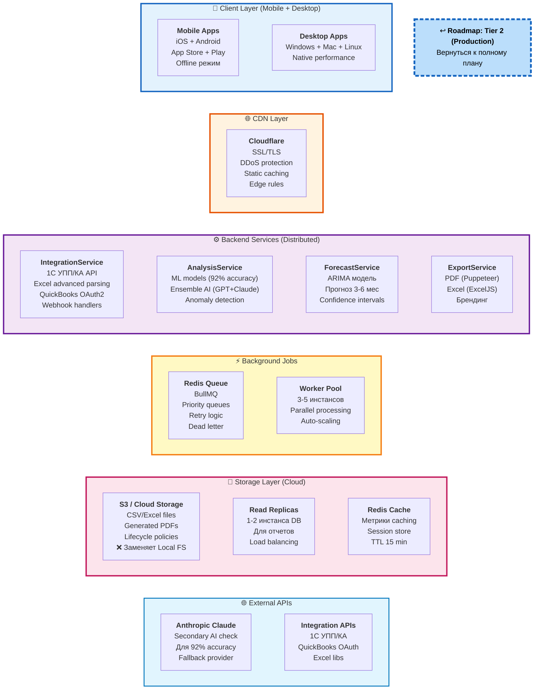

# 2b. Tier 2: Production - Что добавляется к Tier 1

> **Что показано:** ТОЛЬКО новые компоненты, добавляемые к Tier 1 MVP  
> **База:** Tier 1 (Web app, monolith backend, PostgreSQL, OpenAI) уже есть  
> **Цель:** Реализовать 100% обещаний из диаграммы 1, масштабировать до 50 клиентов

**[↩️ Вернуться к Roadmap (Диаграмма 10)](#)** → Кликабельная ссылка в диаграмме ниже



## 🔄 Изменения относительно Tier 1

### ✅ Что ДОБАВЛЯЕТСЯ:
- 💾 **PostgreSQL** (впервые! users + reports + analysis - в MVP не было БД!)
- 🔐 **Auth Service** (JWT, Email/Password, OAuth)
- 💳 **Stripe Billing** (подписки $99/мес)
- 📋 **История отчетов** (сохранение навсегда)
- 📱 Mobile Apps (iOS + Android)
- 📱 Desktop Apps (Windows + Mac + Linux)
- 🌐 Cloudflare CDN
- ⚙️ IntegrationService (1C, QuickBooks, Excel)
- ⚙️ AnalysisService (ML models, 92% accuracy)
- ⚙️ ForecastService (прогноз 3-6 мес)
- ⚙️ ExportService (PDF/Excel)
- ⚡ Redis Queue + Workers (3-5 инстансов)
- 💾 S3 / Cloud Storage
- 💾 Read Replicas (1-2 инстанса DB)
- 💾 Redis Cache
- 🌐 Anthropic Claude (secondary AI)

### ❌ Что УДАЛЯЕТСЯ/ЗАМЕНЯЕТСЯ:
- ❌ **Stateless архитектура** → ✅ Stateful (добавляется БД)
- ❌ **Анонимный доступ** → ✅ Обязательная регистрация
- ❌ **Результат только в ответе** → ✅ Сохранение в PostgreSQL
- ❌ **In-memory file processing** → ✅ S3 / Cloud Storage (постоянное хранение файлов)
- ⚠️ **Monolith backend** → ✅ Distributed services (разбивается на отдельные сервисы)

### 🔧 Что ОСТАЁТСЯ (из Tier 1):
- ✅ Web app (Flutter) - добавляется регистрация/логин
- ✅ REST API - теперь с /auth/*, /reports/* endpoints
- ✅ OpenAI GPT-4 (primary AI)
- ✅ FileService, AIService (логика та же, но теперь сохраняем результат)
- ✅ In-memory CSV parsing (для быстрого анализа)

---

## Новые компоненты Tier 2

### Кросс-платформенность (из обещаний)
**Mobile (iOS + Android):**
- Flutter native apps
- Push уведомления (Firebase)
- Offline режим (SQLite локально)
- App Store + Google Play

**Desktop (Windows + Mac):**
- Flutter desktop apps
- Полноценный offline режим
- Автообновления
- Нативные уведомления

### Интеграции (из обещаний)
**1C УПП/КА (только 1 версия!):**
- REST API connector
- Автоматический импорт отчетов
- Синхронизация категорий
- Focus на самую популярную версию в РФ
- **Почему не SAP?** Откладываем до Tier 3 (требует enterprise клиента-спонсора)

**QuickBooks:**
- OAuth2 integration
- Webhook для real-time updates
- Mapping категорий

**Excel advanced:**
- Парсинг .xlsx файлов
- Поддержка формул
- Мультилистовые файлы
- ExcelJS library

### 4 типа отчетов (полная версия из обещаний)

**1. Главный дашборд:**
```typescript
interface Dashboard {
  metrics: {
    totalRevenue: number;
    totalExpenses: number;
    profitMargin: number;
    burnRate: number;
    runway: number; // месяцев
  };
  charts: {
    revenuetrend: TimeSeriesData;
    categoryBreakdown: PieChartData;
    monthlyComparison: BarChartData;
  };
  topRisks: Risk[]; // Top 3
}
```

**2. Детальные отчеты:**
- По категориям (Marketing, Salaries, Office, etc.)
- Сравнение с прошлыми периодами
- Drill-down по транзакциям

**3. AI рекомендации:**
- Конкретные действия ("Reduce marketing spend by 15%")
- Оценка эффекта в деньгах
- Приоритеты (High/Medium/Low)

**4. Прогноз:**
- 3-6 месяцев вперед
- Confidence intervals (80%, 95%)
- Сценарии (optimistic/realistic/pessimistic)

### Экспорт PDF/Excel (из обещаний)

**PDF Export:**
- Puppeteer для рендеринга
- Кастомный брендинг (лого, цвета)
- Все графики и таблицы
- Генерация 5-10 секунд

**Excel Export:**
- ExcelJS library
- Все raw данные
- Сводные таблицы
- Форматирование

### Точность 92% (улучшение с 75-80%)

**Улучшения анализа:**
- ML модели для обнаружения аномалий
- Двойная проверка: GPT-4 + Claude
- Тестирование на 500+ реальных отчетах
- Continuous learning от feedback

**Metrics tracking:**
```typescript
interface AnalysisQuality {
  accuracy: number; // 92%+
  precision: number;
  recall: number;
  f1Score: number;
  falsePositiveRate: number; // < 5%
}
```

### Background Processing (40 часов экономии)

**Redis + BullMQ:**
- Приоритетные очереди (premium users first)
- Параллельная обработка (3-5 workers)
- Retry logic с exponential backoff
- Dead letter queue для failed jobs

**Workers:**
```typescript
Queue Jobs:
- analyze_report (priority: high)
- generate_forecast (priority: medium)
- export_pdf (priority: medium)
- sync_integration (priority: low)
- send_notification (priority: high)
```

## Масштабирование

### Performance
- **Max CSV size:** 50MB (~500K строк)
- **Analysis time:** 10-30 секунд (параллельная обработка)
- **Concurrent users:** 100-200
- **API rate limit:** 1000 req/min per user

### Availability
- **Uptime:** 99% SLA
- **Read replicas:** 1-2 для отчетов
- **Auto-scaling:** 2-5 backend instances
- **Backups:** Каждые 6 часов

### Monitoring (базовое)
```
- Sentry для errors
- LogRocket для session replay
- Simple metrics dashboard (Grafana Cloud free)
```

## Инфраструктура Tier 2

### Deployment
```
Frontend Web:     Vercel ($20/month - Pro)
Mobile:           Self-hosted CI/CD
Desktop:          GitHub Releases
Backend:          AWS ECS / GCP Cloud Run ($150/month)
Database:         AWS RDS / GCP Cloud SQL ($100/month)
Redis:            AWS ElastiCache / Redis Cloud ($50/month)
S3:               AWS S3 ($20/month)
Cloudflare:       Pro plan ($20/month)
Total:            ~$360/month
```

### Cost per customer
```
50 клиентов × $99/мес = $4,950/мес revenue
Infrastructure: $360/мес
AI API costs: ~$500/мес (50 users × $10)
Total costs: $860/мес
Gross margin: 83% ✅
```

## Соответствие обещаниям

| Обещание | Tier 1 | Tier 2 |
|----------|--------|--------|
| CSV загрузка за 1 клик | ✅ | ✅ |
| Анализ за 3 минуты | ⚠️ 60s | ✅ 10-30s |
| 4 типа отчетов | ⚠️ 3 метрики | ✅ Полный |
| Экспорт PDF/Excel | ❌ | ✅ |
| Точность 92% | ⚠️ 75-80% | ✅ 92%+ |
| Интеграции 1C | ❌ | ✅ УПП/КА |
| Интеграции SAP | ❌ | ❌ (Tier 3) |
| Кросс-платформа | ⚠️ Web only | ✅ Все |
| 40 часов экономии | ⚠️ ~20 часов | ✅ 40+ |

**Результат: 100% обещаний выполнено! ✅**

## Метрики успеха Tier 2

### Технические:
- ✅ API response time < 1s (95th percentile)
- ✅ Анализ завершается за < 30s
- ✅ Uptime > 99%
- ✅ Zero data loss
- ✅ Accuracy > 92%

### Бизнес:
- ✅ 50+ клиентов
- ✅ Экономия 40+ часов/месяц
- ✅ NPS > 60
- ✅ Churn < 5%
- ✅ 20%+ MoM growth

## Переход к Tier 3

**Когда готовы:**
1. ✅ Достигли 50 клиентов
2. ✅ Churn стабилен < 5%
3. ✅ Запросы от enterprise на multi-user
4. ✅ Запросы на SOC 2 сертификацию
5. ✅ Готовы нанять 2-3 devops/инженеров

**Что добавится в Tier 3:**
- Multi-user + RBAC (workspaces)
- SOC 2 Type I сертификация (6-9 мес)
- Real-time collaboration (WebSocket)
- Advanced customization (own AI prompts)
- **SAP integration** (если есть клиент-спонсор $50K/год)
- Enterprise SLA (99.9% uptime)
