# 2c. Tier 3: Enterprise - Что добавляется к Tier 2

> **Что показано:** ТОЛЬКО новые enterprise компоненты, добавляемые к Tier 2  
> **База:** Tier 1 + Tier 2 (кросс-платформа, интеграции, 92% accuracy) уже есть  
> **Цель:** Поддержка enterprise клиентов (10+ компаний, $10K+/год deals), 99.9% uptime

**[↩️ Вернуться к Roadmap (Диаграмма 10)](#)** → Кликабельная ссылка в диаграмме ниже

```mermaid
graph TB
    subgraph clientFeatures ["📱 Client Layer (Multi-user)"]
        direction LR
        multiuser["<b>Multi-user Features</b><br/>Workspaces<br/>RBAC (roles)<br/>Team collaboration<br/>Presence indicators"]
        websocket["<b>Real-time Updates</b><br/>Live notifications<br/>Collaborative editing<br/>Activity feed"]
        
        multiuser ~~~ websocket
    end
    
    clientFeatures ~~~ edge
    
    subgraph edge ["🌐 Edge Security"]
        direction LR
        waf["<b>WAF</b><br/>DDoS protection<br/>Rate limiting<br/>Geo-blocking<br/>IP whitelisting"]
        lb["<b>Global Load Balancer</b><br/>Multi-region<br/>Health checks<br/>Auto-failover<br/>SSL termination"]
        
        waf ~~~ lb
    end
    
    edge ~~~ security
    
    subgraph security ["🔒 Enterprise Security"]
        direction LR
        
        sso["<b>SSO/MFA</b><br/>SAML 2.0<br/>OAuth2/OIDC<br/>MFA enforcement<br/>Session management"]
        rbac["<b>RBAC Engine</b><br/>Owner/Admin/Analyst/Viewer<br/>Custom roles<br/>Permission matrix<br/>API-level checks"]
        audit["<b>Audit Service</b><br/>All actions logged<br/>Immutable logs<br/>Compliance reports<br/>GDPR tools"]
        
        sso ~~~ rbac ~~~ audit
    end
    
    security ~~~ newAppServices
    
    subgraph newAppServices ["⚙️ Backend Services (Enterprise)"]
        direction LR
        
        workspace["<b>WorkspaceService</b><br/>Multi-tenant isolation<br/>Quotas per workspace<br/>Team management<br/>Billing per workspace"]
        custom["<b>CustomizationService</b><br/>Custom AI prompts<br/>Custom metrics<br/>White-labeling<br/>Domain-specific models"]
        sap["<b>SAP Connector</b><br/>OData API<br/>RFC protocol<br/>Real-time sync<br/>⚠️ Только если sponsor"]
        
        workspace ~~~ custom ~~~ sap
    end
    
    newAppServices ~~~ realtime
    
    subgraph realtime ["⚡ Real-time Layer"]
        direction LR
        
        ws["<b>WebSocket Server</b><br/>Socket.io cluster<br/>Presence tracking<br/>Typing indicators<br/>Broadcast events"]
        notifications["<b>NotificationService</b><br/>Push (FCM)<br/>Email templates<br/>Slack/Teams webhooks<br/>In-app notifications"]
        collab["<b>CollaborationService</b><br/>Comments on reports<br/>@mentions<br/>Activity timeline<br/>Version history"]
        
        ws ~~~ notifications ~~~ collab
    end
    
    realtime ~~~ queueUpgrade
    
    subgraph queueUpgrade ["⚙️ Background Jobs (upgraded)"]
        direction LR
        
        kafka["<b>Kafka/RabbitMQ</b><br/>❌ Заменяет BullMQ<br/>Distributed queue<br/>Message persistence<br/>Multi-consumer"]
        workerScale["<b>Worker Pool</b><br/>10-20 instances<br/>⚠️ (было 3-5)<br/>Auto-scaling<br/>Spot instances"]
        scheduler["<b>Scheduler</b><br/>Cron jobs<br/>Recurring reports<br/>Data sync tasks"]
        
        kafka ~~~ workerScale ~~~ scheduler
    end
    
    queueUpgrade ~~~ dataUpgrade
    
    subgraph dataUpgrade ["💾 Storage Layer (Multi-region)"]
        direction LR
        
        multiaz["<b>Primary DB</b><br/>Multi-AZ<br/>Auto-failover < 30s<br/>Connection pooling<br/>Query optimization"]
        moreReplicas["<b>Read Replicas</b><br/>2-3 инстанса<br/>⚠️ (было 1-2)<br/>Geo-distributed<br/>Load balancing"]
        redisCluster["<b>Redis Cluster</b><br/>3+ nodes<br/>❌ (был 1 instance)<br/>High availability<br/>Sentinel"]
        
        multiaz ~~~ moreReplicas ~~~ redisCluster
    end
    
    dataUpgrade ~~~ newStorage
    
    subgraph newStorage ["📦 Object Storage (Advanced)"]
        direction LR
        
        multiregion["<b>Multi-region S3</b><br/>Cross-region replication<br/>Versioning<br/>Lifecycle policies<br/>Glacier archiving"]
        backup["<b>Backup System</b><br/>Daily automated backups<br/>Point-in-time recovery<br/>30-day retention<br/>Disaster recovery"]
        
        multiregion ~~~ backup
    end
    
    newStorage ~~~ monitoring
    
    subgraph monitoring ["📊 Observability Stack"]
        direction LR
        
        prometheus["<b>Prometheus + Grafana</b><br/>Metrics collection<br/>Custom dashboards<br/>Alert manager<br/>PagerDuty integration"]
        elk["<b>ELK Stack</b><br/>Elasticsearch<br/>Logstash<br/>Kibana<br/>90-day retention"]
        jaeger["<b>Jaeger Tracing</b><br/>Distributed tracing<br/>Performance profiling<br/>Latency analysis<br/>Dependency mapping"]
        
        prometheus ~~~ elk ~~~ jaeger
    end
    
    monitoring ~~~ compliance
    
    subgraph compliance ["🛡️ Compliance"]
        direction LR
        
        soc2["<b>SOC 2 Type I</b><br/>6-9 месяцев сертификации<br/>Quarterly audits<br/>Evidence collection<br/>$50K-100K investment"]
        pentest["<b>Security Testing</b><br/>Quarterly pentests<br/>Weekly vuln scans<br/>Bug bounty program<br/>Incident response"]
        
        soc2 ~~~ pentest
    end
    
    phase3Nav["↩️ <b>Roadmap: Tier 3 (Enterprise)</b><br/>Вернуться к полному плану"]
    
    click phase3Nav "?diagram=10" "Вернуться к Roadmap"
    
    style clientFeatures fill:#e3f2fd,stroke:#1565c0,stroke-width:3px
    style edge fill:#fff3e0,stroke:#e65100,stroke-width:3px
    style security fill:#ffebee,stroke:#c62828,stroke-width:4px
    style newAppServices fill:#e8f5e9,stroke:#2e7d32,stroke-width:3px
    style realtime fill:#fff9c4,stroke:#f57f17,stroke-width:3px
    style queueUpgrade fill:#fce4ec,stroke:#c2185b,stroke-width:2px
    style dataUpgrade fill:#e0f2f1,stroke:#00695c,stroke-width:3px
    style newStorage fill:#f3e5f5,stroke:#7b1fa2,stroke-width:2px
    style monitoring fill:#ede7f6,stroke:#4527a0,stroke-width:3px
    style compliance fill:#e0f7fa,stroke:#00838f,stroke-width:3px
    style phase3Nav fill:#ffe0b2,stroke:#e65100,stroke-width:4px,stroke-dasharray: 8 4,cursor:pointer,color:#000
```



## 🔄 Изменения относительно Tier 2

### ✅ Что ДОБАВЛЯЕТСЯ:
- 📱 Multi-user Features (Workspaces, RBAC, Team collaboration)
- 📱 Real-time Updates (Live notifications, Collaborative editing)
- 🌐 WAF (DDoS protection, Rate limiting)
- 🌐 Global Load Balancer (Multi-region, Auto-failover)
- 🔒 SSO/MFA (SAML, OAuth2, MFA enforcement)
- 🔒 RBAC Engine (4+ roles, Permission matrix)
- 🔒 Audit Service (All actions logged, Compliance)
- ⚙️ WorkspaceService (Multi-tenant isolation)
- ⚙️ CustomizationService (Custom AI prompts, White-labeling)
- ⚙️ SAP Connector (если sponsor)
- ⚡ WebSocket Server (Socket.io cluster, Presence)
- ⚡ NotificationService (Push, Email, Slack/Teams)
- ⚡ CollaborationService (Comments, @mentions)
- ⚡ Scheduler (Cron jobs, Recurring reports)
- 💾 Multi-AZ DB (Auto-failover < 30s)
- 💾 Read Replicas upgrade (2-3 инстанса, geo-distributed)
- 📦 Multi-region S3 (Cross-region replication)
- 📦 Backup System (Point-in-time recovery)
- 📊 Prometheus + Grafana (Metrics, Alerts)
- 📊 ELK Stack (Logs, 90-day retention)
- 📊 Jaeger Tracing (Distributed tracing)
- 🛡️ SOC 2 Type I (6-9 месяцев сертификации)
- 🛡️ Security Testing (Quarterly pentests)

### ❌ Что УДАЛЯЕТСЯ/ЗАМЕНЯЕТСЯ:
- ❌ **BullMQ** → ✅ Kafka/RabbitMQ (более мощная очередь для enterprise)
- ❌ **Single Redis instance** → ✅ Redis Cluster (3+ nodes, high availability)
- ❌ **Single-region DB** → ✅ Multi-AZ DB (auto-failover)
- ❌ **Single-region S3** → ✅ Multi-region S3 (cross-region replication)
- ⚠️ **3-5 workers** → ✅ 10-20 workers (auto-scaling)
- ⚠️ **1-2 read replicas** → ✅ 2-3 geo-distributed replicas

### 🔧 Что ОСТАЁТСЯ (из Tier 1 + Tier 2):
- ✅ Web + Mobile + Desktop apps (добавляются multi-user фичи)
- ✅ Cloudflare CDN (расширяется до WAF + Global LB)
- ✅ Distributed services (добавляются enterprise сервисы)
- ✅ PostgreSQL (upgradeится до Multi-AZ)
- ✅ S3 storage (upgradeится до multi-region)
- ✅ Интеграции: 1C УПП/КА, QuickBooks, Excel (добавляется SAP)
- ✅ AI: OpenAI + Claude (добавляется customization)
- ✅ Экспорт PDF/Excel (остаётся)

---

## Новые enterprise компоненты Tier 3

### Multi-user + RBAC

**Workspaces:**
```typescript
interface Workspace {
  id: string;
  name: string;
  plan: 'starter' | 'business' | 'enterprise';
  members: WorkspaceMember[];
  quotas: {
    maxUsers: number;
    maxReports: number;
    maxStorage: number;
  };
}

interface WorkspaceMember {
  userId: string;
  role: 'owner' | 'admin' | 'analyst' | 'viewer' | 'custom';
  permissions: Permission[];
}
```

**Roles:**
- **Owner:** Все права + биллинг
- **Admin:** Управление пользователями, настройки
- **Analyst:** Загрузка отчетов, анализ, экспорт
- **Viewer:** Только просмотр отчетов
- **Custom:** Гранулярные permissions

### SOC 2 Compliance

**Audit Logging:**
```typescript
interface AuditLog {
  timestamp: Date;
  userId: string;
  workspaceId: string;
  action: string; // "report.upload", "user.invite", etc.
  resource: string;
  ip: string;
  userAgent: string;
  result: 'success' | 'failure';
  metadata: Record<string, any>;
}
```

**Compliance Features:**
- ✅ All actions logged (immutable)
- ✅ Data encryption at rest (AES-256)
- ✅ Data encryption in transit (TLS 1.3)
- ✅ GDPR compliance (data export, deletion)
- ✅ Penetration testing (quarterly)
- ✅ Vulnerability scanning (weekly)
- ✅ Access reviews (monthly)

### Real-time Collaboration

**WebSocket Events:**
```typescript
Events:
- user.joined / user.left
- report.uploaded
- analysis.started / analysis.completed
- comment.added
- mention.created
- typing.start / typing.stop
```

**Features:**
- Presence indicators (who's online)
- Live comments on reports
- @mentions with notifications
- Activity feed per workspace
- Typing indicators

### Customization

**Custom Metrics:**
```typescript
interface CustomMetric {
  id: string;
  name: string;
  formula: string; // "revenue - expenses"
  format: 'currency' | 'percentage' | 'number';
  visualization: 'line' | 'bar' | 'pie' | 'gauge';
}
```

**Custom AI Prompts:**
- Enterprise can define own prompts
- Training on their data
- Domain-specific vocabulary
- Custom anomaly rules

**White-labeling:**
- Custom logo
- Custom colors
- Custom domain
- Removal of branding

### Advanced Integrations (включая SAP)

**Поддержка:**
- 1C (REST API)
- SAP (OData + RFC)
- QuickBooks (OAuth2)
- Xero
- NetSuite
- Oracle Financials
- Microsoft Dynamics
- Custom CSV/Excel
- REST API webhooks
- FTP/SFTP sync

**iPaaS Integration:**
- Zapier
- Make (Integromat)
- n8n (self-hosted)

## Infrastructure Enterprise

### High Availability
```
- Multi-region deployment (US, EU, APAC)
- Auto-failover < 30 seconds
- Zero-downtime deployments
- Rolling updates
- Blue-green deployment strategy
```

### Scaling
```
- Horizontal scaling (10-50 instances)
- Auto-scaling rules:
  * CPU > 70% → +2 instances
  * CPU < 30% → -1 instance
  * Min 5 instances, Max 50
- Database connection pooling (PgBouncer)
- Read/write splitting
```

### Disaster Recovery
```
- RPO: < 1 hour (continuous backups)
- RTO: < 4 hours (automated recovery)
- Multi-region replication
- Automated failover tests (monthly)
- Runbooks for all scenarios
```

### Security
```
- WAF (Web Application Firewall)
- DDoS protection (Layer 3/4/7)
- IP whitelisting
- VPN access for enterprise
- SSO (SAML 2.0, OAuth2, OIDC)
- MFA enforced
- Security headers (CSP, HSTS, etc.)
```

## Monitoring & Observability

### Metrics (Prometheus + Grafana)
```
- API latency (p50, p95, p99)
- Error rates (4xx, 5xx)
- Database performance (query time, connections)
- Cache hit rate
- Queue depth
- Worker utilization
- AI API costs
- User activity
```

### Logs (ELK Stack)
```
- Structured JSON logs
- Correlation IDs across services
- 90-day retention
- Full-text search
- Log aggregation by workspace
```

### Distributed Tracing (Jaeger)
```
- End-to-end request tracking
- Performance bottlenecks
- Dependency mapping
- Latency analysis
```

### Alerts
```
- PagerDuty integration
- On-call rotation
- Escalation policies
- Runbooks linked to alerts

Examples:
- Uptime < 99.9% → page oncall
- Error rate > 1% → alert team
- Database connections > 80% → alert devops
- AI API fails → switch to backup
```

## Performance SLA

### Enterprise SLA (99.9% uptime)
```
Uptime: 99.9% (< 44 minutes downtime/month)
API Latency: < 200ms (p95)
Analysis Time: < 30s (p95)
Support: 24/7, < 1h response
Credits: 10% credit per 0.1% missed SLA
```

### Capacity
```
Concurrent Users: 1000+
Reports/month: 10,000+
Storage: Unlimited
API rate limit: 10,000 req/min per workspace
```

## Cost Structure Tier 3

### Infrastructure (~$3,000/month)
```
Compute (AWS ECS / GCP): $1,200
Database (Multi-AZ): $600
Redis Cluster: $200
S3 Storage: $100
CloudFront CDN: $150
Load Balancers: $200
Monitoring (Datadog): $300
Logs (ELK): $150
Backups: $100
```

### Per-Customer Economics
```
10 enterprise @ $15K/year = $150K/year = $12,500/month
Infrastructure: $3,000/month
AI API costs: $2,000/month (10 workspaces × $200)
Support: $2,000/month (1 FTE)
Total costs: $7,000/month
Gross margin: 44%

Break-even: ~6 enterprise customers
```

## Compliance Certifications

### SOC 2 Type II
- **Cost:** $50K-100K initial
- **Timeline:** 6-12 months
- **Maintenance:** $20K/year

### ISO 27001 (optional)
- **Cost:** $30K-50K
- **Timeline:** 6-9 months

### GDPR Compliance
- Built-in from Phase 2
- Data residency options (EU/US)
- Data portability
- Right to be forgotten

## Team Requirements

### Minimal Team for Tier 3:
```
- 2 Backend Engineers
- 1 Frontend Engineer
- 1 DevOps Engineer
- 1 QA Engineer
- 1 Product Manager
- 0.5 FTE Security Engineer (consultant)
- 0.5 FTE Support Engineer
```

## Metrics Success Tier 3

### Technical:
- ✅ Uptime 99.9%
- ✅ API latency < 200ms (p95)
- ✅ Zero data breaches
- ✅ SOC 2 certified

### Business:
- ✅ 10+ enterprise customers
- ✅ Average deal > $10K/year
- ✅ NPS > 70
- ✅ Churn < 3%
- ✅ Logo retention 95%+

## Production Readiness

### После Tier 3 готовы к:
- ✅ Fortune 500 клиентам
- ✅ Регулируемым индустриям (finance, healthcare)
- ✅ Крупным deals ($50K-100K+/year)
- ✅ On-premise deployment (по запросу)
- ✅ Аудитам от enterprise клиентов
- ✅ 24/7 support с SLA
- ✅ Dedicated customer success
