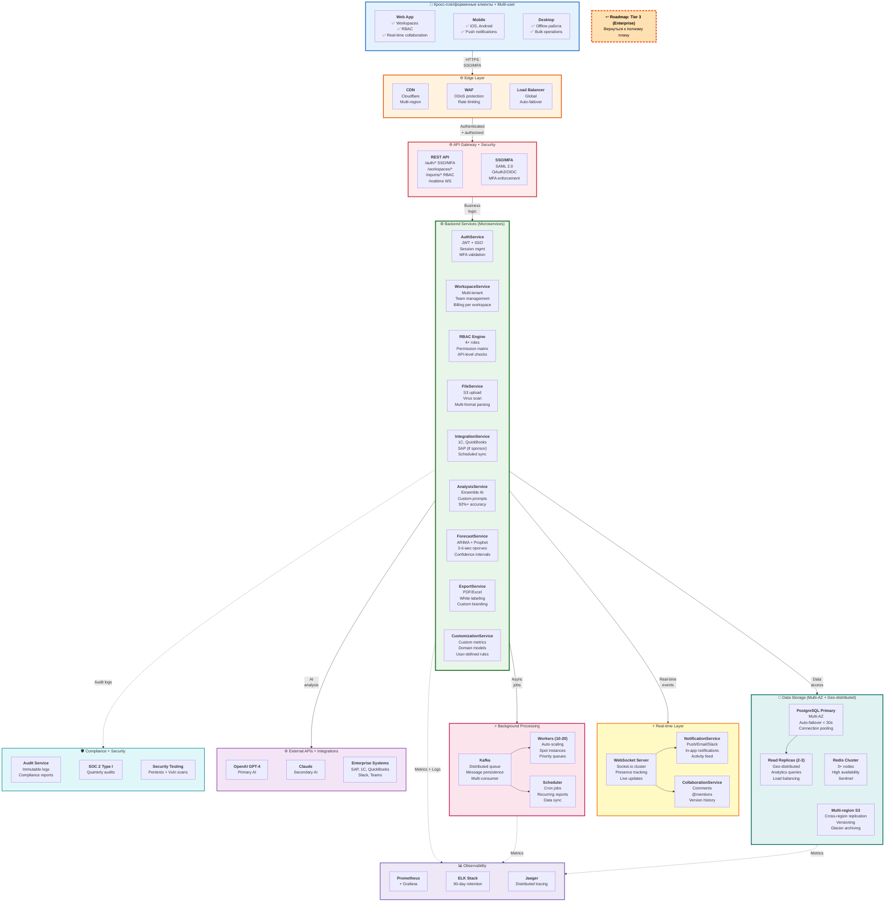

# 2c. Tier 3: Enterprise - Полная архитектура

> **Что показано:** Полная архитектура Enterprise системы (эволюция от Tier 2 Production)  
> **База:** Все из Tier 1 + Tier 2 + enterprise features + 99.9% uptime  
> **Цель:** 10+ enterprise клиентов ($10K+/год), SOC 2, multi-user, real-time collaboration

**[↩️ Вернуться к Roadmap (Диаграмма 10)](#)** → Кликабельная ссылка в диаграмме ниже



## Что включено в Tier 3

### ✅ Клиенты (Multi-user + Collaboration)

**Web App (Enterprise):**
- **Workspaces**: Multi-tenant isolation, team management
- **RBAC**: Owner/Admin/Analyst/Viewer roles + custom roles
- **Real-time collaboration**: Live updates, presence indicators, typing
- **Comments & @mentions**: На любой отчет/метрику
- **Activity feed**: Что делает команда в real-time
- **Version history**: Откат к любой версии отчета

**Mobile + Desktop:**
- Все из Tier 2 + push notifications для team activity
- Offline work с sync при подключении
- White-label branding для enterprise клиентов

### ✅ Backend (Microservices Architecture)

**AuthService (SSO + MFA):**
```typescript
POST /auth/sso/saml
  Input: SAML assertion от IdP (Okta, Azure AD, Auth0)
  Output: { accessToken, refreshToken, user }
  
  Flow:
  1. Validate SAML signature (IdP certificate)
  2. Extract user attributes (email, name, roles)
  3. Auto-provision user in workspace (JIT provisioning)
  4. Generate JWT tokens
  5. Enforce MFA if required by workspace policy
  
POST /auth/mfa/challenge
  Input: { userId, method: 'totp' | 'sms' | 'email' }
  Output: { challengeId, expiresIn: 300s }
  
POST /auth/mfa/verify
  Input: { challengeId, code: '123456' }
  Output: { accessToken, refreshToken }
  
Tech:
- SAML 2.0 (passport-saml)
- OAuth2/OIDC (passport-oauth2)
- TOTP (speakeasy library)
- SMS (Twilio API)
```

**WorkspaceService (Multi-tenant):**
```typescript
POST /workspaces
  Input: { name, settings: {...} }
  Output: { workspaceId, ownerId }
  
  Settings:
  - mfaRequired: boolean
  - allowedDomains: ['company.com']
  - dataRetention: 365 days
  - customBranding: { logo, colors, domain }
  - quotas: { maxUsers: 50, maxReports: 1000 }
  
POST /workspaces/:id/members
  Input: { email, role: 'admin' | 'analyst' | 'viewer' }
  Output: { inviteId, inviteLink }
  
  RBAC Matrix:
  - Owner: все права + billing + delete workspace
  - Admin: все права кроме billing
  - Analyst: создавать/редактировать отчеты, нельзя управлять users
  - Viewer: только просмотр отчетов, нельзя создавать

Multi-tenant Isolation:
- Row-level security (RLS) в PostgreSQL:
  ALTER TABLE reports ENABLE ROW LEVEL SECURITY;
  CREATE POLICY workspace_isolation ON reports
    USING (workspace_id = current_setting('app.workspace_id')::uuid);
- Отдельные S3 prefixes: /workspaces/{workspaceId}/
- Redis namespacing: workspace:{workspaceId}:*
```

**RBAC Engine:**
```typescript
POST /rbac/check
  Input: { userId, resource: 'reports', action: 'update', reportId }
  Output: { allowed: boolean, reason?: string }
  
  Logic:
  1. Get user's role in workspace
  2. Check permission matrix (role → resource → actions)
  3. Check resource ownership (если analyst, может редактировать только свои)
  4. Check custom rules (если есть)
  5. Audit log (кто, что, когда, allowed/denied)
  
Permission Matrix:
┌──────────┬──────────┬──────────┬──────────┬──────────┐
│ Role     │ reports  │ members  │ billing  │ settings │
├──────────┼──────────┼──────────┼──────────┼──────────┤
│ Owner    │ CRUD all │ CRUD all │ CRUD     │ CRUD     │
│ Admin    │ CRUD all │ CRUD all │ Read     │ CRUD     │
│ Analyst  │ CRUD own │ Read     │ -        │ Read     │
│ Viewer   │ Read all │ Read     │ -        │ Read     │
└──────────┴──────────┴──────────┴──────────┴──────────┘

API-level enforcement:
- Middleware: checkPermission('reports', 'update')
- Декоратор: @RequirePermission('reports', 'delete')
- Fail-safe: default deny (если правило не найдено → 403)
```

**CustomizationService (White-label + Custom AI):**
```typescript
POST /workspaces/:id/customization/ai-prompt
  Input: { 
    name: 'Cash Flow Analysis',
    prompt: 'Focus on operating cash flow trends...',
    metrics: ['ocf', 'fcf', 'burnRate']
  }
  Output: { promptId }
  
  Usage:
  - Admin может создавать custom prompts
  - Analysts видят их в dropdown при анализе
  - AI использует custom prompt + base context
  - Результаты помечены как "Custom: Cash Flow Analysis"

POST /workspaces/:id/customization/branding
  Input: {
    logo: 'https://s3.../logo.png',
    primaryColor: '#1E3A8A',
    secondaryColor: '#10B981',
    customDomain: 'analytics.company.com'
  }
  
  Apply to:
  - Web app (logo in header, color scheme)
  - Exported PDFs (logo, footer with company name)
  - Email notifications (custom from: analytics@company.com)
  - Mobile apps (splash screen, app icon - requires rebuild)

POST /workspaces/:id/customization/metrics
  Input: {
    name: 'Patient Lifetime Value',
    formula: 'SUM(revenue) / DISTINCT(patient_id)',
    category: 'Revenue'
  }
  
  Custom Metrics:
  - Domain-specific (PLV для стоматологии, ARR для SaaS)
  - SQL-like formula language (safe, sandboxed)
  - Calculated during analysis
  - Shown в отчетах наравне с базовыми метриками
```

**SAP Connector (если есть sponsor):**
```typescript
POST /integrations/sap/connect
  Input: {
    host: 'sap.company.com',
    client: '100',
    username: 'RFC_USER',
    password: '***',
    system: 'ECC' | 'S/4HANA'
  }
  Output: { connectionId, status: 'testing' }
  
  Protocols:
  - OData API (REST-like, preferred для S/4HANA)
  - RFC (Remote Function Call, legacy для ECC)
  - IDoc (async документы)
  
POST /integrations/sap/sync
  Input: { connectionId, entities: ['FI', 'CO'] }
  Output: { jobId, status: 'queued' }
  
  Entities:
  - FI (Financial Accounting): GL accounts, postings
  - CO (Controlling): cost centers, profit centers
  - SD (Sales & Distribution): invoices, revenue
  - MM (Materials Management): procurement, inventory
  
  Challenges:
  - Сложная авторизация (3+ уровня)
  - Медленные запросы (минуты на большие выборки)
  - Нестабильные схемы (custom fields в каждой компании)
  - Дорогая maintenance (нужен SAP эксперт)
  
  Why только если sponsor:
  - Требует dedicated SAP инженера ($150K/год)
  - Каждый клиент = custom integration (нет "одна интеграция для всех")
  - Long sales cycle (6-12 месяцев для enterprise deal)
  - Sponsor платит upfront за development + annual maintenance
```

### ✅ Real-time Layer

**WebSocket Server (Socket.io Cluster):**
```typescript
WS /realtime
  Auth: JWT token в handshake
  
  Events (client → server):
  - join_workspace: { workspaceId }
  - join_report: { reportId }
  - typing: { reportId, commentId }
  - cursor_move: { reportId, position: {x, y} }
  
  Events (server → client):
  - user_joined: { userId, name, avatar }
  - user_left: { userId }
  - report_updated: { reportId, changes: {...} }
  - comment_added: { reportId, comment: {...} }
  - typing_indicator: { userId, name }
  - presence_update: { userId, status: 'active' | 'away' }
  
  Architecture:
  - Socket.io cluster (3+ nodes за load balancer)
  - Redis adapter (shared state между nodes)
  - Sticky sessions (nginx: ip_hash)
  - Automatic reconnect (exponential backoff)
  - Heartbeat every 30s (disconnect if no response 90s)
  
  Presence tracking:
  - Active: < 5 min since last activity
  - Away: 5-30 min
  - Offline: > 30 min or disconnected
```

**NotificationService:**
```typescript
POST /notifications/send
  Input: {
    userId,
    type: 'push' | 'email' | 'slack' | 'in_app',
    template: 'report_ready',
    data: { reportId, reportName }
  }
  
  Channels:
  
  1. Push (Firebase Cloud Messaging):
     - Mobile: native push (badge, sound, vibration)
     - Web: browser notifications (если разрешено)
     - Desktop: OS-level notifications
     
  2. Email (SendGrid):
     - Transactional: report ready, export done
     - Digest: daily/weekly summary
     - Alerts: anomalies detected, quota exceeded
     - Custom templates (white-label branding)
     
  3. Slack/Teams webhooks:
     - POST https://hooks.slack.com/services/...
     - Formatted message (markdown, attachments)
     - Action buttons (View Report, Download)
     
  4. In-app:
     - Bell icon (unread count)
     - Real-time updates (WebSocket)
     - Persistent (хранятся в DB 30 days)
     - Mark as read/unread, bulk actions
     
  User preferences:
  - Выбор каналов per notification type
  - Quiet hours (не беспокоить 22:00-08:00)
  - Digest frequency (instant, hourly, daily, weekly)
```

**CollaborationService:**
```typescript
POST /reports/:id/comments
  Input: { 
    text: 'Great insight! @john check this anomaly',
    mentionedUsers: ['john-uuid'],
    attachments: [{ type: 'screenshot', url: '...' }]
  }
  Output: { commentId, createdAt }
  
  Features:
  - Markdown support (bold, italic, lists, code blocks)
  - @mentions (notify mentioned users)
  - Thread replies (nested comments)
  - Reactions (👍 ❤️ 🎉)
  - Edit/delete (audit trail сохраняется)
  - Search comments (full-text)
  
POST /reports/:id/versions
  Output: [
    { version: 3, timestamp, author, changes: 'Updated forecast model' },
    { version: 2, timestamp, author, changes: 'Added custom metrics' },
    { version: 1, timestamp, author, changes: 'Initial analysis' }
  ]
  
GET /reports/:id/versions/:version
  Output: { reportData as of version }
  
  Version history:
  - Автоматический snapshot при каждом significant change
  - Manual snapshot (Save as version)
  - Diff view (что изменилось между версиями)
  - Restore to version (creates new version based on old)
  - 90-day retention (старше архивируются в S3)
```

### ✅ Background Processing (Upgraded)

**Kafka (замена BullMQ):**
```typescript
Topics:
- analysis.requests (partition by workspaceId)
- forecast.requests (partition by workspaceId)
- export.requests (partition by userId)
- integrations.sync (partition by connectionId)
- notifications.send (partition by userId)

Producers:
- API services → Kafka (async fire-and-forget)
- Message key = workspaceId (для partition ordering)
- Compression: gzip (reduce network)

Consumers:
- Worker pool (10-20 instances)
- Consumer group (load balancing)
- Offset commit after successful processing
- Dead letter queue для failed messages (retry 3x → DLQ)
- At-least-once delivery (idempotent handlers!)

Why Kafka (vs BullMQ):
- ✅ Distributed (multi-region replication)
- ✅ Persistent (сообщения не теряются при restart)
- ✅ Multi-consumer (разные worker groups для разных задач)
- ✅ High throughput (millions msgs/sec)
- ❌ More complex (requires Zookeeper or KRaft)
- ❌ Higher latency (10-50ms vs 1-5ms для Redis)
```

**Workers (10-20 instances):**
```typescript
Auto-scaling rules:
- Scale up: queue lag > 1000 msgs OR avg wait > 2 min
- Scale down: queue lag < 100 msgs AND avg wait < 10s
- Min: 10 instances (always on)
- Max: 20 instances (cost cap)
- Cool down: 5 min (не чаще scaling)

Instance types:
- Spot instances (70% cost savings)
- Fallback to on-demand (если no spot available)
- Mix: 50% spot + 50% on-demand (reliability)

Resource allocation:
- analysis: 4 vCPU, 8GB RAM (AI inference heavy)
- forecast: 2 vCPU, 4GB RAM (compute heavy)
- export: 2 vCPU, 4GB RAM (Puppeteer memory)
- integration: 1 vCPU, 2GB RAM (I/O bound)
```

**Scheduler (Cron Jobs):**
```typescript
Jobs:
1. Recurring reports (user-defined)
   - Schedule: daily/weekly/monthly at HH:MM
   - Action: fetch data → analyze → export → email
   - Use case: CFO wants weekly P&L every Monday 9am
   
2. Integration sync (automatic)
   - 1C/QuickBooks: daily at 2am
   - SAP: hourly (if real-time not available)
   - Dropbox/Google Drive: every 6 hours
   
3. Data cleanup (maintenance)
   - Delete old exports (S3 lifecycle handles this)
   - Archive old reports (> 365 days → Glacier)
   - Vacuum PostgreSQL (weekly)
   - Prune Redis cache (automatic TTL)
   
4. Health checks (monitoring)
   - Check all integrations (every 15 min)
   - Test AI providers (every 5 min)
   - Database connection pool (every 1 min)
   - Alert if failures > threshold
```

### ✅ Data Storage (Multi-AZ + Geo-distributed)

**PostgreSQL Primary (Multi-AZ):**
```sql
Instance: db.m5.xlarge (4 vCPU, 16GB RAM)
Storage: 500GB SSD (auto-scaling to 1TB)
Multi-AZ: Primary + Standby (auto-failover < 30s)

Connection pooling:
- PgBouncer (1000+ connections → 20 DB connections)
- Transaction mode (не держим connections open)

Query optimization:
- Indexes на все FK + frequently queried columns
- Partial indexes (WHERE workspace_id = '...')
- EXPLAIN ANALYZE для медленных запросов (>100ms)
- Query timeout 30s (kill long queries)

Schemas:
CREATE TABLE workspaces (
  id UUID PRIMARY KEY,
  name VARCHAR(255),
  owner_id UUID REFERENCES users(id),
  settings JSONB,
  created_at TIMESTAMP
);

CREATE TABLE workspace_members (
  workspace_id UUID REFERENCES workspaces(id),
  user_id UUID REFERENCES users(id),
  role VARCHAR(50), -- 'owner', 'admin', 'analyst', 'viewer'
  PRIMARY KEY (workspace_id, user_id)
);

CREATE TABLE reports (
  id UUID PRIMARY KEY,
  workspace_id UUID REFERENCES workspaces(id),
  created_by UUID REFERENCES users(id),
  filename VARCHAR(255),
  s3_key VARCHAR(500),
  status VARCHAR(50),
  created_at TIMESTAMP
);
-- Row-level security enabled!
ALTER TABLE reports ENABLE ROW LEVEL SECURITY;

CREATE TABLE comments (
  id UUID PRIMARY KEY,
  report_id UUID REFERENCES reports(id),
  user_id UUID REFERENCES users(id),
  text TEXT,
  mentioned_users UUID[],
  created_at TIMESTAMP,
  updated_at TIMESTAMP
);

CREATE TABLE audit_logs (
  id UUID PRIMARY KEY,
  workspace_id UUID,
  user_id UUID,
  action VARCHAR(100), -- 'report.create', 'member.invite'
  resource_type VARCHAR(50),
  resource_id UUID,
  metadata JSONB,
  ip_address INET,
  created_at TIMESTAMP
);
CREATE INDEX idx_audit_workspace ON audit_logs(workspace_id, created_at);
-- Immutable (no UPDATE or DELETE allowed!)
```

**Read Replicas (2-3 instances):**
```
Locations:
- Primary: US East (N. Virginia)
- Replica 1: US West (Oregon)
- Replica 2: EU West (Ireland) - если есть EU клиенты

Replication lag: < 1 second (async)

Routing:
- Write queries → Primary
- Read queries → Replicas (load balancing)
  - Reports list: replica
  - Analytics/dashboards: replica
  - Search: replica
  - User profile: primary (need latest data)

Use cases:
- Long-running analytics queries (не блокируют writes)
- Nightly ETL jobs (export data для BI tools)
- Compliance reports (SOC 2 auditor access)
```

**Redis Cluster (3+ nodes):**
```
Topology:
- 3 masters (sharding by key hash)
- 3 replicas (1 per master, auto-failover)
- Sentinel (monitors health, promotes replica if master down)

Use cases:
1. Session store (TTL: 24h)
   - session:{userId} → { workspaceId, role, lastActivity }
   
2. Cache (TTL: 5-15 min)
   - report:{reportId}:metadata
   - workspace:{workspaceId}:members
   - user:{userId}:permissions
   
3. Real-time presence (TTL: 5 min)
   - presence:{workspaceId} → Set<userId>
   - Refresh TTL on every activity
   
4. Rate limiting (TTL: 1h)
   - ratelimit:{userId}:{endpoint} → counter
   - INCR + EXPIRE
   
5. WebSocket state (no TTL)
   - ws:connections:{userId} → Set<socketId>
   - Pub/Sub для broadcasting
```

**Multi-region S3:**
```
Buckets:
- prod-ident-uploads (CSV/Excel files)
- prod-ident-exports (PDF/Excel exports)
- prod-ident-backups (DB dumps, archives)

Cross-region replication:
- US East → US West (sync, 15 min delay)
- US East → EU West (async, 1h delay) - только если EU customers

Versioning: enabled (случайный delete → restore)

Lifecycle policies:
- Uploads: Standard → Glacier after 90 days
- Exports: Standard → delete after 30 days (or keep if premium)
- Backups: Glacier immediately, delete after 365 days

Costs:
- Storage: ~$1,000/month (10TB at $0.023/GB + Glacier)
- Replication: ~$200/month (cross-region transfer)
```

### ✅ Observability

**Prometheus + Grafana:**
```
Metrics collected:
- API latency (p50, p95, p99)
- Request rate (per endpoint)
- Error rate (5xx, 4xx)
- Worker job duration
- Queue lag (msgs waiting)
- DB connection pool (active, idle)
- Redis hit/miss rate
- AI API latency + cost
- Active WebSocket connections

Dashboards:
1. API Overview (latency, throughput, errors)
2. Worker Performance (job duration, queue lag, failures)
3. Database Health (connections, queries/sec, slow queries)
4. Cost Tracking (AI API spend, infrastructure, per-workspace)
5. User Activity (DAU, MAU, reports created, retention)

Alerting:
- PagerDuty integration (для on-call)
- Alert rules:
  * API p95 latency > 500ms → warning
  * API p95 latency > 1s → critical
  * Error rate > 1% → warning
  * Error rate > 5% → critical
  * Queue lag > 5 min → warning
  * DB connections > 80% → warning
```

**ELK Stack (Logs):**
```
Elasticsearch:
- 3-node cluster (master + 2 data nodes)
- 90-day retention (после архив в S3 или delete)
- Full-text search (ошибки, user actions, audit logs)

Logstash:
- Parse structured logs (JSON format)
- Enrich with metadata (geo IP, user agent)
- Filter sensitive data (passwords, tokens)

Kibana:
- Dashboards для error tracking
- Real-time log streaming
- Saved searches (common queries)
- Alerts (spike detection)

Log structure:
{
  "timestamp": "2026-01-25T10:30:45Z",
  "level": "error",
  "service": "analysis-service",
  "workspaceId": "...",
  "userId": "...",
  "message": "AI analysis failed",
  "error": { "type": "OpenAIError", "message": "..." },
  "context": { "reportId": "...", "retryCount": 2 }
}
```

**Jaeger (Distributed Tracing):**
```
Trace flow:
1. User uploads CSV → API Gateway (span 1)
2. API → FileService (span 2)
3. FileService → S3 upload (span 3)
4. FileService → Queue job (span 4)
5. Worker picks up job (span 5)
6. Worker → AnalysisService (span 6)
7. AnalysisService → OpenAI API (span 7)
8. AnalysisService → Claude API (span 8)
9. Worker → PostgreSQL save (span 9)
10. Worker → NotificationService (span 10)

Total trace duration: 35s
Slowest span: OpenAI API (22s)

Use cases:
- Find bottlenecks (which service is slow?)
- Dependency mapping (who calls whom?)
- Error root cause (где началась проблема?)
- Latency percentiles (p95, p99)
```

### ✅ Compliance + Security

**Audit Service:**
```typescript
POST /audit/log
  Input: {
    workspaceId,
    userId,
    action: 'report.delete',
    resourceType: 'report',
    resourceId: 'report-uuid',
    metadata: { filename: 'Q4-2025.csv' },
    ipAddress: '1.2.3.4'
  }
  
  Storage:
  - PostgreSQL audit_logs table (immutable!)
  - No UPDATE or DELETE allowed (compliance requirement)
  - 7-year retention (SOC 2 requirement)
  - Encrypted at rest (AES-256)
  
GET /audit/export
  Output: CSV with all audit logs (для SOC 2 auditor)
  
  Compliance reports:
  - All user actions (create, read, update, delete)
  - All login attempts (success, failed, MFA challenges)
  - All permission changes (role assignments)
  - All data exports (who downloaded what)
  - All API calls (если breach, можем reconstruct attack)
```

**SOC 2 Type I Certification:**
```
Timeline: 6-9 месяцев
Cost: $50K-100K (auditor fees + implementation)

Requirements:
1. Security policies (documented, approved)
2. Access control (RBAC, MFA, SSO)
3. Encryption (at rest, in transit)
4. Audit logs (immutable, 7-year retention)
5. Incident response plan (documented, tested)
6. Vendor management (assess all third-party vendors)
7. Employee training (security awareness annually)
8. Penetration testing (quarterly)
9. Vulnerability scanning (weekly)
10. Disaster recovery (tested annually)

Evidence collection:
- Screenshots (MFA enforcement, RBAC matrix)
- Access logs (who accessed what)
- Change logs (code reviews, approvals)
- Training records (employees completed security training)
- Pentest reports (findings, remediation)

Auditor:
- Big 4 (Deloitte, PwC, EY, KPMG) OR
- Specialized firm (A-LIGN, Drata, Vanta)
- Quarterly audits (ongoing compliance)
```

**Security Testing:**
```
Quarterly penetration tests:
- External pentest (attack from internet)
- Internal pentest (compromised employee)
- Social engineering (phishing campaign)
- Report findings (severity: critical, high, medium, low)
- Remediation (fix critical/high in 30 days)

Weekly vulnerability scans:
- Automated (Nessus, Qualys)
- All infrastructure (APIs, DBs, workers)
- OWASP Top 10 checks
- CVE database (known vulnerabilities)
- Auto-patch critical vulns (in 7 days)

Bug bounty program:
- Public (HackerOne, Bugcrowd) OR private (invite-only)
- Rewards: $100-$10K depending on severity
- Responsible disclosure (90-day embargo)
- Hall of fame (recognize researchers)
```

## Инфраструктура

### Deployment (Multi-region)
```
Regions:
- Primary: US East (N. Virginia) - 80% traffic
- Secondary: US West (Oregon) - 15% traffic
- EU: Ireland - 5% traffic (если EU customers)

Frontend:
- Web: Vercel Edge Network ($200/мес - Enterprise plan)
- Mobile: App Store + Google Play (published)
- Desktop: Auto-updates (Electron + Squirrel)

Backend:
- Kubernetes (EKS / GKE) ($800/мес)
  * API pods: 5-10 instances (auto-scaling)
  * Worker pods: 10-20 instances (spot + on-demand)
  * WebSocket pods: 3-5 instances (sticky sessions)
- Load balancer: AWS ALB / GCP GCLB ($50/мес)

Database:
- PostgreSQL: db.m5.xlarge Multi-AZ ($500/мес)
- Read replicas: 2-3 instances ($700/мес)
- Redis Cluster: 3 nodes ($200/мес)

Storage:
- S3: Multi-region ($1,000/мес for 10TB)
- Backups: Glacier ($50/мес)

Queue:
- Kafka: 3-node cluster ($300/мес)

Observability:
- Prometheus + Grafana: self-hosted ($100/мес)
- ELK Stack: 3-node cluster ($400/мес)
- Jaeger: self-hosted ($50/мес)

External APIs:
- OpenAI GPT-4: ~$2,000/мес (100 users × 10 reports)
- Anthropic Claude: ~$1,000/мес (secondary checks)
- SendGrid: $200/мес (emails)
- Twilio: $100/мес (SMS for MFA)

Total: ~$8,650/мес
```

### Cost per customer
```
100 enterprise users across 10 workspaces
Avg: $10K/year per workspace = $100K/year revenue

Monthly:
Revenue: $8,333/мес
Infrastructure: $8,650/мес
Gross margin: -4% ❌ (not profitable yet!)

Break-even: ~12 workspaces ($10K/year each)

At 20 workspaces:
Revenue: $16,666/мес
Infrastructure: ~$10,000/мес (scale slightly)
Gross margin: 40% ✅
Net profit: $6,666/мес
```

### CI/CD
```
Backend (Kubernetes):
- GitHub Actions
- Docker images → Container Registry
- Helm charts (deploy config)
- Canary deployments (10% traffic → 100% if healthy)
- Auto-rollback if error rate spikes

Frontend:
- Web: Vercel (auto-deploy on push to main)
- Mobile: Fastlane (manual release to App Store/Play)
- Desktop: GitHub Actions → code signing → GitHub Releases

Database migrations:
- Flyway / Liquibase
- Run migrations before deployment
- Test on staging (exact copy of prod)
- Rollback plan (if migration fails)
```

## Ограничения Tier 3

### Performance
- **Max CSV size:** 100MB (~1M строк)
- **Analysis time:** 30-60 секунд (больше из-за custom metrics)
- **Concurrent users:** 500-1000 per region
- **API rate limit:** 5000 req/hour per workspace
- **WebSocket connections:** 10K concurrent per region

### Availability
- **Uptime:** 99.9% SLA (~43 min downtime/месяц)
- **Backups:** Hourly, 90-day retention
- **Recovery:** Point-in-time recovery (любой момент за 30 days)
- **Support:** Priority support (chat, phone, email), 4h response time
- **SLA credits:** Refund если uptime < 99.9%

## Метрики успеха Tier 3

### Технические:
- ✅ API latency < 100ms (p95)
- ✅ Analysis < 60s (p95)
- ✅ Uptime > 99.9%
- ✅ Zero data loss (hourly backups)
- ✅ AI accuracy > 92%
- ✅ WebSocket latency < 50ms

### Бизнес:
- ✅ 10+ enterprise workspaces
- ✅ $100K+ ARR
- ✅ NPS > 70
- ✅ Churn < 3%
- ✅ Gross margin > 40%

### Пользовательские:
- ✅ Collaboration features adoption > 60%
- ✅ SSO adoption > 80% (enterprise requirement)
- ✅ Comments/report > 3
- ✅ Mobile DAU > 40%

### Compliance:
- ✅ SOC 2 Type I certified
- ✅ Pentests: 0 critical, < 3 high findings
- ✅ Incident response: < 1h detection, < 4h remediation

## Что дальше (Post-Tier 3)

**Когда готовы к следующему уровню:**
1. ✅ 20+ enterprise workspaces ($200K+ ARR)
2. ✅ SOC 2 Type II (operational effectiveness, 12 months proof)
3. ✅ GDPR compliance (если expansion в EU)
4. ✅ Multi-region deployment (US + EU + APAC)
5. ✅ Custom AI models (fine-tuned on customer data)
6. ✅ API for developers (public API, SDKs, webhooks)

**Possible future features:**
- **SOC 2 Type II** (12 months operational audit)
- **ISO 27001** (international security standard)
- **HIPAA compliance** (healthcare customers)
- **GDPR compliance** (EU customers - уже частично есть)
- **FedRAMP** (government customers - очень дорого!)
- **Public API** (developers can build on top)
- **Marketplace** (third-party integrations, plugins)
- **AI fine-tuning** (train models on customer data)
- **Multi-language** (i18n for global expansion)
- **Advanced forecasting** (ML models beyond ARIMA)
