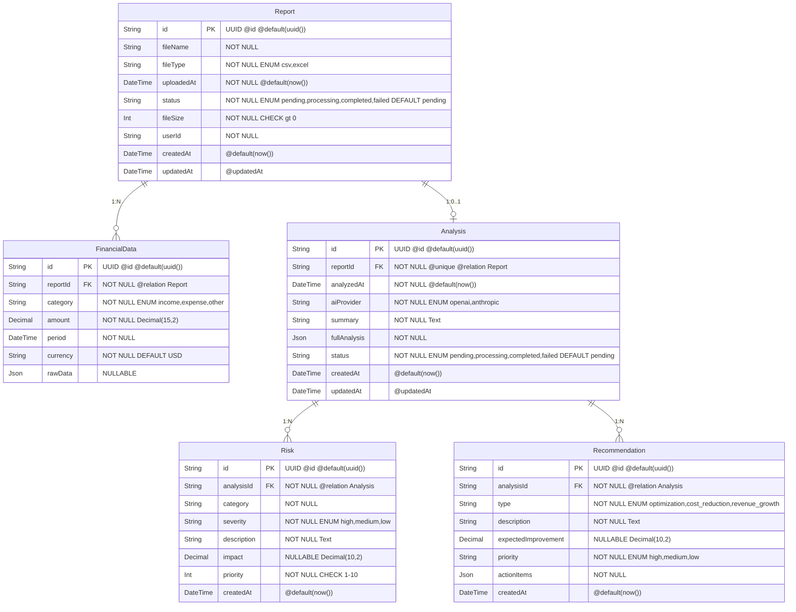

# 3. Схема базы данных - Prisma модель

**Детальная схема БД** с типами, ограничениями и индексами для генерации Prisma.



## Индексы (для production)

```prisma
@@index([userId, uploadedAt(sort: Desc)])  // Report: поиск по пользователю
@@index([status])                          // Report: фильтр по статусу
@@index([reportId])                        // FinancialData: связь с отчетом
@@index([category])                        // FinancialData: фильтр по категории
@@index([reportId])                        // Analysis: связь с отчетом
@@index([analysisId, severity])            // Risk: фильтр рисков
@@index([analysisId, priority])            // Recommendation: сортировка
```

## Ограничения (Constraints)

- **Foreign Keys**: ON DELETE CASCADE
- **UUID**: Используется для всех ID
- **Timestamps**: createdAt, updatedAt автоматически
- **Enum**: Строгие значения для статусов
- **Decimal**: Для денежных значений (precision 15, scale 2)
