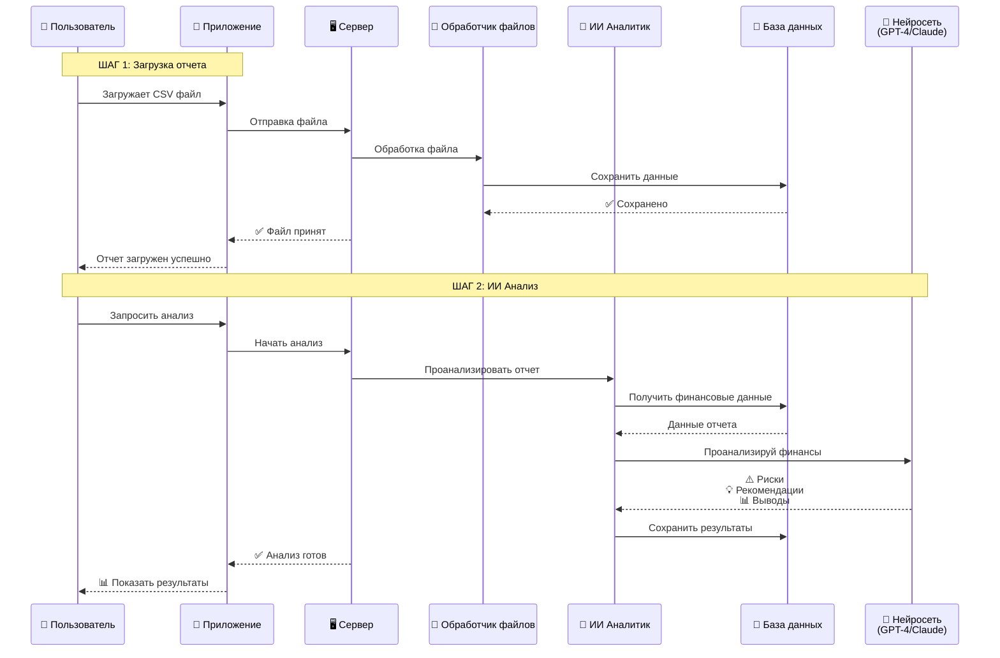

# 4. Поток обработки данных (Sequence Diagram)

**Как работает система**: от загрузки отчета до получения рекомендаций от ИИ.

```mermaid
sequenceDiagram
    participant 👤 as 👤 Пользователь
    participant 📱 as 📱 Приложение
    participant 🖥️ as 🖥️ Сервер
    participant 📄 as 📄 Обработчик файлов
    participant 🤖 as 🤖 ИИ Аналитик
    participant 💾 as 💾 База данных
    participant 🧠 as 🧠 Нейросеть<br/>(GPT-4/Claude)
    
    Note over 👤,📱: ШАГ 1: Загрузка отчета
    👤->>📱: Загружает CSV файл
    📱->>🖥️: Отправка файла
    🖥️->>📄: Обработка файла
    📄->>💾: Сохранить данные
    💾-->>📄: ✅ Сохранено
    🖥️-->>📱: ✅ Файл принят
    📱-->>👤: Отчет загружен успешно
    
    Note over 👤,🧠: ШАГ 2: ИИ Анализ
    👤->>📱: Запросить анализ
    📱->>🖥️: Начать анализ
    🖥️->>🤖: Проанализировать отчет
    🤖->>💾: Получить финансовые данные
    💾-->>🤖: Данные отчета
    🤖->>🧠: Проанализируй финансы
    🧠-->>🤖: ⚠️ Риски<br/>💡 Рекомендации<br/>📊 Выводы
    🤖->>💾: Сохранить результаты
    🖥️-->>📱: ✅ Анализ готов
    📱-->>👤: 📊 Показать результаты
```
