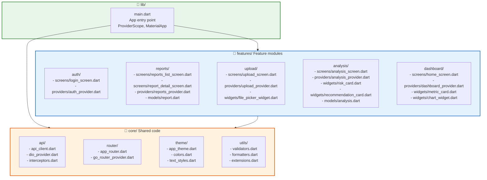

# 5. Структура Flutter приложения

**Структура папок и модулей** Flutter приложения с Riverpod.


```mermaid
graph TB
    subgraph root ["📁 lib/"]
        main["main.dart<br/>App entry point<br/>ProviderScope, MaterialApp"]
    end
    
    main --> features
    main --> core
    
    subgraph features ["📂 features/ Feature modules"]
        direction LR
        
        auth["auth/<br/>- screens/login_screen.dart<br/>- providers/auth_provider.dart"]
        
        reports["reports/<br/>- screens/reports_list_screen.dart<br/>- screens/report_detail_screen.dart<br/>- providers/reports_provider.dart<br/>- models/report.dart"]
        
        upload["upload/<br/>- screens/upload_screen.dart<br/>- providers/upload_provider.dart<br/>- widgets/file_picker_widget.dart"]
        
        analysis["analysis/<br/>- screens/analysis_screen.dart<br/>- providers/analysis_provider.dart<br/>- widgets/risk_card.dart<br/>- widgets/recommendation_card.dart<br/>- models/analysis.dart"]
        
        dashboard["dashboard/<br/>- screens/home_screen.dart<br/>- providers/dashboard_provider.dart<br/>- widgets/metric_card.dart<br/>- widgets/chart_widget.dart"]
        
        auth ~~~ reports ~~~ upload ~~~ analysis ~~~ dashboard
    end
    
    subgraph core ["📂 core/ Shared code"]
        direction LR
        
        api["api/<br/>- api_client.dart<br/>- dio_provider.dart<br/>- interceptors.dart"]
        
        router["router/<br/>- app_router.dart<br/>- go_router_provider.dart"]
        
        theme["theme/<br/>- app_theme.dart<br/>- colors.dart<br/>- text_styles.dart"]
        
        utils["utils/<br/>- validators.dart<br/>- formatters.dart<br/>- extensions.dart"]
        
        api ~~~ router ~~~ theme ~~~ utils
    end
    
    features --> core
    
    style root fill:#e8f5e9,stroke:#2e7d32,stroke-width:2px
    style features fill:#e3f2fd,stroke:#1565c0,stroke-width:2px
    style core fill:#fff3e0,stroke:#e65100,stroke-width:2px
```

## Ключевые зависимости (pubspec.yaml)

```yaml
dependencies:
  flutter_riverpod: ^2.4.9      # State management
  dio: ^5.4.0                    # HTTP client
  go_router: ^13.0.0             # Routing
  fl_chart: ^0.66.0              # Charts
  file_picker: ^6.1.1            # File selection
  freezed_annotation: ^2.4.1     # Immutable models
  
dev_dependencies:
  freezed: ^2.4.6                # Code generation
  build_runner: ^2.4.7           # Build tool
```

## Паттерны Riverpod провайдеров

```dart
// State provider
final reportsProvider = StateNotifierProvider<ReportsNotifier, AsyncValue<List<Report>>>

// Future provider for async data
final analysisProvider = FutureProvider.family<Analysis, String>

// Stream provider for realtime
final uploadProgressProvider = StreamProvider<double>
```
