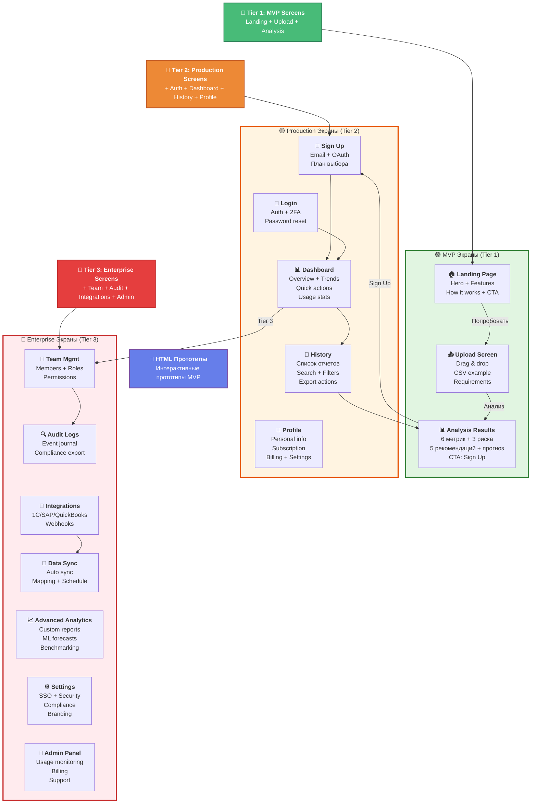

# 6. Mind Map экранов приложения

**Полная структура экранов** для всех tier с навигацией по детальным диаграммам.



---

## 📱 Детальные диаграммы по Tier

### 🟢 [Tier 1: MVP Screens](06a-screens-tier1.md)
**3 экрана | Без регистрации**

- 🏠 **Landing Page** - Hero, Features, CTA
- 📤 **Upload Screen** - Drag & drop, CSV validation
- 📊 **Analysis Results** - Метрики, риски, рекомендации, прогноз

**Доступны HTML прототипы:** `mindmap/prototypes/`

---

### 🟡 [Tier 2: Production Screens](06b-screens-tier2.md)
**+5 новых экранов | Регистрация + История**

- 📝 **Sign Up** - Email + OAuth, план выбора
- 🔐 **Login** - Auth + 2FA
- 📊 **Dashboard** - Overview + trends
- 📁 **History** - Управление отчетами
- 👤 **Profile** - Подписка + биллинг

---

### 🔴 [Tier 3: Enterprise Screens](06c-screens-tier3.md)
**+7 новых экранов | Enterprise функции**

- 👥 **Team Management** - Роли + права
- 🔍 **Audit Logs** - SOC 2 compliance
- 🔌 **Integrations** - 1C/SAP/QuickBooks
- 🔄 **Data Sync** - Автоматизация
- 📈 **Advanced Analytics** - ML прогнозы
- ⚙️ **Enterprise Settings** - SSO + брендинг
- 👑 **Admin Panel** - Monitoring + support

---

## 🎨 HTML Прототипы

**Интерактивные прототипы для MVP** доступны в `mindmap/prototypes/`

### 📂 Файлы:
- `index.html` - Навигация по прототипам
- `01-landing.html` - Landing Page (Hero + Features)
- `02-upload.html` - Upload Screen (Drag & drop)
- `03-analysis.html` - Analysis Results (Полный анализ)

### 🚀 Как открыть:

**Вариант 1: Через Viewer (рекомендуется)**
- Нажмите кнопку "🎨 HTML Прототипы" в диаграмме выше
- Или выберите "🎨 HTML Прототипы (открыть)" в меню слева

**Вариант 2: Напрямую в браузере**
```bash
open mindmap/prototypes/index.html
```

**Вариант 3: Через локальный сервер (лучший опыт)**
```bash
cd mindmap
npx live-server --port=8001
# Откройте http://localhost:8001/prototypes/
```

### 📖 Документация:
- [prototypes/README.md](../prototypes/README.md) - Полное описание прототипов
- [06a-screens-tier1.md](06a-screens-tier1.md) - Детальная диаграмма MVP экранов

---

## 📊 Сравнение Tier

| Фича | Tier 1 (MVP) | Tier 2 (Production) | Tier 3 (Enterprise) |
|------|--------------|---------------------|---------------------|
| Экранов | 3 | 8 (+5) | 15 (+7) |
| Регистрация | ❌ | ✅ | ✅ |
| История | ❌ | ✅ | ✅ |
| Команды | ❌ | ❌ | ✅ |
| Интеграции | ❌ | ❌ | ✅ |
| SSO | ❌ | ❌ | ✅ |
| Audit logs | ❌ | ❌ | ✅ |
| ML прогнозы | ❌ | ❌ | ✅ |

---

## 🔗 Связанные диаграммы

- **[← Roadmap](10-roadmap.md)** - план разработки всех tier
- **[📐 Архитектура MVP](02a-architecture-mvp.md)** - Tier 1 architecture
- **[📐 Архитектура Production](02b-architecture-tier2.md)** - Tier 2 architecture
- **[📐 Архитектура Enterprise](02c-architecture-tier3.md)** - Tier 3 architecture
- **[🎨 HTML Прототипы](../prototypes/README.md)** - интерактивные прототипы
