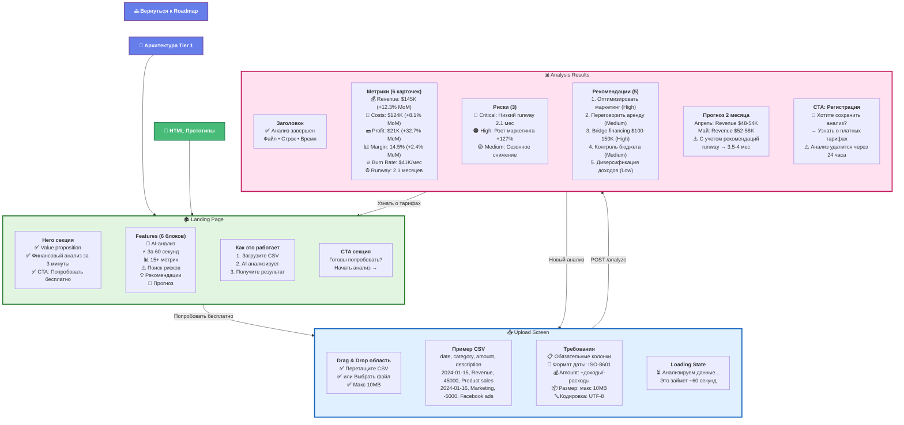

# 6a. Экраны приложения - Tier 1 (MVP)

**Минимальный набор экранов** для proof-of-concept без регистрации.



---

## 📱 Описание экранов

### 1. Landing Page
**Файл:** `mindmap/prototypes/01-landing.html`

**Цель:** Объяснить продукт и конвертировать в trial

**Секции:**
- **Hero:** "Финансовый анализ за 3 минуты" + CTA
- **Features:** 6 блоков (AI-анализ, скорость, метрики, риски, рекомендации, прогноз)
- **How it works:** 3 шага (Загрузить → AI анализирует → Результат)
- **CTA:** "Готовы попробовать?"

**Ключевые сообщения:**
- Без регистрации
- Анонимно
- Результат за 60 секунд

---

### 2. Upload Screen
**Файл:** `mindmap/prototypes/02-upload.html`

**Цель:** Минимизировать friction при загрузке

**Компоненты:**
- Drag & drop область (работающая)
- Пример правильного CSV формата
- Требования к файлу
- Loading state с прогрессом

**Валидация:**
- Тип файла: .csv
- Размер: макс 10MB
- Обязательные колонки: date, category, amount, description

---

### 3. Analysis Results
**Файл:** `mindmap/prototypes/03-analysis.html`

**Цель:** Показать ПОЛНУЮ мощь AI + CTA для конверсии

**Блоки:**

#### Метрики (6 карточек):
- Revenue, Costs, Profit, Margin, Burn Rate, Runway
- С изменениями MoM и color-coded badges

#### Риски (3 карточки):
- Severity: critical/high/medium/low
- Описание + вероятность + категория
- Color-coded borders и badges

#### Рекомендации (5 карточек):
- Приоритет: high/medium/low
- Описание + ожидаемый эффект
- Сложность + срок реализации

#### Прогноз (2 месяца):
- Revenue, Costs, Profit ranges
- Уровень уверенности
- Влияние рекомендаций

#### CTA:
- "Хотите сохранить анализ?"
- → Регистрация для доступа к истории
- ⚠️ Анализ удалится через 24 часа

---

## 🎨 HTML Прототипы

**Доступны по пути:** `mindmap/prototypes/`

```
prototypes/
├── index.html          # Навигация
├── 01-landing.html     # Landing Page
├── 02-upload.html      # Upload Screen  
└── 03-analysis.html    # Analysis Results
```

**Как открыть:**

### В Viewer'е:
1. Нажмите на кнопку "🎨 HTML Прототипы" в диаграмме выше
2. Или выберите "prototypes" в меню слева (если доступно)

### Напрямую:
```bash
# Открыть в браузере
open mindmap/prototypes/index.html

# Или через локальный сервер (рекомендуется)
cd mindmap
npx live-server --port=8001
# Откройте http://localhost:8001/prototypes/
```

**Прямые ссылки:**
- [index.html](../prototypes/index.html) - Навигация
- [01-landing.html](../prototypes/01-landing.html) - Landing Page
- [02-upload.html](../prototypes/02-upload.html) - Upload Screen
- [03-analysis.html](../prototypes/03-analysis.html) - Analysis Results

---

## 🔗 Связанные диаграммы

- **[← Roadmap Tier 1](10-roadmap.md#tier-1-mvp)** - план разработки MVP
- **[📐 Архитектура Tier 1](02a-architecture-mvp.md)** - техническая архитектура
- **[🎨 HTML Прототипы](../prototypes/README.md)** - интерактивные прототипы
- **[→ Экраны Tier 2](06b-screens-tier2.md)** - что добавится в Production

---

## 📊 Что НЕТ в MVP

❌ Регистрация / Login  
❌ История анализов  
❌ Профиль пользователя  
❌ Сохранение отчетов  
❌ Экспорт PDF/Excel  
❌ Настройки  
❌ Дашборд с аналитикой  

**Все это появится в Tier 2!**

---

## ✅ User Flow MVP

```
Landing → Upload → Analysis → [CTA: Sign Up]
   ↓         ↓         ↓
 Demo     Analyze   Convert
```

**Метрики успеха:**
- **Time to value:** < 3 минуты от лендинга до результата
- **Conversion rate:** 15-20% пользователей нажмут "Sign Up"
- **Bounce rate:** < 40% на Upload Screen

---

**Tier:** 1 (MVP)  
**Статус:** ✅ Прототипы готовы  
**Файлы:** 3 HTML экрана + навигация
