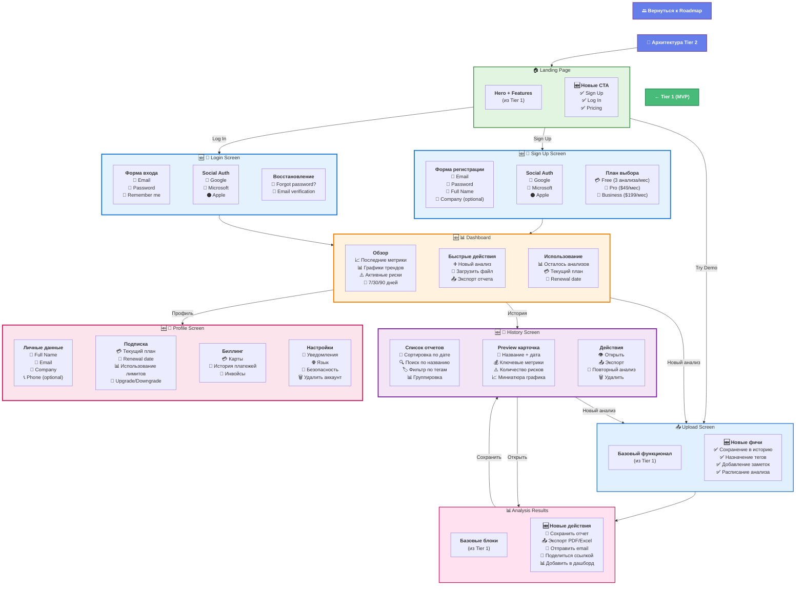

# 6b. Экраны приложения - Tier 2 (Production)

**Добавление регистрации, истории и платных функций** для производственного использования.



---

## 🆕 Новые экраны в Tier 2

### 1. Sign Up Screen
**Цель:** Регистрация пользователей с выбором тарифа

**Компоненты:**
- **Форма регистрации:** Email, Password, Full Name, Company (optional)
- **Social Auth:** Google, Microsoft, Apple
- **Выбор плана:**
  - 💳 Free: 3 анализа/месяц
  - 💼 Pro: $49/месяц, 50 анализов
  - 🏢 Business: $199/месяц, unlimited

**Валидация:**
- Email verification (код на email)
- Strong password (8+ символов, uppercase, цифры)
- Terms & Conditions acceptance

---

### 2. Login Screen
**Цель:** Авторизация существующих пользователей

**Компоненты:**
- **Форма входа:** Email, Password, Remember me
- **Social Auth:** Google, Microsoft, Apple
- **Восстановление:** Forgot password? → Email reset

**Security:**
- Rate limiting (5 попыток)
- 2FA (optional для Business плана)
- Session management (JWT, 24 часа)

---

### 3. Dashboard
**Цель:** Центральный hub для управления отчетами

**Блоки:**

#### Overview:
- 📈 Последние метрики из всех отчетов
- 📊 Графики трендов (7/30/90 дней)
- ⚠️ Активные риски (все отчеты)
- 💡 Top рекомендации

#### Quick Actions:
- ➕ Новый анализ
- 📁 Загрузить файл
- 📤 Экспорт всех отчетов
- 🔔 Настроить уведомления

#### Usage Stats:
- 📊 Осталось анализов (3/50)
- 💳 Текущий план (Free/Pro/Business)
- 📅 Renewal date
- 🔄 Upgrade CTA

---

### 4. History Screen
**Цель:** Управление всеми сохраненными отчетами

**Функции:**

#### Список отчетов:
- 📅 Сортировка: по дате, названию, рискам
- 🔍 Поиск по названию и описанию
- 🏷️ Фильтр по тегам (Revenue, Costs, Q1, etc.)
- 📊 Группировка по периодам

#### Preview карточка:
- 📄 Название + дата создания
- 💰 Ключевые метрики (Revenue, Profit, Runway)
- ⚠️ Количество рисков (3 critical, 5 high)
- 📈 Миниатюра графика

#### Действия:
- 👁️ Открыть полный отчет
- 📤 Экспорт (PDF/Excel/JSON)
- 🔄 Повторный анализ (с новыми данными)
- 🗑️ Удалить

---

### 5. Profile Screen
**Цель:** Управление аккаунтом и подпиской

**Секции:**

#### Личные данные:
- 👤 Full Name, Email, Company, Phone
- 🖼️ Avatar upload
- 🌐 Язык интерфейса

#### Подписка:
- 💳 Текущий план (Free/Pro/Business)
- 📅 Renewal date / Billing cycle
- 📊 Использование: 3/50 анализов
- 🔄 Upgrade/Downgrade кнопки

#### Биллинг:
- 💳 Сохраненные карты (Stripe)
- 📄 История платежей (table)
- 🧾 Скачать инвойсы (PDF)

#### Настройки:
- 🔔 Email уведомления (новые риски, отчеты)
- 🔐 Изменить пароль
- 🔒 Enable 2FA (Business план)
- 🗑️ Удалить аккаунт (с подтверждением)

---

## 🔄 Обновленные экраны

### Upload Screen (обновлен)
**Новые фичи:**
- ✅ **Сохранение в историю** (автоматически)
- ✅ **Назначение тегов** (Revenue, Q1, Marketing, etc.)
- ✅ **Добавление заметок** (контекст для будущего)
- ✅ **Расписание анализа** (recurring, weekly/monthly)

---

### Analysis Results (обновлен)
**Новые действия:**
- 💾 **Сохранить отчет** → History
- 📤 **Экспорт:** PDF (formatted), Excel (raw data), JSON (API)
- 📧 **Отправить email** (отчет коллегам)
- 🔗 **Поделиться ссылкой** (read-only access, 7 дней)
- 📊 **Добавить в дашборд** (pin metrics)

---

## 📊 User Flow Tier 2

```
Landing → Sign Up → Dashboard → Upload → Analysis → History
                      ↓           ↓          ↓         ↓
                   Overview    Save     Export    Search
```

**Новые пути:**
- **New User:** Landing → Sign Up → Onboarding → First Upload
- **Returning User:** Login → Dashboard → (Upload | History)
- **Free to Paid:** Dashboard → Upgrade CTA → Pricing → Checkout

---

## 🔗 Связанные диаграммы

- **[← Roadmap Tier 2](10-roadmap.md#tier-2-production)** - план разработки Production
- **[📐 Архитектура Tier 2](02b-architecture-tier2.md)** - техническая архитектура
- **[← Экраны Tier 1](06a-screens-tier1.md)** - базовые экраны MVP
- **[→ Экраны Tier 3](06c-screens-tier3.md)** - Enterprise функции

---

## ✅ Что добавилось vs Tier 1

| Фича | Tier 1 (MVP) | Tier 2 (Production) |
|------|--------------|---------------------|
| Регистрация | ❌ | ✅ Email + OAuth |
| Авторизация | ❌ | ✅ JWT + Session |
| История отчетов | ❌ | ✅ Unlimited storage |
| Экспорт | ❌ | ✅ PDF/Excel/JSON |
| Dashboard | ❌ | ✅ Trends + Overview |
| Профиль | ❌ | ✅ Full management |
| Подписки | ❌ | ✅ Free/Pro/Business |
| Биллинг | ❌ | ✅ Stripe integration |

---

## 📈 Метрики успеха Tier 2

**Активация:**
- Регистрация: 15-20% от посетителей
- Первый анализ: 80% новых пользователей (D0)
- Второй анализ: 40% пользователей (D7)

**Retention:**
- D7 retention: 35-40%
- D30 retention: 20-25%
- Платная конверсия: 5-8% (Free → Pro)

**Монетизация:**
- ARPU: $15-20/месяц
- CAC: $50-80
- LTV/CAC ratio: 3-4x

---

**Tier:** 2 (Production)  
**Статус:** 🏗️ В разработке  
**Новых экранов:** 5 (Sign Up, Login, Dashboard, History, Profile)
