# 6c. Экраны приложения - Tier 3 (Enterprise)

**Enterprise функции:** команды, роли, интеграции, аудит и расширенная аналитика.

```mermaid
graph TB
    nav["<b>🔙 Вернуться к Roadmap</b>"]
    arch["<b>📐 Архитектура Tier 3</b>"]
    prevTier["<b>← Tier 2 (Production)</b>"]
    
    nav ~~~ arch ~~~ prevTier
    
    arch --> dashboard
    
    subgraph dashboard ["📊 Dashboard (улучшен)"]
        direction LR
        
        dashboardBase["<b>Базовый функционал</b><br/>(из Tier 2)"]
        newDash["<b>🆕 Новые виджеты</b><br/>📊 Кастомные дашборды<br/>🔄 Real-time метрики<br/>👥 Командные отчеты<br/>🎯 KPI tracking<br/>⚠️ Alert центр"]
        
        dashboardBase ~~~ newDash
    end
    
    dashboard --> team
    dashboard --> integrations
    dashboard --> advanced
    
    subgraph team ["🆕 👥 Team Management"]
        direction LR
        
        members["<b>Члены команды</b><br/>👤 Список пользователей<br/>📧 Email + Role<br/>📅 Last active<br/>🎯 Assigned reports<br/>➕ Invite members"]
        roles["<b>Роли и права</b><br/>👑 Admin (full access)<br/>📝 Editor (create/edit)<br/>👁️ Viewer (read-only)<br/>🔍 Auditor (audit logs)<br/>⚙️ Custom roles"]
        permissions["<b>Права доступа</b><br/>📁 Папки и отчеты<br/>🔐 Sensitive data mask<br/>📤 Export permissions<br/>🔔 Notification settings"]
        
        members ~~~ roles ~~~ permissions
    end
    
    team --> audit
    
    subgraph audit ["🆕 🔍 Audit Logs"]
        direction LR
        
        auditList["<b>Журнал событий</b><br/>📅 Timestamp<br/>👤 User + IP<br/>🎬 Action (view/edit/export)<br/>📄 Resource (report ID)<br/>✅ Status (success/fail)"]
        auditFilters["<b>Фильтры</b><br/>📅 Диапазон дат<br/>👤 По пользователю<br/>🎬 По типу действия<br/>📄 По ресурсу"]
        auditExport["<b>Экспорт</b><br/>📤 CSV для аудита<br/>🔐 SOC 2 compliance<br/>📊 Analytics dashboard"]
        
        auditList ~~~ auditFilters ~~~ auditExport
    end
    
    dashboard --> integrations
    
    subgraph integrations ["🆕 🔌 Integrations"]
        direction LR
        
        available["<b>Доступные интеграции</b><br/>🏦 1C (УПП/КА)<br/>💼 SAP (OData/RFC)<br/>📊 QuickBooks (OAuth2)<br/>📈 Excel (API)<br/>🔔 Slack/Teams<br/>📧 Email (SMTP)"]
        configured["<b>Настроенные</b><br/>✅ Active connections<br/>⚙️ Configuration<br/>🔄 Sync status<br/>📅 Last sync<br/>❌ Disconnect"]
        webhooks["<b>Webhooks</b><br/>🔗 Custom endpoints<br/>📤 Events (report ready)<br/>🔐 Secret keys<br/>📊 Delivery logs"]
        
        available ~~~ configured ~~~ webhooks
    end
    
    integrations --> syncScreen
    
    subgraph syncScreen ["🆕 🔄 Data Sync Screen"]
        direction LR
        
        syncConfig["<b>Конфигурация</b><br/>📋 Источник данных<br/>🗺️ Маппинг полей<br/>⏰ Расписание (cron)<br/>🔐 Credentials"]
        syncStatus["<b>Статус синхронизации</b><br/>✅ Last success<br/>❌ Errors log<br/>📊 Records processed<br/>⏱️ Duration"]
        syncActions["<b>Действия</b><br/>▶️ Run now<br/>⏸️ Pause<br/>🔄 Retry failed<br/>📤 Export logs"]
        
        syncConfig ~~~ syncStatus ~~~ syncActions
    end
    
    dashboard --> advanced
    
    subgraph advanced ["🆕 📈 Advanced Analytics"]
        direction LR
        
        customReports["<b>Кастомные отчеты</b><br/>🎨 Drag & drop builder<br/>📊 Custom metrics<br/>📈 Chart types<br/>🗓️ Period comparison"]
        forecasting["<b>Прогнозирование</b><br/>🔮 ML forecasts (6-12 мес)<br/>📊 Scenario planning<br/>🎯 What-if analysis<br/>📈 Confidence intervals"]
        benchmarking["<b>Бенчмаркинг</b><br/>📊 Industry averages<br/>🏆 Peer comparison<br/>📈 Growth percentiles<br/>🎯 Target setting"]
        
        customReports ~~~ forecasting ~~~ benchmarking
    end
    
    dashboard --> settings
    
    subgraph settings ["🆕 ⚙️ Enterprise Settings"]
        direction LR
        
        security["<b>Безопасность</b><br/>🔐 SSO (SAML/OAuth)<br/>🛡️ 2FA enforcement<br/>🔒 IP whitelist<br/>📋 Password policy<br/>⏱️ Session timeout"]
        compliance["<b>Compliance</b><br/>🏛️ SOC 2 Type II<br/>🔐 ISO 27001<br/>🇪🇺 GDPR tools<br/>📋 Data retention<br/>🗑️ Data deletion"]
        branding["<b>Брендинг</b><br/>🎨 Custom logo<br/>🌈 Color scheme<br/>📧 Email templates<br/>📄 Report headers<br/>🔗 Custom domain"]
        
        security ~~~ compliance ~~~ branding
    end
    
    dashboard --> admin
    
    subgraph admin ["🆕 👑 Admin Panel"]
        direction LR
        
        usage["<b>Использование</b><br/>📊 Usage по командам<br/>💰 Spending by user<br/>📈 API calls<br/>💾 Storage used<br/>📉 Rate limits"]
        billing["<b>Биллинг</b><br/>💳 Enterprise plan<br/>📄 Invoices<br/>🧾 Usage-based pricing<br/>📞 Support tier<br/>📅 Contract details"]
        support["<b>Поддержка</b><br/>💬 Priority tickets<br/>👤 Dedicated manager<br/>📞 24/7 phone<br/>🎓 Training sessions<br/>📚 Custom docs"]
        
        usage ~~~ billing ~~~ support
    end
    
    style dashboard fill:#fff3e0,stroke:#f57c00,stroke-width:3px
    style team fill:#e8f5e9,stroke:#388e3c,stroke-width:3px
    style audit fill:#fce4ec,stroke:#c2185b,stroke-width:3px
    style integrations fill:#e1f5fe,stroke:#0288d1,stroke-width:3px
    style syncScreen fill:#e1f5fe,stroke:#0288d1,stroke-width:2px
    style advanced fill:#f3e5f5,stroke:#7b1fa2,stroke-width:3px
    style settings fill:#fff9c4,stroke:#f9a825,stroke-width:3px
    style admin fill:#ffebee,stroke:#c62828,stroke-width:3px
    
    style nav fill:#667eea,stroke:#764ba2,stroke-width:2px,color:#fff,cursor:pointer
    style arch fill:#667eea,stroke:#764ba2,stroke-width:2px,color:#fff,cursor:pointer
    style prevTier fill:#48bb78,stroke:#2f855a,stroke-width:2px,color:#fff,cursor:pointer
    
    click nav "#diagram-10" "Roadmap Tier 3"
    click arch "#diagram-02c" "Архитектура Tier 3"
    click prevTier "#diagram-06b" "Tier 2 Screens"
```



---

## 🆕 Новые экраны в Tier 3

### 1. Team Management
**Цель:** Управление командными доступами и ролями

**Функции:**

#### Члены команды:
- 👤 **Список пользователей** с ролями
- 📧 Email, Full Name, Last active
- 🎯 Assigned reports (количество)
- ➕ **Invite members** (bulk email invites)
- 🗑️ Деактивация пользователей

#### Роли и права:
```
👑 Admin - полный доступ + биллинг
📝 Editor - создание/редактирование отчетов
👁️ Viewer - только просмотр
🔍 Auditor - audit logs + compliance
⚙️ Custom - гибкая настройка прав
```

#### Права доступа:
- 📁 **Папки и отчеты** (по группам/проектам)
- 🔐 **Sensitive data masking** (скрытие $ amounts)
- 📤 **Export permissions** (кто может экспортировать)
- 🔔 **Notification settings** (кто получает алерты)

---

### 2. Audit Logs
**Цель:** Соответствие SOC 2, ISO 27001 требованиям

**Компоненты:**

#### Журнал событий:
```json
{
  "timestamp": "2024-01-25T14:32:15Z",
  "user": "john@company.com",
  "ip": "192.168.1.100",
  "action": "export_report_pdf",
  "resource": "report_id_12345",
  "status": "success",
  "metadata": { "file_size": "2.3MB" }
}
```

#### Типы событий:
- 👁️ View (открыл отчет)
- ✏️ Edit (изменил отчет)
- 📤 Export (скачал PDF/Excel)
- 🗑️ Delete (удалил отчет)
- 👤 User management (добавил/удалил юзера)
- 🔐 Auth (login/logout/failed attempts)

#### Фильтры и экспорт:
- 📅 Диапазон дат (last 7/30/90 дней, custom)
- 👤 По пользователю
- 🎬 По типу действия
- 📤 **Экспорт CSV** для аудита
- 📊 **Analytics dashboard** (top users, actions)

---

### 3. Integrations Screen
**Цель:** Подключение внешних систем для автоматизации

**Доступные интеграции:**

#### ERP системы:
- 🏦 **1C (УПП/КА):** HTTP API, XML data exchange
- 💼 **SAP:** OData API, RFC calls
- 📊 **QuickBooks:** OAuth2, real-time sync
- 📈 **Excel/Google Sheets:** API import/export

#### Коммуникация:
- 🔔 **Slack:** Notifications, alerts, /commands
- 💬 **Microsoft Teams:** Cards, channels
- 📧 **Email (SMTP):** Custom reports distribution

#### iPaaS:
- ⚡ **Zapier:** Pre-built zaps
- 🔗 **Make (Integromat):** Visual workflows
- 🛠️ **n8n:** Self-hosted automation

**Настройка:**
1. Выбрать интеграцию
2. Авторизоваться (OAuth/API key)
3. Настроить маппинг полей
4. Тестировать подключение
5. Активировать

---

### 4. Data Sync Screen
**Цель:** Автоматическая синхронизация данных

**Конфигурация:**
```yaml
source: "1C_API"
mapping:
  date: "Дата"
  category: "Счет"
  amount: "Сумма"
  description: "Комментарий"
schedule: "0 0 * * *"  # daily at midnight
credentials: encrypted_token
```

**Статус синхронизации:**
- ✅ **Last success:** 2024-01-25 00:00:15
- ❌ **Errors:** 3 records failed (invalid format)
- 📊 **Records processed:** 1,247
- ⏱️ **Duration:** 42 seconds

**Действия:**
- ▶️ **Run now** (manual trigger)
- ⏸️ **Pause** (остановить автосинхронизацию)
- 🔄 **Retry failed** (повторить ошибочные записи)
- 📤 **Export logs** (для диагностики)

---

### 5. Advanced Analytics
**Цель:** ML-powered аналитика и прогнозы

**Функции:**

#### Custom Reports Builder:
- 🎨 **Drag & drop interface** (no-code)
- 📊 **Custom metrics** (формулы, calculations)
- 📈 **Chart types:** line, bar, pie, heatmap, scatter
- 🗓️ **Period comparison:** YoY, MoM, custom periods

#### ML Forecasting:
- 🔮 **6-12 месяцев прогноз** (Prophet, ARIMA)
- 📊 **Scenario planning** (best/worst/expected)
- 🎯 **What-if analysis** (если revenue +10%?)
- 📈 **Confidence intervals** (80%, 95%)

#### Benchmarking:
- 📊 **Industry averages** (по вертикали)
- 🏆 **Peer comparison** (анонимизированно)
- 📈 **Growth percentiles** (где мы среди 100 компаний)
- 🎯 **Target setting** (based on benchmarks)

---

### 6. Enterprise Settings
**Цель:** Безопасность, compliance, брендинг

**Секции:**

#### Security:
- 🔐 **SSO:** SAML 2.0, OAuth 2.0, Azure AD, Okta
- 🛡️ **2FA enforcement:** Обязательный для всех
- 🔒 **IP whitelist:** Доступ только с офисных IP
- 📋 **Password policy:** 12+ символов, rotation 90 дней
- ⏱️ **Session timeout:** Автовыход через 30 минут

#### Compliance:
- 🏛️ **SOC 2 Type II:** Audit reports, controls
- 🔐 **ISO 27001:** Сертификация, processes
- 🇪🇺 **GDPR tools:** Data export, deletion, consent
- 📋 **Data retention:** Автоудаление после N дней
- 🗑️ **Right to erasure:** Полное удаление данных

#### Branding:
- 🎨 **Custom logo** (header, reports, emails)
- 🌈 **Color scheme** (primary, secondary colors)
- 📧 **Email templates** (custom branding)
- 📄 **Report headers/footers** (company info)
- 🔗 **Custom domain:** analytics.yourcompany.com

---

### 7. Admin Panel
**Цель:** Мониторинг использования и поддержка

**Компоненты:**

#### Usage Dashboard:
- 📊 **Usage по командам** (top consumers)
- 💰 **Spending by user** (кто использует больше)
- 📈 **API calls** (rate limits monitoring)
- 💾 **Storage used** (GB per team)
- 📉 **Quota tracking** (приближение к лимитам)

#### Enterprise Billing:
- 💳 **Enterprise plan:** Custom pricing
- 📄 **Annual invoices** (wire transfer)
- 🧾 **Usage-based add-ons** (extra seats, storage)
- 📞 **Support tier:** Premium/Enterprise
- 📅 **Contract details** (renewal, SLA)

#### Premium Support:
- 💬 **Priority tickets** (response < 1 hour)
- 👤 **Dedicated CSM** (Customer Success Manager)
- 📞 **24/7 phone support** (hotline)
- 🎓 **Training sessions** (onboarding, best practices)
- 📚 **Custom documentation** (tailored to use case)

---

## 🔄 Обновленные экраны

### Dashboard (улучшен)
**Новые виджеты:**
- 📊 **Кастомные дашборды** (drag & drop widgets)
- 🔄 **Real-time метрики** (WebSocket updates)
- 👥 **Командные отчеты** (aggregated view)
- 🎯 **KPI tracking** (custom goals, progress bars)
- ⚠️ **Alert центр** (centralized notifications)

---

## 📊 User Flow Tier 3

```
Dashboard → Team Mgmt → Invite Users → Roles
    ↓           ↓            ↓          ↓
Advanced    Integrations  Sync     Settings
Analytics      1C/SAP    Auto     SSO/2FA
```

**Enterprise пути:**
- **Admin:** Dashboard → Admin Panel → Usage/Billing
- **Manager:** Dashboard → Team Mgmt → Assign roles
- **Analyst:** Dashboard → Advanced Analytics → Custom reports
- **Auditor:** Dashboard → Audit Logs → Compliance export

---

## 🔗 Связанные диаграммы

- **[← Roadmap Tier 3](10-roadmap.md#tier-3-enterprise)** - план разработки Enterprise
- **[📐 Архитектура Tier 3](02c-architecture-tier3.md)** - техническая архитектура
- **[← Экраны Tier 2](06b-screens-tier2.md)** - Production экраны
- **[📊 Интеграции](15-integrations.md)** - детали интеграций

---

## ✅ Что добавилось vs Tier 2

| Фича | Tier 2 (Production) | Tier 3 (Enterprise) |
|------|---------------------|---------------------|
| Команды | ❌ | ✅ Team management + roles |
| SSO | ❌ | ✅ SAML/OAuth/Azure AD |
| Audit logs | ❌ | ✅ SOC 2 compliance |
| Интеграции | ❌ | ✅ 1C/SAP/QuickBooks |
| Auto sync | ❌ | ✅ Scheduled + webhooks |
| ML прогнозы | ❌ | ✅ 6-12 мес forecasts |
| Custom reports | ❌ | ✅ No-code builder |
| Benchmarking | ❌ | ✅ Industry comparison |
| Брендинг | ❌ | ✅ White label |
| Premium support | ❌ | ✅ 24/7 + CSM |

---

## 📈 Метрики успеха Tier 3

**Enterprise Adoption:**
- Trial to Paid: 40-50% (с POC)
- Onboarding time: < 2 weeks (с CSM)
- Feature adoption: 80% используют интеграции

**Revenue:**
- ARPU: $500-1,500/месяц
- ACV (Annual Contract Value): $6K-18K
- Expansion MRR: 20-30% (upsells)

**Retention:**
- Logo retention: 95%+
- Net revenue retention: 120-130%
- NPS: 50+

---

**Tier:** 3 (Enterprise)  
**Статус:** 🎯 Планируется  
**Новых экранов:** 7 (Team, Audit, Integrations, Sync, Advanced, Settings, Admin)
