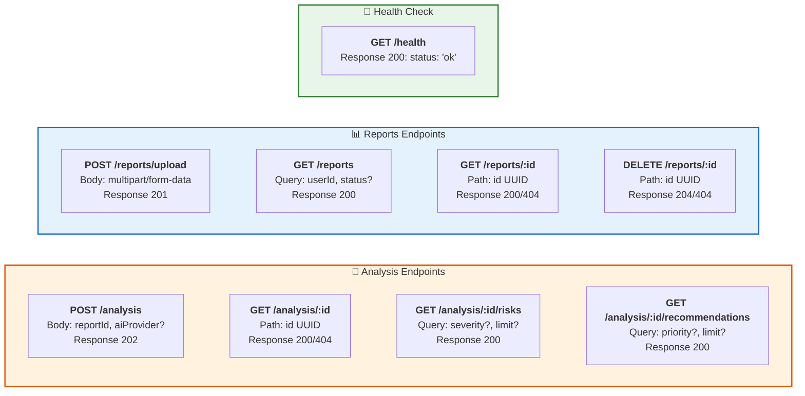

# 7. Структура API - REST эндпоинты

**REST API спецификация** с HTTP методами, путями и форматами данных.

## HTTP коды состояния

- **200** OK - Успешный запрос
- **201** Created - Ресурс создан
- **202** Accepted - Запрос принят в обработку
- **204** No Content - Успешно удалено
- **400** Bad Request - Неверные параметры
- **404** Not Found - Ресурс не найден
- **500** Internal Server Error - Ошибка сервера

## Типы контента (Content Types)

- **Request**: `multipart/form-data` (upload), `application/json` (analysis)
- **Response**: `application/json`
