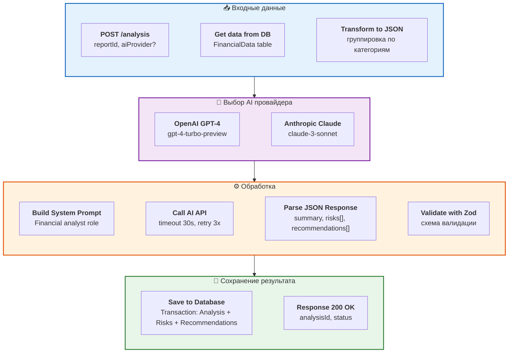

# 8. AI Analysis Process - Детали реализации

**Детальный процесс анализа** с промптами и параметрами для AI.



## Детали реализации

### API Endpoint
```
POST /api/analysis
Body: { reportId: UUID, aiProvider?: 'openai' | 'anthropic' }
Response: { analysisId: UUID, status: 'processing' }
```

### AI Models
- **OpenAI**: gpt-4-turbo-preview, max tokens 4096, temperature 0.3
- **Anthropic**: claude-3-sonnet, max tokens 4096, temperature 0.3

### Процесс
1. **GET data** - Получить финансовые данные из FinancialData table
2. **Transform** - Преобразовать в JSON, сгруппировать по категориям
3. **Select AI** - Выбор OpenAI или Anthropic (default: openai)
4. **Build Prompt** - Создать system prompt для financial analyst
5. **Call AI** - POST к AI API с timeout 30s
6. **Parse** - Извлечь summary, risks[], recommendations[]
7. **Validate** - Zod schema validation
8. **Save** - Transaction: INSERT Analysis, Risks, Recommendations
9. **Respond** - Return analysisId

### System Prompt Template

```javascript
const SYSTEM_PROMPT = `You are an expert financial analyst. 
Analyze the provided financial data and return a JSON response with:
{
  "summary": "Brief overview (200 words max)",
  "risks": [{
      "category": "string",
      "severity": "high|medium|low",
      "description": "Detailed explanation",
      "impact": number,
      "priority": number
    }],
  "recommendations": [{
      "type": "optimization|cost_reduction|revenue_growth",
      "description": "Actionable advice",
      "expectedImprovement": number,
      "priority": "high|medium|low",
      "actionItems": ["step1", "step2"]
    }]
}`;
```

### Обработка ошибок
- **Timeout**: 30 секунд
- **Retry**: 3 попытки с exponential backoff (1s, 2s, 4s)
- **Fallback**: Переключение на другой AI провайдер при сбое
- **Validation**: Строгая валидация JSON схемы через Zod
