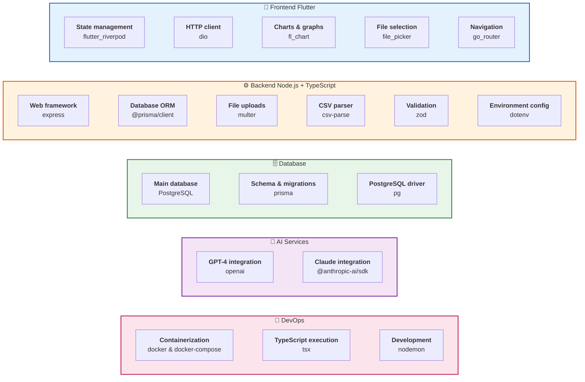

# 9. Технологический стек - Зависимости

**Конкретные технологии с версиями** для генерации кода.

## Менеджеры пакетов

- **Frontend**: `flutter pub` (pubspec.yaml)
- **Backend**: `npm` (package.json)

## Требования к окружению

- **Node.js**: 20.x or later
- **Flutter**: 3.16 or later
- **PostgreSQL**: 16.x
- **Docker**: 24.x (optional)
