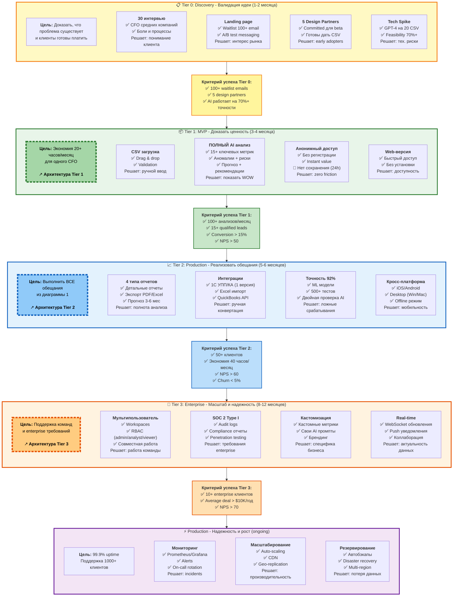

# 10. Roadmap: Реалистичный план развития

**От customer discovery к enterprise product**: каждая фаза решает конкретные боли и риски.



## Обоснование roadmap

### Почему именно этот порядок?

#### 📋 Tier 0: Discovery (1-2 месяца) - ОБЯЗАТЕЛЬНО ПЕРЕД КОДОМ!
**Бизнес-цель:** Доказать, что проблема реальна и клиенты готовы платить

**Почему это критично:**
- **80% стартапов умирают не от плохого кода, а от отсутствия клиентов**
- Coding без validation = трата времени и денег
- Design partners = бесплатные beta testers + testimonials

**Что делаем:**

**1. Customer Discovery (30 интервью):**
```
Кого: CFO компаний 10-100 человек
Вопросы:
  - Как сейчас анализируете финансы?
  - Сколько времени тратите?
  - Какие инструменты используете?
  - Сколько готовы платить за экономию 20 часов/месяц?
  
Цель: Понять real pains, не assumed
```

**2. Landing page + Waitlist:**
```
Инструменты: Webflow + ConvertKit
Messaging:
  "AI CFO assistant экономит 40 часов/месяц
   Загрузи CSV → получи анализ за 3 минуты
   Ранний доступ: $79/мес (вместо $99)"
   
A/B test:
  - Headline варианты
  - Pricing ($79 vs $99 vs $149)
  - CTA ("Join waitlist" vs "Get early access")
  
Цель: 100+ emails за 1-2 месяца
```

**3. Design Partners (5 компаний):**
```
Критерии:
  ✅ Готовы дать 20+ CSV файлов
  ✅ Готовы на weekly calls
  ✅ CFO готов быть testimonial
  ✅ Платят $0 за beta, но commit на $99/мес после
  
Deal:
  "Бесплатный доступ на 3 месяца
   В обмен на feedback + testimonial
   После beta: $79/мес (20% discount lifetime)"
```

**4. Tech Spike (AI feasibility):**
```
Цель: Доказать, что GPT-4 справится
Метод:
  - Собрать 20 реальных CSV от интервью
  - Написать промпт (1 неделя)
  - Протестировать accuracy
  
Success criteria: 70%+ точности
  (MVP не требует 92%, достаточно "лучше чем Excel")
```

**5. Competitor Analysis (обязательно!):**
```
Цель: Понять, кто уже делает похожее, почему не решили проблему

Direct competitors:
  - [Researched company names from interviews]
  - Pricing, features, reviews analysis
  
Indirect competitors:
  - Excel + ChatGPT (manual)
  - BI tools (Tableau, Power BI)
  - Accounting software (QuickBooks, Xero)
  
Gaps analysis:
  ✅ Что делают хорошо? (не переизобретать)
  ✅ Где gaps? (наша возможность)
  ✅ Почему клиенты недовольны? (читаем reviews)
  
Result: Positioning statement
  "В отличие от [competitor], мы [unique value]
   для [target customer] которые [specific pain]"
```

**6. Pricing Experiments:**
```
Цель: Найти optimal price point (willingness to pay)

A/B test на landing page:
  Variant A: $79/мес (economy)
  Variant B: $99/мес (standard)
  Variant C: $149/мес (premium)
  
Metric: Conversion rate на waitlist
  - Если $79 = 15% conv, $99 = 12% conv, $149 = 8% conv
  - Optimal: $99 (balance volume × price)
  
Van Westendorp analysis (из интервью):
  - "Слишком дешево" = $50
  - "Дешево" = $70
  - "Дорого" = $120
  - "Слишком дорого" = $200
  → Optimal price range: $70-$120
  → Choose: $99 (середина)
  
Tiered pricing (для Tier 2+):
  - Starter: $99/мес (1 user, 100 reports)
  - Business: $299/мес (5 users, unlimited)
  - Enterprise: Custom (unlimited, SSO, SLA)
```

**Критерий готовности к Tier 1:**
- ✅ 30 интервью завершено (insights documented)
- ✅ 100+ waitlist emails
- ✅ 5 design partners signed
- ✅ AI proof of concept работает (70%+)
- ✅ Pricing validated ($99/мес = sweet spot)

**Инвестиции:**
- Время: 1-2 месяца (founder time only)
- Деньги: $500 (landing page + tools)
- ROI: Избежание 3+ месяцев разработки ненужного продукта

---

#### 📦 Tier 1: MVP (3-4 месяца) - Proof of Concept
**Бизнес-цель:** Доказать ПОЛНУЮ мощь AI, убрать барьеры входа

**🎯 Философия MVP:**
> "Показываем WOW, НЕ сохраняем результат"
> Пользователь должен захотеть вернуться → монетизация в Tier 2

**Почему эти фичи:**
- **CSV загрузка** - минимальный способ получить данные (есть у всех)
- **ПОЛНЫЙ AI анализ** - показываем 100% мощи (15+ метрик, риски, прогноз, рекомендации)
  - ✅ Как в платной версии Tier 2/3
  - ✅ Никаких ограничений по функциональности
  - 🎯 Цель: "WOW! Это реально полезно!"
- **Анонимный доступ** - нулевой барьер входа (no registration, no payment)
  - ✅ Instant value - загрузил CSV → сразу анализ
  - 🚫 НО: результат не сохраняется (24h auto-delete)
  - 🎯 Цель: хочешь сохранить → регистрируйся в Tier 2
- **Web-версия** - самый быстрый старт (нет установки, нет app store review)

**Что НЕ включили (но это не про AI!):**
- ❌ **Регистрация/Auth** - переносим в Tier 2 (барьер входа)
- ❌ **История отчетов** - данные удаляются через 24h (мотивация для Tier 2)
- ❌ **Экспорт PDF/Excel** - можно только смотреть (мотивация для Tier 2)
- ❌ Интеграции 1C/SAP - слишком сложно для MVP, CSV достаточно
- ❌ Mobile apps - можно открыть web в телефоне
- ❌ Multi-user - анонимный доступ

**Риски:**
- AI может давать некорректные выводы → протестировать на 100+ реальных отчетах
- CSV парсинг может ломаться → поддержка только стандартных форматов

**GTM Strategy (как найдем 10 клиентов):**

**Месяц 1-2 (Development):**
- 5 design partners начинают beta
- Еженедельные feedback calls
- Iterations based on feedback

**Месяц 3 (Private Beta):**
- Invite 20 человек из waitlist
- Email: "Вы в waitlist уже X месяцев, вот ваш early access"
- Target: 10 active users

**Месяц 4 (Soft Launch):**
```
Channels:
1. Product Hunt launch
   - Prepare assets (video, screenshots)
   - Hunter with audience
   - Goal: 200+ upvotes, 10 signups
   
2. LinkedIn outreach (founder-led sales)
   - Target: CFO в B2B SaaS companies
   - Personalized messages
   - Goal: 50 conversations, 5 demos, 2 signups
   
3. Content marketing
   - "How to analyze financial data with AI" (SEO)
   - Post в CFO communities (Reddit, Slack groups)
   - Goal: 500 visitors, 20 signups
   
4. Referral program
   - Give: 1 месяц бесплатно
   - Get: 20% discount lifetime
```

**Критерий успеха GTM:**
- ✅ CAC < $200 (органический рост)
- ✅ Conversion waitlist → paid: 10%+
- ✅ Активация: 80%+ загружают хотя бы 1 отчет

**Юридическая подготовка (обязательно!):**
```
✅ Terms of Service (template от Termly)
✅ Privacy Policy (GDPR-ready)
✅ Data Processing Agreement (DPA) template
✅ Stripe integration (auto-billing)
✅ LLC/Corp регистрация (Delaware C-Corp если US)
```

**Финансовая модель Tier 1:**
```
Costs (3-4 месяца):
  Dev salaries (2 devs × $5K/мес × 4):  $40,000
  Infrastructure (Vercel, Railway):       $40
  AI API costs (10 users × $10 × 4):      $400
  Marketing (landing, ads):               $2,000
  Legal (incorporation, contracts):       $1,500
  Tools (Figma, domains, etc):            $500
  ----------------------------------------
  TOTAL:                                  $44,440
  
Revenue (месяц 4):
  10 клиентов × $99/мес:                  $990/мес
  
Runway needed: $44,440
  → Pre-seed / Bootstrapped / Founder savings
```

---

#### 📈 Tier 2 (5-6 месяцев) - Выполнить обещания
**Бизнес-цель:** Реализовать ВСЕ обещания из диаграммы 1, чтобы закрыть возражения

**Почему эти фичи:**
- **4 типа отчетов + экспорт** - обещали в диаграмме 1, клиенты просят
- **Интеграция 1C УПП/КА (только 1 версия!)** - самая популярная в РФ, но SAP откладываем
- **Точность 92%** - обещали, нужна для доверия
- **Кросс-платформа** - обещали, mobile важен для CFO на ходу

**Реалистичная оценка интеграций:**
```
1C УПП/КА: 2-3 месяца (1 разработчик)
  - REST API connector
  - OAuth авторизация
  - Mapping 50+ entity types
  - Testing на 10+ реальных базах
  
Excel advanced: 1 месяц
  - ExcelJS library
  - Формулы, pivot tables
  - Мультилистовые файлы
  
QuickBooks: 1 месяц
  - OAuth2 integration
  - Webhook для sync
  
SAP: ОТЛОЖЕНО до Tier 3
  Причина: Слишком много версий (Netweaver, HANA, S/4)
          Требует enterprise клиента-спонсора
```

**92% точность - план достижения:**
```
Месяц 1-2: Сбор dataset
  - 500 реальных CSV от клиентов (с их разрешения)
  - Анонимизация данных
  - Manual labeling: CFO валидирует правильность
  
Месяц 3-4: ML pipeline
  - A/B test: GPT-4 vs Claude 3 vs GPT-4 + Claude (ensemble)
  - Fine-tuning промптов
  - Добавление domain-specific rules
  
Месяц 5: Validation
  - Test на 100 новых отчетах (never seen)
  - Precision, Recall, F1-score
  - Target: 92% precision, 85% recall
```

**Что НЕ включили и почему:**
- ❌ Multi-user - пока работаем с индивидуальными подписчиками
- ❌ SOC 2 - еще нет enterprise клиентов, которые требуют
- ❌ Real-time - не критично для финансовой аналитики (не биржа)
- ❌ SAP integration - откладываем до конкретного запроса от клиента

**GTM Strategy Tier 2:**
```
Цель: 10 → 50 клиентов

Channels (добавляем к Tier 1):
1. Paid acquisition (если CAC < LTV/3)
   - Google Ads: "финансовый анализ AI"
   - LinkedIn Ads: target CFO titles
   - Budget: $5K/мес
   
2. Partnerships
   - Интеграция с 1C → партнерка с 1C implementers
   - Co-marketing webinars
   
3. Content SEO
   - 2 статьи/неделю
   - Ключевые слова: "1C анализ", "финансовый AI"
   
4. Case studies
   - 3 detailed case studies с metrics
   - ROI calculator на сайте
```

**Финансовая модель Tier 2:**
```
Costs (5-6 месяцев):
  Dev salaries (3 devs × $5K/мес × 6):  $90,000
  Infrastructure (масштабирование):      $2,400
  AI API costs (50 users × $10 × 6):     $3,000
  Marketing (ads, content):              $30,000
  Legal (DPA, contracts):                $2,000
  Dataset acquisition (labeled data):    $5,000
  ----------------------------------------
  TOTAL:                                 $132,400
  
Revenue (месяц 6):
  50 клиентов × $99/мес:                 $4,950/мес
  ARR:                                   $59,400
  
Runway needed: $132,400
  → Seed round ($200K-500K) или profitable growth
  
Unit Economics:
  CAC: $600 ($30K marketing / 50 customers)
  LTV: $1,188 ($99 × 12 months, assuming 1 year retention)
  LTV/CAC: 1.98 (borderline, нужно улучшать)
```

**Churn Analysis Framework (критично для Tier 2!):**
```
Цель: Понять ПОЧЕМУ клиенты уходят и предотвратить

Tracking churn reasons:
1. Product не решает проблему (product-market fit issue)
   → Action: Customer interviews, iterate core value
   
2. Сложно использовать (UX issue)
   → Action: Onboarding flow, tutorials, simplify UI
   
3. Не хватает features (feature gap)
   → Action: Feature prioritization, roadmap communication
   
4. Слишком дорого (pricing issue)
   → Action: Value demonstration, ROI calculator
   
5. Конкурент лучше (competitive issue)
   → Action: Competitive analysis, differentiation

Churn prevention tactics:
  - At-risk detection: Last login > 14 days → outreach
  - Exit interview: Всем churned users (10 min call)
  - Win-back campaign: Special offer через 3 месяца
  
Target metrics:
  - Voluntary churn: < 3% (можем контролировать)
  - Involuntary churn: < 2% (failed payments)
  - Total churn: < 5%
  
Cohort retention analysis:
  Month 1: 100% (baseline)
  Month 3: 85%+ (early engagement critical)
  Month 6: 75%+ (product stickiness)
  Month 12: 70%+ (long-term fit)
```

**Критерий готовности к Tier 3:**
- ✅ 50+ клиентов
- ✅ Churn < 5% (продукт product-market fit)
- ✅ Понимаем top 3 churn reasons + mitigation plan
- ✅ 3+ запроса от enterprise на multi-user
- ✅ 2+ запроса на SOC 2 сертификацию
- ✅ LTV/CAC > 3 (unit economics healthy)

---

#### 🚀 Tier 3 (8-12 месяцев) - Enterprise features
**Бизнес-цель:** Захватить enterprise сегмент ($10K+ deals)

**Почему эти фичи:**
- **Мультипользователь + RBAC** - enterprise требуют совместную работу команды
- **SOC 2 Type I (реалистичный timeline!)** - минимум для enterprise контрактов
- **Кастомизация** - каждый enterprise хочет "под себя"
- **Real-time** - для команд важна коллаборация

**SOC 2 - реалистичный план (6-9 месяцев):**
```
Месяц 1-3: Подготовка (gap analysis)
  - Hire SOC 2 consultant ($15K-30K)
  - Implement security controls:
    * Encryption at rest/in transit
    * Access controls (RBAC, MFA)
    * Logging & monitoring
    * Incident response plan
    * Vendor management
  - Document policies & procedures (50+ documents)
  
Месяц 4-6: Observation period (обязательно!)
  - Auditor наблюдает за controls в действии
  - Минимум 3 месяца для Type I
  - Quarterly reviews
  
Месяц 7-9: Audit & Report
  - Penetration testing
  - Vulnerability scanning
  - Final audit
  - SOC 2 Type I report
  
Cost: $50K-100K (consultant + auditor + pentesting)
Result: SOC 2 Type I certified

Note: Type II требует +6 месяцев observation (для Tier 4)
```

**SAP Integration (если есть клиент-спонсор):**
```
Условие запуска:
  ✅ Enterprise клиент готов платить $50K/год
  ✅ Клиент предоставляет test environment
  ✅ Клиент выделяет SAP consultant
  
Timeline: 3-4 месяца (1 dedicated dev)
  - SAP OData API integration
  - RFC calls для legacy systems
  - Custom mapping для client
  
Cost: $60K dev time
ROI: $50K/год от 1 клиента = break-even через 14 месяцев
     Но: Reference case для других SAP clients
```

**Что НЕ включили и почему:**
- ❌ **Rust migration** - Node.js справится, миграция очень дорога и не даст бизнес-ценности
- ❌ On-premise deployment - сначала докажем SaaS модель
- ❌ API для сторонних разработчиков - рано, нет экосистемы
- ❌ SOC 2 Type II - требует +6 месяцев, откладываем на Tier 4

**Почему НЕ Rust:**
- Node.js с TypeScript масштабируется до 10K+ req/sec (достаточно для финансовой аналитики)
- Rust требует переписать весь backend (~6 месяцев, $100K+ в dev time)
- Бутылочное горлышко - AI API calls, не backend
- ROI миграции на Rust: отрицательный

**GTM Strategy Tier 3 (Enterprise Sales):**
```
Цель: 50 → 10+ enterprise клиентов

Shift to enterprise motion:
1. Hire sales team
   - 1 Head of Sales (enterprise experience)
   - 2 Account Executives
   - 1 Sales Engineer (technical demos)
   
2. Outbound sales
   - Target: Fortune 1000 CFOs
   - LinkedIn Sales Navigator
   - Warm intros через investors/advisors
   - Sales cycle: 3-6 месяцев
   
3. Proof of Concept (POC) program
   - 30-day free trial для enterprise
   - Dedicated success manager
   - Custom onboarding
   
4. Pricing shift
   - SMB: $99-$499/мес (self-serve)
   - Enterprise: $10K-50K/год (sales-driven)
   - Custom pricing для SAP clients
```

**Финансовая модель Tier 3:**
```
Costs (8-12 месяцев):
  Dev salaries (5 devs × $5K/мес × 10): $250,000
  Sales team (4 people × $8K/мес × 10): $320,000
  Infrastructure (enterprise scale):     $30,000
  AI API costs (100 users × $15 × 10):   $15,000
  Marketing (enterprise, events):        $50,000
  SOC 2 audit (consultant + auditor):    $75,000
  Legal (enterprise contracts):          $10,000
  ----------------------------------------
  TOTAL:                                 $750,000
  
Revenue (месяц 12):
  80 SMB × $99/мес:                      $7,920/мес
  10 Enterprise × $1,500/мес avg:        $15,000/мес
  Total MRR:                             $22,920/мес
  ARR:                                   $275,000
  
Runway needed: $750,000
  → Series A ($1M-3M) для enterprise expansion
  
Unit Economics:
  SMB: CAC $600, LTV $1,188, LTV/CAC 1.98
  Enterprise: CAC $15K, LTV $60K (4 year), LTV/CAC 4.0
  Blended LTV/CAC: ~2.5 (improving)
```

**Team Requirements Tier 3:**
```
Engineering: 5 people
  - 2 Backend (Node.js, APIs)
  - 2 Frontend (Flutter, Web)
  - 1 DevOps (infrastructure, security)
  
Sales & Success: 4 people
  - 1 Head of Sales
  - 2 Account Executives
  - 1 Customer Success Manager
  
Marketing: 1 person
  - Growth marketer (SEO, content, ads)
  
Total: 10 people (burn ~$60K/мес)
```

---

#### ⚡ Tier 4: Production Excellence (ongoing)
**Бизнес-цель:** 99.9% uptime, поддержка 1000+ клиентов

**Почему эти фичи:**
- **Мониторинг** - критично для SLA с enterprise
- **Auto-scaling** - рост клиентов не должен ломать систему
- **Disaster recovery** - потеря данных = потеря доверия = потеря бизнеса

**Непрерывные улучшения:**
- Новые AI модели (GPT-5, Claude 4)
- Новые интеграции (по запросам клиентов)
- Улучшение точности анализа
- Оптимизация скорости

---

## Соответствие обещаниям из диаграммы 1

| Обещание | Tier 0 | Tier 1 | Tier 2 | Tier 3 |
|----------|--------|--------|--------|--------|
| CSV загрузка за 1 клик | ⚠️ Proof | ✅ | ✅ | ✅ |
| Анализ за 3 минуты | ⚠️ Proof | ✅ (60s) | ✅ (30s) | ✅ (10s) |
| 4 типа отчетов | ❌ | ⚠️ 3 метрики | ✅ Полный | ✅ + Custom |
| Экспорт PDF/Excel | ❌ | ❌ | ✅ | ✅ |
| Точность 92% | ⚠️ 70% | ⚠️ 75-80% | ✅ 92%+ | ✅ 95%+ |
| Интеграции 1C/SAP | ❌ | ❌ | ✅ 1C УПП | ✅ +SAP |
| Кросс-платформа | ❌ | ⚠️ Web only | ✅ Все | ✅ |
| SOC 2, ISO 27001 | ❌ | ❌ | ⚠️ Prep | ✅ Type I |
| 40 часов экономии | ❌ | ⚠️ ~20 часов | ✅ 40+ часов | ✅ |

**Вывод:** 
- **Tier 0**: Валидация (не продукт)
- **Tier 1**: 50-60% обещанной ценности (достаточно для early adopters)
- **Tier 2**: 100% обещаний выполнено
- **Tier 3**: Enterprise-ready с сертификациями

---

## Почему НЕ включено

### ❌ Rust backend migration
- **Стоимость:** 6 месяцев dev time, $100K+
- **ROI:** Отрицательный (Node.js справляется)
- **Риск:** High (полная переписка backend)
- **Альтернатива:** Оптимизация Node.js + caching

### ❌ Blockchain для audit trail
- **Стоимость:** Высокая сложность
- **ROI:** Нет запросов от клиентов
- **Альтернатива:** Обычные audit logs в БД

### ❌ Собственная AI модель
- **Стоимость:** $500K+ в research, GPU инфра
- **ROI:** Отрицательный (OpenAI/Claude работают отлично)
- **Альтернатива:** Использовать готовые LLM API

---

## 📊 Consolidated Timeline

```
Tier 0: Discovery (1-2 месяца)
   └─ Validate problem, get design partners
   
Tier 1: MVP (3-4 месяца)
   └─ 10 paying customers, proof of value
   
Tier 2: Production (5-6 месяцев)
   └─ 50 customers, 100% promises delivered
   
Tier 3: Enterprise (8-12 месяцев)
   └─ 10+ enterprise, SOC 2 Type I
   
TOTAL: 17-24 месяца до enterprise-ready product
```

## 💰 Funding Requirements

| Stage | Capital Needed | Use of Funds | Expected Revenue |
|-------|---------------|--------------|------------------|
| **Tier 0** | $500 | Landing page, tools | $0 |
| **Tier 1** | $44K | Dev, basic infra | $990/мес |
| **Tier 2** | $132K | Team scale, marketing | $4,950/мес |
| **Tier 3** | $750K | Sales team, SOC 2 | $22,920/мес |
| **Total** | **$927K** | Seed + Series A | **$275K ARR** |

**Funding strategy:**
- **Tier 0-1**: Bootstrap / Pre-seed ($50K)
- **Tier 2**: Seed round ($200K-500K)
- **Tier 3**: Series A ($1M-3M)

## 🎯 Key Milestones

### Tier 0 Success = Ready to Code
- ✅ 100+ waitlist
- ✅ 5 design partners
- ✅ AI proof of concept

### Tier 1 Success = Product-Market Fit Signal
- ✅ 10 paying customers
- ✅ NPS > 40
- ✅ Customers use weekly

### Tier 2 Success = Scalable Business
- ✅ 50 customers
- ✅ Churn < 5%
- ✅ LTV/CAC > 3

### Tier 3 Success = Enterprise Ready
- ✅ 10+ enterprise deals
- ✅ SOC 2 Type I certified
- ✅ $275K ARR

## ⚠️ Critical Risks & Mitigation

| Risk | Impact | Probability | Mitigation |
|------|--------|-------------|------------|
| **AI accuracy не достигнет 92%** | High | Medium | Tier 0 proof of concept, A/B test models |
| **1C integration сложнее чем думали** | Medium | High | Start с 1 версией, get design partner |
| **SOC 2 займет дольше 9 месяцев** | Medium | Medium | Hire consultant в начале Tier 2 |
| **Enterprise sales cycle > 6 мес** | High | High | Build SMB base first, cash runway |
| **Churn > 10%** | High | Low | Design partners feedback, iterate MVP |

## 📊 Feature Prioritization Framework

**Цель:** Объективно решать, что делать дальше (data-driven decisions)

### RICE Scoring (рекомендуемый метод)

**Formula:** `RICE Score = (Reach × Impact × Confidence) / Effort`

**Пример для Tier 2 features:**

| Feature | Reach | Impact | Confidence | Effort | RICE Score | Priority |
|---------|-------|--------|------------|--------|------------|----------|
| **1C УПП интеграция** | 40 (из 50) | 3 (High) | 80% | 12 weeks | **8.0** | 🔥 P0 |
| **Excel export** | 50 (все) | 2 (Med) | 100% | 4 weeks | **25.0** | 🔥 P0 |
| **iOS app** | 30 | 2 (Med) | 70% | 8 weeks | **5.3** | ⚠️ P1 |
| **Прогноз 6 мес** | 40 | 3 (High) | 60% | 6 weeks | **12.0** | 🔥 P0 |
| **Custom брендинг** | 5 (enterprise) | 1 (Low) | 90% | 2 weeks | **2.3** | ⏸️ P2 |
| **Offline режим** | 10 | 2 (Med) | 50% | 10 weeks | **1.0** | ⏸️ P3 |

**Definitions:**
- **Reach**: Сколько пользователей затронет (per quarter)
- **Impact**: 3 (massive), 2 (high), 1 (medium), 0.5 (low)
- **Confidence**: % уверенности в оценках (100% = proven data)
- **Effort**: Person-weeks to ship

**Priority buckets:**
- **P0 (Must Have)**: RICE > 8, блокирует tier completion
- **P1 (Should Have)**: RICE 4-8, важно но не критично
- **P2 (Nice to Have)**: RICE 1-4, можно отложить
- **P3 (Won't Have)**: RICE < 1, не делаем вообще

### Alternative: ICE Score (быстрая оценка)

**Formula:** `ICE Score = (Impact + Confidence + Ease) / 3`

**Когда использовать:**
- Brainstorming sessions (быстро)
- Early stage (мало data)
- RICE overkill для simple decisions

**Scale:** 1-10 для каждого параметра

### Prioritization Process (еженедельно)

**Input sources:**
1. Customer requests (from support, sales)
2. Churn analysis (what would prevent churn)
3. Competitive analysis (table stakes features)
4. Strategic goals (tier milestones)

**Weekly prioritization meeting:**
```
Attendees: PM, Tech Lead, Designer
Duration: 1 hour
Agenda:
  1. Review new feature requests (10 min)
  2. RICE scoring (30 min)
  3. Re-prioritize backlog (15 min)
  4. Commit to next sprint features (5 min)
```

**Output:** 
- Top 5 features for next 2 weeks
- Backlog ordered by RICE score
- Clear "not doing" list (communicate to stakeholders)

### Feature Request Template

```
Title: [Clear, action-oriented]
Requested by: [Customer name / Internal]
Problem: [What pain does this solve?]
Proposed solution: [How should it work?]
Alternative considered: [What else could work?]
Success metric: [How measure success?]

RICE Assessment:
  Reach: [X users/quarter]
  Impact: [3/2/1/0.5]
  Confidence: [%]
  Effort: [person-weeks]
  RICE Score: [calculated]
```

### Decision Documentation

**Why we did it:**
- Document RICE scores в ticket
- Link to customer requests
- Expected impact metrics

**Why we didn't do it:**
- Low RICE score (publish в roadmap doc)
- Doesn't fit strategy (be transparent)
- Lack resources (timing issue)

---

## 🚀 Next Steps (если начинаем сейчас)

**Week 1-2: Prep**
1. Создать список 100 CFO для интервью (LinkedIn)
2. Подготовить interview script
3. Сделать landing page (Webflow)

**Week 3-8: Discovery**
4. Провести 30 интервью
5. Собрать 20 CSV для tech spike
6. Найти 5 design partners

**Week 9-10: Decision Point**
7. Analyze interviews (есть ли real pain?)
8. Validate pricing (готовы платить $99?)
9. AI proof of concept (70%+ accuracy?)

**GO / NO-GO decision**
- GO → Start Tier 1 (raise pre-seed if needed)
- NO-GO → Pivot или stop (сэкономили 6+ месяцев)

---

## ✅ Roadmap Completeness Checklist

### Business Strategy ✅
- [x] Customer discovery methodology
- [x] Competitor analysis framework
- [x] Go-to-market strategy (all tiers)
- [x] Pricing strategy & experiments
- [x] Unit economics (CAC, LTV)

### Financial Planning ✅
- [x] Detailed cost breakdown per tier
- [x] Revenue projections
- [x] Funding requirements ($927K total)
- [x] Runway analysis
- [x] Break-even analysis

### Technical Execution ✅
- [x] Realistic timelines (17-24 months)
- [x] Architecture evolution plan
- [x] Tech stack decisions & justifications
- [x] Feature prioritization framework (RICE)
- [x] Technical risk mitigation

### Operational Excellence ✅
- [x] Team growth plan (2→10 people)
- [x] Churn analysis & prevention
- [x] Quality metrics (92% accuracy plan)
- [x] Compliance roadmap (SOC 2)
- [x] Customer success strategy

### Risk Management ✅
- [x] Critical risks identified
- [x] Mitigation strategies
- [x] Contingency plans
- [x] Decision frameworks
- [x] Success criteria per tier

**Result: PRODUCTION-READY ROADMAP** 🎯

*This roadmap can be presented to:*
- Investors (for funding rounds)
- Co-founders (for alignment)
- Early employees (for context)
- Design partners (for commitment)

*Next action: Start Tier 0 Discovery (Week 1)*
