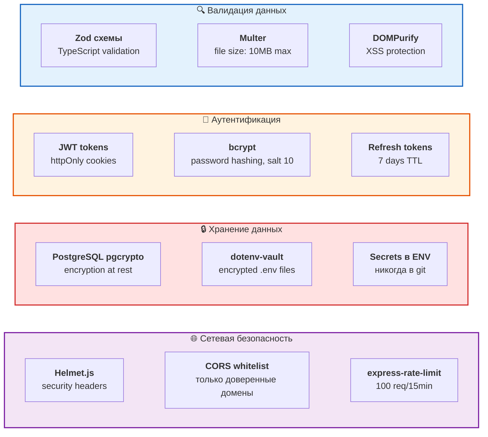

# 11. Безопасность системы

**Конкретные меры безопасности** с технологиями и инструментами.

```mermaid
graph TB
    subgraph validation ["🔍 Валидация данных"]
        direction LR
        zod["<b>Zod схемы</b><br/>TypeScript validation"]
        multer["<b>Multer</b><br/>file size: 10MB max"]
        sanitize["<b>DOMPurify</b><br/>XSS protection"]
        
        zod ~~~ multer ~~~ sanitize        
    end
    
    validation ~~~ auth
    
    subgraph auth ["🔐 Аутентификация"]
        direction LR
        jwt["<b>JWT tokens</b><br/>httpOnly cookies"]
        bcrypt["<b>bcrypt</b><br/>password hashing, salt 10"]
        refresh["<b>Refresh tokens</b><br/>7 days TTL"]
        
        jwt ~~~ bcrypt ~~~ refresh        
    end
    
    auth ~~~ storage
    
    subgraph storage ["🔒 Хранение данных"]
        direction LR
        pgcrypto["<b>PostgreSQL pgcrypto</b><br/>encryption at rest"]
        dotenv["<b>dotenv-vault</b><br/>encrypted .env files"]
        secrets["<b>Secrets в ENV</b><br/>никогда в git"]
        
        pgcrypto ~~~ dotenv ~~~ secrets        
    end
    
    storage ~~~ network
    
    subgraph network ["🌐 Сетевая безопасность"]
        direction LR
        helmet["<b>Helmet.js</b><br/>security headers"]
        cors["<b>CORS whitelist</b><br/>только доверенные домены"]
        ratelimit["<b>express-rate-limit</b><br/>100 req/15min"]
        
        helmet ~~~ cors ~~~ ratelimit        
    end
    
    style validation fill:#e3f2fd,stroke:#1565c0,stroke-width:2px
    style auth fill:#fff3e0,stroke:#e65100,stroke-width:2px
    style storage fill:#ffe1e1,stroke:#d32f2f,stroke-width:2px
    style network fill:#f3e5f5,stroke:#7b1fa2,stroke-width:2px
```
