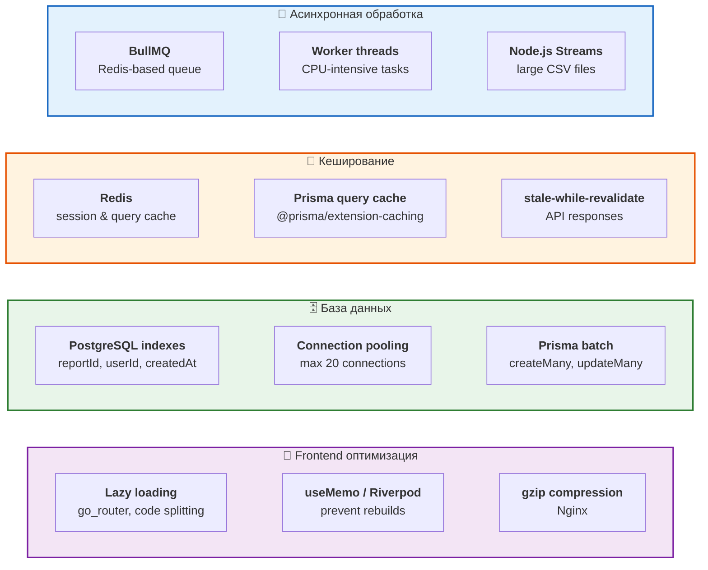

# 12. Производительность системы

**Конкретные решения для оптимизации** производительности.

```mermaid
graph TB
    subgraph async ["🔄 Асинхронная обработка"]
        direction LR
        bullmq["<b>BullMQ</b><br/>Redis-based queue"]
        worker["<b>Worker threads</b><br/>CPU-intensive tasks"]
        stream["<b>Node.js Streams</b><br/>large CSV files"]
        
        bullmq ~~~ worker ~~~ stream        
    end
    
    async ~~~ cache
    
    subgraph cache ["💾 Кеширование"]
        direction LR
        redis["<b>Redis</b><br/>session & query cache"]
        prisma["<b>Prisma query cache</b><br/>@prisma/extension-caching"]
        stale["<b>stale-while-revalidate</b><br/>API responses"]
        
        redis ~~~ prisma ~~~ stale        
    end
    
    cache ~~~ db
    
    subgraph db ["🗄️ База данных"]
        direction LR
        index["<b>PostgreSQL indexes</b><br/>reportId, userId, createdAt"]
        pool["<b>Connection pooling</b><br/>max 20 connections"]
        batch["<b>Prisma batch</b><br/>createMany, updateMany"]
        
        index ~~~ pool ~~~ batch        
    end
    
    db ~~~ frontend
    
    subgraph frontend ["📱 Frontend оптимизация"]
        direction LR
        lazy["<b>Lazy loading</b><br/>go_router, code splitting"]
        memo["<b>useMemo / Riverpod</b><br/>prevent rebuilds"]
        compress["<b>gzip compression</b><br/>Nginx"]
        
        lazy ~~~ memo ~~~ compress        
    end
    
    style async fill:#e3f2fd,stroke:#1565c0,stroke-width:2px
    style cache fill:#fff3e0,stroke:#e65100,stroke-width:2px
    style db fill:#e8f5e9,stroke:#2e7d32,stroke-width:2px
    style frontend fill:#f3e5f5,stroke:#7b1fa2,stroke-width:2px
```
