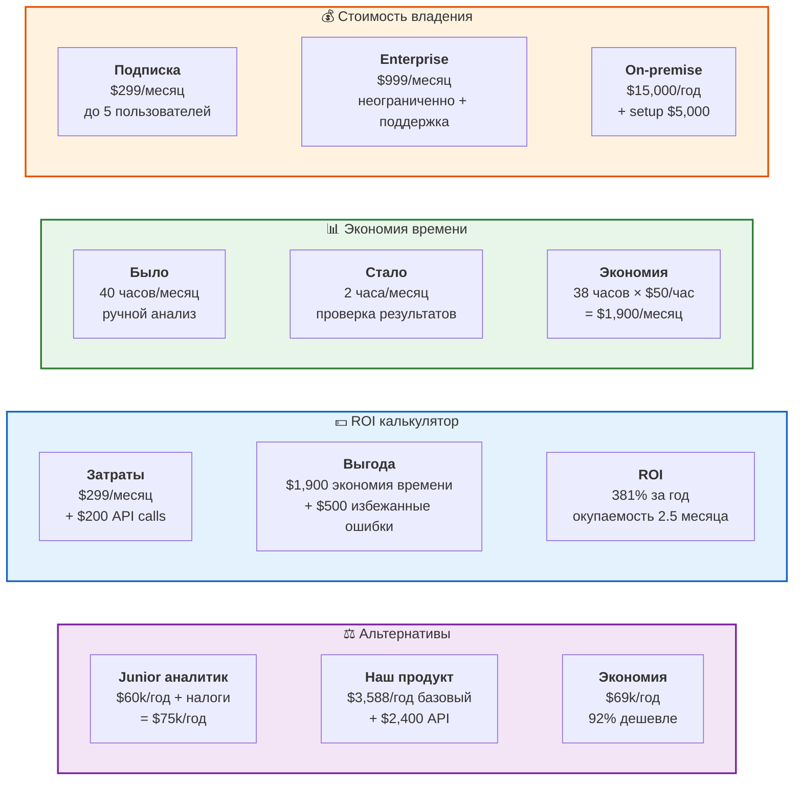

# 13. Бизнес-ценность и ROI

**Финансовое обоснование** покупки продукта с конкретными цифрами.

## Детальный ROI расчет

### Стоимость владения (TCO)
- **Базовая подписка**: $299/месяц ($3,588/год)
- **API вызовы**: ~$200/месяц ($2,400/год)
- **Обучение**: бесплатно (включено)
- **Обновления**: бесплатно (включено)
- **Итого**: $5,988/год

### Экономия
- **Время аналитика**: 38 часов/месяц × $50/час = $22,800/год
- **Избежанные ошибки**: ~$6,000/год (по статистике)
- **Быстрые решения**: ~$10,000/год (выгода от оперативности)
- **Итого экономия**: $38,800/год

### Чистая выгода
**$38,800 - $5,988 = $32,812/год (ROI 548%)**

### Точка безубыточности
**2.5 месяца** использования

## Гарантии

- 💯 **30 дней money-back** - не понравилось, вернем деньги
- 📈 **Гарантия ROI** - если не окупится за 6 месяцев, следующий год бесплатно
- 🔒 **Фиксированная цена** - на 2 года вперед, без скрытых платежей
