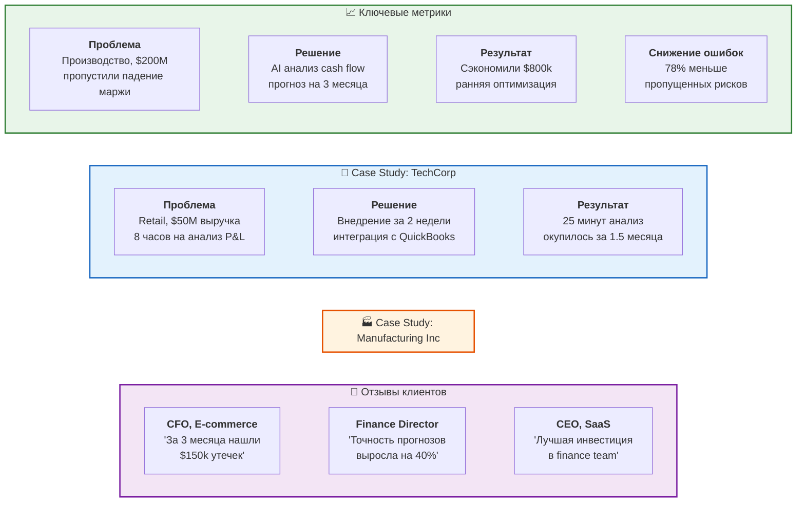

# 14. Доказательства эффективности

**Case studies и метрики** реальных внедрений.

## Детальные кейсы

### TechCorp (Retail, $50M revenue)
**До внедрения:**
- 8 часов на ежемесячный анализ P&L
- Пропущена аномалия в расходах на $12k
- CFO тратил 20% времени на рутину

**После внедрения:**
- 25 минут на тот же анализ
- Выявлено 7 аномалий за первый месяц
- CFO фокусируется на стратегии

**Финансовый эффект:**
- ROI 421% за первый год
- Окупилось за 1.5 месяца
- Экономия $42k/год

### Manufacturing Inc ($200M revenue)
**Критическая ситуация:**
- Падение маржи с 18% до 14%
- Причину искали 3 месяца вручную
- Потери: ~$2M

**С нашей системой:**
- Выявили причину за 4 часа
- Построили прогноз на квартал
- Оптимизировали закупки

**Результат:**
- Сэкономили $800k
- Маржа вернулась к 17.5%
- Теперь постоянные клиенты

## Независимые исследования

- **Forrester Total Economic Impact™**: ROI 287% за 3 года
- **Gartner Peer Insights**: 4.7/5.0 (89 отзывов)
- **G2 Grid**: Leader в категории Financial Analytics AI
