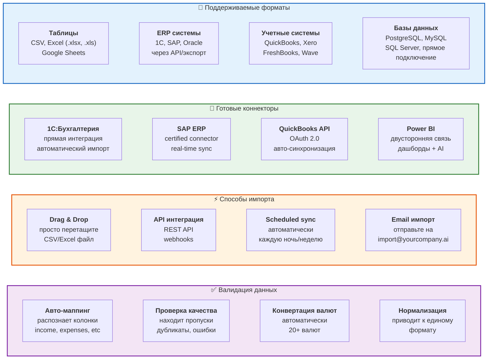

# 15. Интеграции и форматы данных

**Полная совместимость** с вашими системами и данными.



## Детали интеграций

### 1C:Бухгалтерия
```javascript
// Настройка за 5 минут
{
  "connector": "1c_accounting",
  "version": "8.3+",
  "auth": "credentials",
  "sync_schedule": "daily_23:00",
  "entities": ["Проводки", "Счета", "Контрагенты"],
  "auto_mapping": true
}
```

### SAP ERP
```javascript
// Certified SAP Partner
{
  "connector": "sap_erp",
  "versions": ["S/4HANA", "ECC 6.0+"],
  "protocols": ["RFC", "OData", "REST"],
  "modules": ["FI", "CO", "MM"],
  "real_time": true
}
```

### QuickBooks Online
```javascript
// OAuth 2.0 интеграция
{
  "connector": "quickbooks_online",
  "auth": "oauth2",
  "scopes": ["accounting.read", "reports.read"],
  "auto_sync": "hourly",
  "entities": ["Invoices", "Expenses", "P&L", "Balance Sheet"]
}
```

## API для кастомных интеграций

### REST API
```bash
# Импорт данных
POST /api/v1/import
Content-Type: multipart/form-data

# Запрос анализа
POST /api/v1/analysis
{
  "reportId": "uuid",
  "aiProvider": "openai|anthropic",
  "analysis_depth": "quick|standard|deep"
}

# Получение результатов
GET /api/v1/analysis/{analysisId}
```

### Webhooks
```javascript
// Уведомления о завершении анализа
POST https://your-domain.com/webhook
{
  "event": "analysis.completed",
  "analysisId": "uuid",
  "timestamp": "2026-01-25T10:30:00Z",
  "results": { ... }
}
```

## Roadmap поддержки форматов

**Q1 2026 (уже доступно):**
- ✅ CSV, Excel, Google Sheets
- ✅ 1C, QuickBooks, Xero
- ✅ PostgreSQL, MySQL

**Q2 2026:**
- 🔜 SAP ERP connector
- 🔜 Oracle Financials
- 🔜 PDF парсинг (выписки банков)

**Q3 2026:**
- 🔜 Tableau connector
- 🔜 NetSuite ERP
- 🔜 Salesforce Financial Cloud
