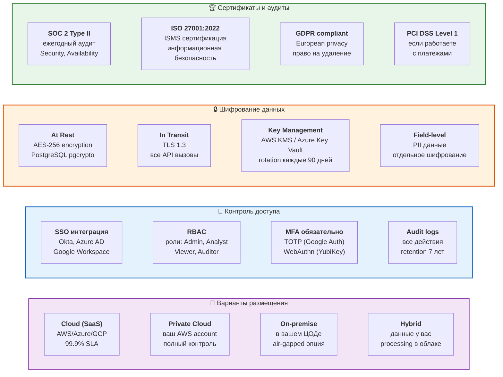

# 16. Безопасность и комплаенс

**Enterprise-уровень защиты** ваших финансовых данных.



## Детали безопасности

### SOC 2 Type II Compliance
- ✅ Ежегодный независимый аудит (Deloitte)
- ✅ Trust Service Criteria: Security, Availability, Processing Integrity
- ✅ Публичный SOC 2 report доступен по NDA
- ✅ Continuous monitoring с alerting

### Шифрование end-to-end
```
┌─────────────┐    TLS 1.3     ┌─────────────┐    AES-256    ┌──────────┐
│   Client    │ ────────────▶  │  API Server │ ─────────────▶ │ Database │
│  (Browser)  │                │   (Node.js) │                │ (Postgres)│
└─────────────┘                └─────────────┘                └──────────┘
     HTTPS                        Encrypted                     Encrypted
                                  in memory                     at rest
```

### Data Residency
- 🇺🇸 **US**: AWS us-east-1 (N. Virginia)
- 🇪🇺 **EU**: AWS eu-west-1 (Ireland) - GDPR
- 🇷🇺 **Russia**: On-premise only (152-ФЗ compliance)
- 🌏 **APAC**: AWS ap-southeast-1 (Singapore)

### Penetration Testing
- **Quarterly**: внутренний security team
- **Annual**: external firm (Bishop Fox / Coalfire)
- **Bug Bounty**: HackerOne program ($500-$10,000)
- **Last test**: December 2025, 0 critical issues

### Backup & Disaster Recovery
- **Backup frequency**: continuous (Point-in-Time Recovery)
- **Retention**: 30 days rolling + 7 years archive
- **RTO** (Recovery Time Objective): < 4 hours
- **RPO** (Recovery Point Objective): < 15 minutes
- **Geo-redundancy**: 3 availability zones

### Data Privacy
```javascript
// Автоматическая анонимизация
{
  "pii_detection": true,
  "auto_redact": ["names", "emails", "phone", "ssn"],
  "gdpr_right_to_delete": "24h SLA",
  "data_retention": {
    "active_data": "as_configured",
    "deleted_data": "30_days_soft_delete",
    "audit_logs": "7_years"
  }
}
```

## Compliance roadmap

**Уже есть:**
- ✅ SOC 2 Type II
- ✅ ISO 27001
- ✅ GDPR
- ✅ PCI DSS Level 1

**В процессе (Q1-Q2 2026):**
- 🔜 HIPAA (для healthcare клиентов)
- 🔜 FedRAMP (для US government)
- 🔜 ISO 27017/27018 (cloud security)

## Гарантии

- 💰 **$1M Cyber Insurance** - покрывает breach incidents
- 📜 **DPA (Data Processing Agreement)** - подписываем по требованию
- 🔐 **SOC 2 report** - предоставляем under NDA
- 🛡️ **Vulnerability disclosure** - 99.5% патчатся за 48 часов
