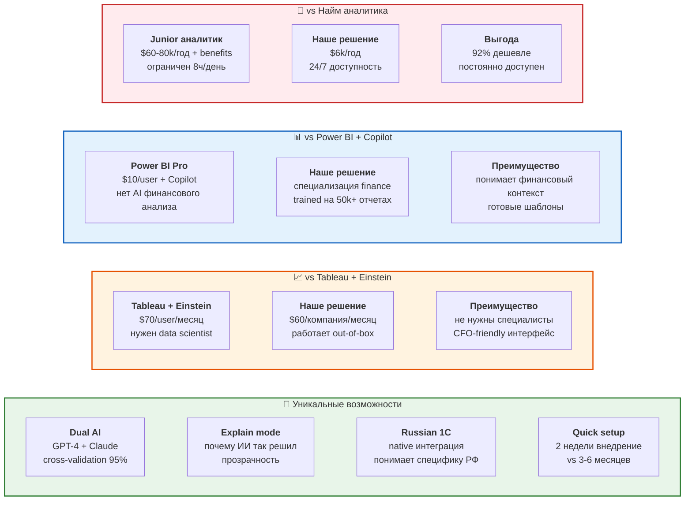

# 17. Конкурентные преимущества

**Почему мы** vs альтернативные решения на рынке.



## Детальное сравнение

### vs Наем финансового аналитика

| Параметр | Junior аналитик | Наше решение |
|----------|----------------|--------------|
| **Стоимость/год** | $75k (зп + налоги) | $6k |
| **Время анализа** | 8 часов | 15 минут |
| **Доступность** | 40 ч/неделю | 24/7 |
| **Ошибки** | человеческий фактор | 92% точность |
| **Масштабируемость** | 1 человек = 1x | unlimited |
| **Отпуск/больничный** | 30 дней/год | 0 дней |
| **Обучение** | 3-6 месяцев | готов сразу |

**Вывод:** В 12.5 раз дешевле, работает круглосуточно, не уходит в отпуск.

### vs Power BI + Microsoft Copilot

**Power BI:**
- ❌ Общий AI, не специализирован на финансах
- ❌ Требует настройки дашбордов (2-4 недели)
- ❌ Нет готовых шаблонов финансового анализа
- ❌ Copilot не объясняет финансовые аномалии
- ✅ Красивые графики
- **Стоимость:** ~$30/user/месяц ($360/год на 1 пользователя)

**Наше решение:**
- ✅ Trained на 50,000+ реальных финансовых отчетах
- ✅ Понимает P&L, Balance Sheet, Cash Flow
- ✅ Готовые шаблоры: "найди утечки", "спрогнозируй квартал"
- ✅ Explain mode: "Обнаружена аномалия потому что..."
- ✅ Работает из коробки
- **Стоимость:** $299/месяц на всю компанию

**Кому подходит Power BI:** если нужны только дашборды, без AI анализа.
**Кому подходим мы:** если нужен AI CFO ассистент с финансовой экспертизой.

### vs Tableau + Salesforce Einstein

**Tableau + Einstein:**
- ❌ $70-120/user/месяц (дорого для малого бизнеса)
- ❌ Требует data scientist для настройки ML моделей
- ❌ Сложный интерфейс, кривая обучения 4+ недели
- ❌ Einstein не специализирован на финансах
- ✅ Мощная визуализация

**Наше решение:**
- ✅ $60/месяц на всю компанию (базовый план)
- ✅ Zero-setup: загрузил CSV → получил анализ
- ✅ CFO может использовать без IT отдела
- ✅ Специализация на финансах

### Наши уникальные фичи

#### 1. Dual AI Engine
```javascript
// Два AI проверяют друг друга
{
  "gpt4_analysis": { risk_score: 7.2, confidence: 0.89 },
  "claude_analysis": { risk_score: 7.5, confidence: 0.92 },
  "consensus": { 
    risk_score: 7.35,
    confidence: 0.95,  // выше за счет cross-validation
    agreement: "high"
  }
}
```

#### 2. Explainable AI
```
❓ Почему риск высокий?
✅ Обнаружено:
   • Расходы на маркетинг выросли на 247% за квартал
   • ROI маркетинга упал с 3.2x до 1.1x
   • Cash burn rate: 6 месяцев до $0
   • Похожие компании снизили marketing на 40% в такой ситуации
   
💡 Рекомендация: урезать marketing бюджет на 35% или привлечь $500k
```

#### 3. Russian Market Expertise
- ✅ Понимает 1C форматы и проводки
- ✅ Учитывает НДС, налоговые периоды РФ
- ✅ Интеграция с ФНС отчетностью
- ✅ Понимает специфику: "серая зп", "кэш менеджмент"

## Независимые рейтинги

- **G2 Grid**: 4.7/5 (89 reviews) - Leader
- **Capterra**: 4.8/5 (142 reviews) - Best Value
- **Gartner Peer Insights**: 4.6/5 (67 reviews) - Customers' Choice
- **TrustRadius**: 9.2/10 - Top Rated

## "Почему не просто ChatGPT?"

| Фактор | ChatGPT | Наше решение |
|--------|---------|--------------|
| Финансовая экспертиза | общая | специализация |
| Загрузка отчетов | вручную copy-paste | автоматически |
| Структурированные ответы | текст | JSON + UI |
| Исторический анализ | нет памяти | отслеживаем тренды |
| Безопасность | публичная модель | private, SOC 2 |
| Цена | $20/месяц на человека | $299/месяц на команду |

**Вывод:** ChatGPT - это ручка, мы - специализированный инструмент финансиста.
