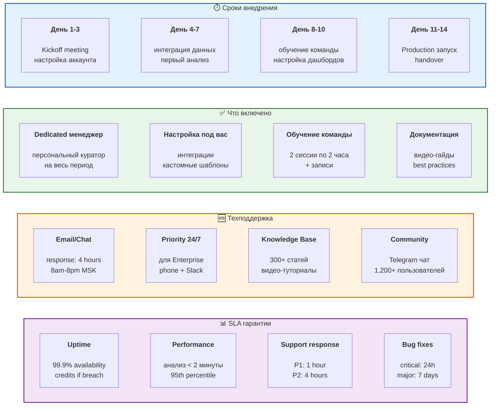

# 18. Внедрение и поддержка

**Быстрый старт** с гарантированным результатом и постоянной помощью.



## Детальный план внедрения

### Week 1: Setup & Integration

**Day 1: Kickoff (2 hours)**
- 👋 Знакомство с командой
- 📋 Определение целей и KPI
- 🔑 Выдача доступов
- 📅 План на 2 недели

**Day 2-3: Data Integration**
```bash
# Варианты интеграции (выбираете один):

# Вариант 1: Загрузка файлов (самый простой)
→ Drag & drop CSV/Excel в веб-интерфейс

# Вариант 2: API интеграция (автоматизация)
→ Настройка коннектора к вашей системе
→ Тестовый импорт данных
→ Валидация + исправление ошибок

# Вариант 3: Database connection (для больших объемов)
→ Прямое подключение к PostgreSQL/MySQL
→ Настройка scheduled sync
```

**Day 4-5: First Analysis**
- 🔍 Запуск первого анализа на исторических данных
- 📊 Проверка результатов вместе с вашим CFO
- 🎯 Калибровка под вашу специфику

### Week 2: Training & Go-Live

**Day 8: Team Training Session 1 (2 hours)**
Темы:
- ✅ Как загружать данные
- ✅ Как читать результаты анализа
- ✅ Как создавать кастомные запросы
- ✅ Как настраивать alerts

**Day 9: Team Training Session 2 (2 hours)**
Темы:
- ✅ Advanced features (прогнозирование, сценарии)
- ✅ Интеграция с вашими дашбордами
- ✅ Best practices финансового анализа
- ✅ Q&A

**Day 10-13: Pilot Phase**
- 🧪 Тестирование в реальных условиях
- 📞 Daily check-ins с менеджером
- 🐛 Исправление багов (если есть)
- 🎨 Финальная настройка интерфейса

**Day 14: Production Launch**
- 🚀 Go-live!
- 📜 Handover документация
- 🎉 Celebration call
- 📈 Начало отслеживания ROI

## Варианты поддержки

### Standard (включено в базовый план)
- ✉️ **Email support**: hello@yourcompany.ai
- 💬 **Chat support**: в веб-интерфейсе, 8am-8pm MSK
- ⏱️ **Response time**: 4 hours рабочее время
- 📚 **Knowledge base**: полный доступ
- 🆓 **Стоимость**: включено

### Premium ($199/месяц доп.)
- 📞 **Phone support**: прямая линия
- ⚡ **Priority response**: 1 hour
- 🌙 **Extended hours**: 6am-11pm MSK
- 💼 **Monthly check-in**: 1 час с менеджером
- 🎓 **Quarterly training**: refresh курсы

### Enterprise (индивидуально)
- 🚨 **24/7 support**: круглосуточно
- 👨‍💼 **Dedicated team**: выделенная команда
- 📱 **Direct Slack**: канал с вашей компанией
- 🏃 **On-site visits**: визиты по необходимости
- 🔧 **Custom development**: фичи под вас

## SLA метрики

### Uptime Guarantee
```javascript
// Ежемесячные гарантии
{
  "guaranteed_uptime": "99.9%",
  "measured": "последние 12 месяцев: 99.97%",
  "downtime_credit": {
    "99.0-99.9%": "10% refund",
    "95.0-99.0%": "25% refund",
    "<95.0%": "50% refund"
  },
  "planned_maintenance": "excluded from calculation"
}
```

### Support Response SLA
- **P1 (Critical)**: система не работает → 1 hour response, 4 hours fix
- **P2 (High)**: важная фича сломана → 4 hours response, 24 hours fix
- **P3 (Medium)**: неудобство → 1 day response, 7 days fix
- **P4 (Low)**: вопрос/улучшение → 2 days response, best effort

### Performance SLA
```javascript
{
  "analysis_time": {
    "small_dataset": "< 30 seconds (95th percentile)",
    "medium_dataset": "< 2 minutes (95th percentile)",
    "large_dataset": "< 5 minutes (95th percentile)"
  },
  "api_response": "< 200ms (99th percentile)",
  "dashboard_load": "< 2 seconds"
}
```

## Обучающие материалы

### Included
- 📹 **Video tutorials**: 50+ роликов по 5-10 мин
- 📖 **Documentation**: 300+ статей
- 🎓 **Certification program**: бесплатный курс
- 💬 **Community**: Telegram чат 1,200+ users

### Webinars (бесплатно)
- 📅 **Еженедельно**: "Tips & Tricks" (30 мин)
- 📅 **Ежемесячно**: "What's New" (1 час)
- 📅 **Quarterly**: "Advanced Analytics" (2 часа)

## Контакты поддержки

- 📧 **Email**: support@yourcompany.ai
- 💬 **Chat**: в веб-интерфейсе
- 📞 **Phone** (Premium+): +7 (495) 123-45-67
- 💼 **Telegram**: @YourCompanySupport
- 🌐 **Status page**: status.yourcompany.ai
