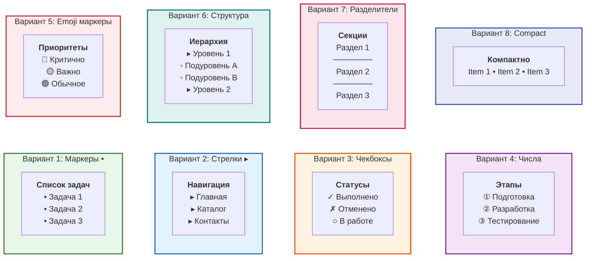

# Демо: Форматирование списков в Mermaid

Различные варианты форматирования текста внутри блоков.

## Unicode символы для списков

### Маркеры:
- `•` (U+2022) - bullet point
- `◦` (U+25E6) - white bullet
- `▪` (U+25AA) - black small square
- `▫` (U+25AB) - white small square
- `▸` (U+25B8) - black right-pointing small triangle
- `▹` (U+25B9) - white right-pointing small triangle
- `►` (U+25BA) - black right-pointing pointer
- `▻` (U+25BB) - white right-pointing pointer

### Чекбоксы:
- `✓` (U+2713) - check mark
- `✔` (U+2714) - heavy check mark
- `✗` (U+2717) - ballot X
- `✘` (U+2718) - heavy ballot X
- `☐` (U+2610) - ballot box
- `☑` (U+2611) - ballot box with check
- `☒` (U+2612) - ballot box with X

### Цифры в кружках:
- `①②③④⑤⑥⑦⑧⑨⑩` (U+2460-2469)
- `❶❷❸❹❺❻❼❽❾❿` (U+2776-277F)

### Разделители:
- `─` (U+2500) - box drawings light horizontal
- `━` (U+2501) - box drawings heavy horizontal
- `═` (U+2550) - box drawings double horizontal
- `•••` - три точки

### Стрелки:
- `→` (U+2192) - rightwards arrow
- `←` (U+2190) - leftwards arrow
- `↑` (U+2191) - upwards arrow
- `↓` (U+2193) - downwards arrow
- `⇒` (U+21D2) - rightwards double arrow
- `⟹` (U+27F9) - long rightwards double arrow

## Рекомендации

**Лучшие практики:**
1. ✅ Используйте `•` для обычных списков
2. ✅ Emoji для категорий (🔴🟡🟢 для приоритетов)
3. ✅ `▸` для навигационных элементов
4. ✅ `✓✗` для статусов
5. ❌ Избегайте слишком много символов - перегрузка
6. ❌ Не используйте сложные Unicode символы - могут не отрендериться

**Для вашего проекта:**
- Риски: 🔴🟡🟢 (уже используется)
- Обычные списки: `•`
- Этапы/порядок: ①②③
- Статусы: ✓ / ○ / ✗
